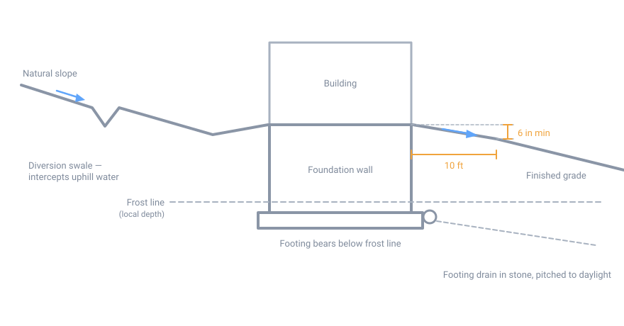

# Site Preparation

## Summary

Site preparation is everything between choosing where to build and being ready
to excavate for a foundation: evaluating the ground, clearing it, and shaping it
so water runs away from the building instead of toward it.

In the Northeast, five conditions govern the work. The frost line is deep. The
frost-free construction season is short. Glacial soils are often silty, which
means frost-susceptible. Bedrock is frequently shallow. And the spring water
table is much higher than the summer one, so a site inspected in August can
mislead you badly.

Nearly every expensive foundation problem in this climate traces back to water
and frost, and both are decided at this stage. Drainage corrected now costs
hours with an excavator; corrected later it means digging up a finished
building.

## Before you begin

Gather these before any machine arrives:

- **Local frost depth.** The single most important number on the project. It is
  set by your municipality, not the state. Get it from the building department
  in writing.
- **Permits and setbacks.** Zoning setbacks, building permit, driveway or
  curb-cut permit.
- **Wetlands determination.** Northeast states regulate wetlands aggressively
  and the buffers extend well beyond standing water. Disturbing a wetland
  without a permit is expensive to undo.
- **Septic design and percolation test**, if there is no sewer connection.
- **Well location**, respecting the required separation from the leach field.
- **Radon zone** for your county, which determines whether you should plan a
  passive mitigation rough-in.
- **Dig Safe ticket** (see below). This one has a mandatory waiting period, so
  file it early.

## Procedure

### 1. Choose the building location

- **Get out of the low spot.** Cold air pools in depressions, creating frost
  pockets that are measurably colder than ground 20 feet higher. Water collects
  there too. High ground solves several problems at once.
- **Orient for winter sun.** Run the long axis roughly east–west and put the
  main glazing on the south face. This is free heat every winter for the life of
  the building, and it is unrecoverable once the foundation is poured.
- **Respect the prevailing winter wind**, generally out of the northwest. Keep
  or plant a windbreak on that side; avoid an exposed ridge top.
- **Think about snow.** Where will it slide off the roof, where will it drift,
  and where will the plow put it? Entries, egress windows, fuel fills, and vent
  terminations all need to stay clear in February.
- **Check winter access.** A driveway grade that is merely steep in July is
  impassable in freezing rain. Plan for a turnaround.

### 2. Investigate the subsurface

Do this before committing to a location, not after.

Dig test pits with an excavator at the proposed corners, going deeper than the
planned footing. You are looking for four things:

| Finding | Why it matters |
|---|---|
| Depth to bedrock | Ledge is common in New England. Hammering or blasting is a major cost, and it can make a full basement uneconomical. |
| Depth to seasonal high water table | Mottled orange-grey soil marks the level water reaches in spring, even when the pit is dry in summer. |
| Soil type | Determines frost susceptibility, bearing, and drainage. |
| Depth of organic material | Everything organic has to come out from under the building. |

**Frost susceptibility** is the property that matters most here. Silts and
low-plasticity clays are the worst: their pore structure wicks water upward
toward the freezing front, where it forms ice lenses that lift whatever sits
above them. Clean sands and gravels drain instead, and do not heave. A common
engineering threshold is that soil with less than about 6% passing a #200 sieve
is non-frost-susceptible.

Glacial till, the default soil across much of the region, is dense and often
silty — it bears well but drains poorly.

!!! tip "Test in spring if you can"
    A pit dug in April tells you the truth about groundwater. The same pit in
    August tells you a comfortable lie.

### 3. Locate underground utilities

In Massachusetts, Maine, New Hampshire, Rhode Island, and Vermont, this is
**Dig Safe**, reached by calling 811. It is a legal requirement, not a courtesy.

- Wait the full **72 hours**, not counting weekends or holidays — three business
  days — before digging.
- Tickets expire in **30 days** in MA, NH, and VT, and **60 days** in ME.
- **Dig Safe does not mark private lines.** Buried feeds to outbuildings,
  propane lines, well lines, septic components, and irrigation are the property
  owner's responsibility to locate and mark.

### 4. Clear and grub

Clearing removes vegetation; grubbing removes stumps and the root mat below.

- Clear well beyond the building footprint — roughly 15 to 25 feet of working
  room for equipment, more if you are craning anything.
- Grub the entire footprint. Organic material decomposes, loses volume, and
  settles unevenly under load. Footings must bear on undisturbed mineral soil or
  properly compacted engineered fill.
- Do not bury stumps under the building, the driveway, or anywhere you will
  later need stable ground.
- Clearing is also a siting decision: take trees on the south side for solar
  gain, leave them on the northwest side for wind.

### 5. Strip and stockpile topsoil

Strip topsoil from the footprint and from drives and parking areas. Depths of 4
to 12 inches are typical in the region.

Stockpile it on site, out of the drainage path, and seed or cover the pile if it
will sit through a season. Topsoil is the most valuable material on the property
and buying it back is expensive.

Never place structural fill or a footing on topsoil.

### 6. Establish grade and drainage

This is the step that pays for itself.

The code requirement is a floor, not a target: grade must fall **at least 6
inches within the first 10 feet** measured away from foundation walls — about a
5% slope. Impervious surfaces such as walks and patios within 10 feet of the
building must slope at least 2% away. Where lot lines, walls, or slopes make
that impossible, swales or drains must carry water away instead.

Beyond the minimum:

- **Cut a diversion swale uphill** of the building on any sloped site, to
  intercept surface runoff and shallow subsurface flow before it reaches the
  excavation. This one earthwork detail keeps more basements dry than any
  waterproofing product.
- **Decide where the footing drain will daylight** before you excavate. It needs
  an outlet lower than the footing. On a flat site there may not be one, which
  means a sump — and it is far better to learn that now.
- **Plan roof runoff.** A modest roof sheds thousands of gallons per storm
  directly at the foundation if nothing carries it away. Route downspouts to
  extensions or buried leaders that discharge downhill and well clear.

{ width="820" }

*Diversion swale uphill, positive grade away from the wall, footing below the
frost line, footing drain pitched to daylight. Not to scale.*

### 7. Erosion and sediment control

Usually required by permit, and worth doing regardless:

- Silt fence along the downhill perimeter, installed **before** earthwork starts.
- A stabilized construction entrance of crushed stone, to keep mud off the
  public road.
- Seed or mulch disturbed areas that will sit exposed, especially going into
  winter.

### 8. Work with the season

The practical frost-free earthwork window in the Northeast runs roughly May
through October.

- **Mud season**, through March and April, is the worst time to move heavy
  equipment. Sites get rutted and compacted, and recovery takes a year.
- **Never place a footing on frozen ground.** Frozen subgrade thaws later,
  loses volume, and settles unevenly under the completed structure.
- If you excavate late in the season, protect the open excavation and any placed
  concrete from freezing with insulated blankets, straw, or poly.
- An open excavation left through the winter will heave, slough, and fill with
  water. Either close it out or plan to rework it in spring.

## Decisions that are cheap now and costly later

Handle these while the ground is still open:

- **Radon rough-in.** Under-slab gravel, membrane, and a capped vent stack cost
  little during construction and are disruptive to retrofit. The EPA's guidance
  is to test every home regardless of mapped zone.
- **Utility trenches.** Water, power, and any conduit for future use — a spare
  empty conduit is nearly free now.
- **Footing drain outlet**, as above.
- **Well and septic locations**, including how a drilling rig or pumper truck
  will physically reach them once the building exists.

## Safety

- **Excavation collapse** is the serious hazard on this work. Unsupported soil
  walls fail without warning and a cubic yard of soil weighs well over a ton.
  Under OSHA rules an excavation 5 feet or deeper generally requires a
  protective system — sloping, benching, or shoring. Do not enter an unprotected
  excavation, however briefly.
- **Keep spoil piles back** from the edge, at least 2 feet, to avoid surcharging
  the wall.
- **Struck utilities.** Respect the Dig Safe marks, hand-dig within the
  tolerance zone, and remember that private lines are unmarked.
- **Overhead lines.** Excavator booms and dump bodies reach higher than people
  estimate.
- **Open excavations** need to be fenced or covered against children, livestock,
  and wildlife overnight.

## A note on frost depth figures

Commonly cited design frost depths for the region run roughly 36–48 inches in
southern New England, 48–60 inches in the northern states, and deeper at
elevation. **Treat those numbers as orientation only.** Frost depth is set
locally and varies between neighboring towns. The authoritative figure is the
one your building department gives you, and it is the number to design to.

## Sources

- [2024 International Residential Code, R401.3 Drainage](https://codes.iccsafe.org/s/IRC2024P2/chapter-4-foundations/IRC2024P2-Pt03-Ch04-SecR401.3) — grading and surface drainage requirements
- [Dig Safe System, Inc. — How It Works](https://www.digsafe.com/how-it-works) and [FAQ](https://www.digsafe.com/faqs) — 811 notice periods and ticket expiry for MA, ME, NH, RI, VT
- [EPA Map of Radon Zones](https://www.epa.gov/radon/epa-map-radon-zones-and-supplemental-information) — county radon potential and the recommendation to test regardless of zone
- [USACE CRREL, *Frost Susceptibility of Soil: Review of Index Tests*](https://apps.dtic.mil/sti/tr/pdf/ADA111752.pdf) — frost-susceptibility classification
- [FHWA NHI-05-037, Geotechnical Aspects of Pavements, Ch. 7](https://www.fhwa.dot.gov/engineering/geotech/pubs/05037/07c.cfm) — frost action and soil gradation
