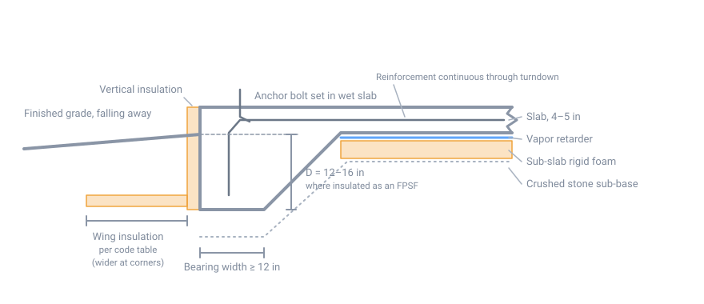

# Foundations

## Summary

A foundation does three jobs: carry the building's loads into soil that can
take them, resist frost heave, and keep water out of the structure. In the
Northeast the second job drives almost every decision, because frost can lift a
correctly loaded footing straight out of the ground.

Frost heave is not the ground freezing and swelling. It is ice lenses forming
in frost-susceptible soil, fed by water wicking up to the freezing front, and
growing with enough force to lift a house. It needs three ingredients: freezing
temperatures, frost-susceptible soil, and water. A foundation strategy works by
removing at least one of them.

This page assumes [Site Preparation](10-site-preparation.md) is done and you know
your local frost depth, your soil, and where water goes.

## The three ways to satisfy frost

The IRC gives exactly three methods. Everything below is one of these:

| Method | How it works |
|---|---|
| **Bear below the frost line** | Put the footing deeper than frost reaches, so no ice lens can form beneath it. |
| **Design per ASCE 32** | Use insulation to keep the soil under the footing above freezing. This is the frost-protected shallow foundation. |
| **Bear on solid rock** | Ledge does not heave. |

There are also exceptions worth knowing, because they decide what is legal for
outbuildings:

- Freestanding accessory structures of **600 sq ft or less**, light-frame, with
  an eave height of 10 ft or less, do not require frost protection.
- Freestanding accessory structures of **400 sq ft or less** of other than
  light-frame construction, same eave limit, likewise.
- Decks not supported by a dwelling do not need footings below the frost line.

!!! warning "State adoptions differ"
    These thresholds come from the model IRC. States amend it — Connecticut's
    adopted text differs from the base code, for instance. Confirm the numbers
    your jurisdiction actually enforces before relying on an exception.

## Choosing a type

| Type | Typical use | Frost strategy | Watch out for |
|---|---|---|---|
| Full basement | Houses, where excavation is feasible | Footing below frost | Ledge, water table, drain outlet |
| Frost wall + crawlspace | Houses on sloped or rocky sites | Footing below frost | Moisture management in the crawl |
| Frost wall + slab | Garages, shops, slab-on-grade houses | Footing below frost | Cost of deep wall for a single-story |
| Monolithic "Alaskan" slab | Outbuildings, shops, slab houses | Exception, or FPSF, or deepened turndown | **Frost depth compliance — see below** |
| Frost-protected shallow | Heated buildings, any climate zone | Insulation per ASCE 32 | Heated buildings only |
| Piers / helical piles | Decks, cabins, small outbuildings | Bear below frost, or helical to depth | Heave on undersized or shallow piers |

In this region a full basement is often the cheapest floor area you will ever
build — the excavation and wall are largely sunk costs once you are digging
below frost anyway. That calculus flips as soon as you hit ledge.

## Full basement and frost walls

The conventional assembly is a continuous spread footing with a wall on top.

- **Footing** bears on undisturbed mineral soil or engineered fill, never on
  topsoil, fill of unknown origin, or frozen ground. Width comes from IRC Table
  R403.1(1), based on the soil's load-bearing value and the number of stories.
  Get the soil bearing value from your test pits or a geotechnical engineer;
  do not assume.
- **Keyway or dowels** tie the wall to the footing.
- **Wall** is typically poured concrete in this region, sometimes block, and
  increasingly ICF where the insulation is wanted anyway.
- **Drainage** is not optional — see below.

A frost wall is the same assembly without the headroom: it reaches frost depth,
encloses a crawlspace or supports a slab, and nothing more.

## Monolithic slab — the "Alaskan slab"

A monolithic slab, commonly called an **Alaskan slab** or thickened-edge slab,
places the floor slab and its perimeter footing in a single pour. There is no
separate footing, no wall, no backfill, and no crawlspace. It is fast, it uses
less concrete and less labor than a frost wall plus slab, and for outbuildings
and single-story shops it is often the obvious answer.

### Typical section

A common detail for a 4 to 5 inch slab is a perimeter edge thickened to roughly
12 inches or more, with a bearing width of at least 12 inches, transitioning
back up into the slab at about a 1:1 slope. Reinforcing runs continuously
through the turndown.

{ width="820" }

*Monolithic slab with integral turndown footing, shown with the vertical and
wing insulation that makes it a frost-protected shallow foundation. Not to
scale; insulation dimensions and R-values come from the code table for your
Air-Freezing Index.*

### The catch in a frost climate

**A 12-inch turndown is nowhere near frost depth in New England.** On its own,
an Alaskan slab does not satisfy frost protection. This is the single most
common mistake with the detail, and it is why the same slab that works fine in
Virginia heaves in New Hampshire.

There are only four honest ways to use one here:

1. **Qualify under the accessory-structure exception.** A detached shed or
   small garage inside the square-footage limits above needs no frost
   protection, and a floating monolithic slab is entirely appropriate. This
   covers a large share of real-world Alaskan slab projects.
2. **Insulate it as a frost-protected shallow foundation.** Legitimate,
   engineered, and effective — but only for heated buildings. See the next
   section.
3. **Deepen the turndown to full frost depth.** Now it is a monolithic frost
   wall. This works and is sometimes done, but at 48 inches you are pouring a
   great deal of concrete in a trench, and the cost advantage over a
   conventional footing-and-wall largely disappears.
4. **Bear on ledge**, where you have it.

What does *not* work is pouring a shallow monolithic slab under a heated house
or an unheated garage that exceeds the exception thresholds and hoping the
climate cooperates.

### Building one

- **Sub-base**: compacted crushed stone, which drains and is not
  frost-susceptible. Do not place a slab on native silt.
- **Under-slab insulation**: rigid foam under the whole slab for any heated
  building, and especially under radiant floors.
- **Vapor retarder** directly under the slab, lapped and sealed.
- **Reinforcement** continuous through the turndown; thicken further under
  bearing walls, columns, and point loads.
- **Anchor bolts** set wet, at the spacing the wall design requires — not
  drilled in afterward as an afterthought.
- **Control joints** cut early, to put the inevitable cracking where you chose.
- **Edge insulation** where the slab edge is exposed, or the perimeter becomes
  a continuous thermal bridge around the entire heated floor.

## Frost-protected shallow foundations

An FPSF keeps the soil beneath a shallow footing above freezing by trapping
heat lost through the building's floor. Building heat loss is part of the
design, which has a hard consequence: it only works for heated buildings.

Key provisions of IRC R403.3:

- The building must maintain a **monthly mean temperature of at least 64°F**.
- Footing depth can drop to **12 inches** where the Air-Freezing Index is 1,500
  degree-days or less, rising to **16 inches** at 2,500 degree-days and above.
  The code table covers AFI values from 1,500 to 4,000 degree-days.
- **Vertical insulation** runs down the outside of the foundation from the top
  to the footing.
- **Horizontal wing insulation** extends outward from the base at the
  perimeter, and must be **wider and higher-R at corners**, which lose heat in
  two directions at once.
- Foam used below grade for frost protection must be labeled as complying with
  **ASTM C578**.
- The prescriptive method **may not be used for unheated spaces** — porches,
  utility rooms, garages, carports — and may not be attached to a basement or
  crawlspace that is not itself kept at 64°F.

Designs outside the prescriptive table, including unheated structures, go
through **ASCE 32** and generally want an engineer.

To size the insulation you need your **Air-Freezing Index**, a 100-year return
period value. Take it from IRC Figure R403.3(2) or from the NOAA table linked
in the sources. New England spans a wide range — coastal and southern areas sit
well below northern interior and higher-elevation sites — so look up your
location rather than assuming a regional value.

!!! danger "Failure modes specific to FPSF"
    The system depends on heat flow, drainage, and intact insulation. It fails
    when the building is left unheated through a winter, when the perimeter is
    over-insulated to the point that no heat reaches the soil, when foam is
    damaged during backfill, or when poor drainage saturates the soil the
    design assumed would stay relatively dry.

## Piers, posts, and helical piles

For decks, cabins, and small outbuildings, discrete supports are cheaper than
continuous footings.

- A concrete pier must bear **below frost depth** on undisturbed soil, with a
  footing pad sized for the load.
- A pier with a rough or flared upper shaft gives frost a grip on its sides.
  Smooth-sided tubes shed that adfreeze force better.
- **Helical piles** are screwed below the frost zone and are the practical
  answer where digging is impractical or the site is steep or wet.
- Blocks on grade are not a foundation. They will move, and outbuildings set on
  them rack themselves apart over a few winters.

## Drainage and waterproofing

Whatever the type, water management is what determines whether the foundation
is a problem later.

- **Footing drain**: perforated pipe at the footing, surrounded by washed
  stone, wrapped in filter fabric, pitched to daylight or to a sump. Decide the
  outlet during site prep.
- **Damproofing vs. waterproofing**: damproofing is a coating that resists
  moisture; waterproofing is a membrane that resists standing water. Below a
  habitable space, or anywhere the water table gets close, pay for
  waterproofing.
- **Backfill with granular material**, not the silty spoil that came out of the
  hole. Backfilling a foundation with frost-susceptible soil rebuilds the exact
  problem the depth was meant to solve, right against the wall.
- **Do not backfill early.** A basement wall is braced by the floor deck above
  and the slab below. Backfilling before those are in place is a common way to
  crack or push in a new wall.

## Insulation, vapor, and radon

Handle these while the foundation is open:

- **Sub-slab rigid foam** under any heated slab, and continuous insulation on
  the foundation wall, inside or outside, chosen deliberately.
- **Vapor retarder** under all slabs.
- **Radon rough-in**: a clean gravel layer under the slab, a sealed membrane,
  and a capped vent stack run to the roof. Trivial now, disruptive later. Test
  the finished building regardless of what the radon map says about your
  county.

## Placing concrete in the cold

The Northeast season makes this routine rather than exceptional.

- **Never place concrete on frozen ground.** It thaws, settles, and takes the
  footing with it.
- ACI 306 minimum as-placed concrete temperatures depend on section size:
  **55°F** for sections under 12 inches, **50°F** for 12 to 36 inches, **45°F**
  for 36 to 72 inches, and **40°F** above that.
- Concrete that freezes before reaching about **500 psi** suffers permanent
  loss of strength and durability. That threshold, not the calendar, ends the
  protection period — typically one to four days with an accelerator.
- Protect with insulated blankets, heated enclosures, hot mix water, or
  accelerating admixtures.
- Use **non-chloride accelerators** in reinforced work. Calcium chloride
  corrodes reinforcement.

## Common failure modes

| Symptom | Usual cause |
|---|---|
| Outbuilding racked, doors binding | Piers or slab above frost depth |
| Seasonal cracking that opens in winter, closes in spring | Frost heave under part of the footing |
| Chronically wet basement | No footing drain, or drain with no functioning outlet |
| Wall cracked or bowed inward | Backfilled before the deck and slab braced it, or backfilled with silt |
| Uneven settlement | Footing on fill, topsoil, disturbed, or frozen ground |
| Slab edge cold, condensation at the perimeter | No edge insulation — thermal bridge around the floor |

## Sources

- [IRC R403.1.4.1, Frost protection](https://codes.iccsafe.org/s/IRC2021P3/chapter-4-foundations/IRC2021P3-Pt03-Ch04-SecR403.1.4.1) — the three permitted methods and the accessory-structure and deck exceptions
- [IRC R403.3, Frost-protected shallow foundations](https://up.codes/s/frost-protected-shallow-foundations) — 64°F requirement, 12–16 in footing depths, Table R403.3(1) and the AFI range, ASTM C578, unheated-space prohibition
- [InterNACHI, Inspecting Frost-Protected Shallow Foundations](https://www.nachi.org/frost-protected-shallow-foundation-fpsf.htm) — how the system works, wing insulation at corners, failure modes
- [NOAA NCEI, Air-Freezing Index Return Periods](https://www.ncei.noaa.gov/sites/default/files/2021-09/Air-Freezing-Index-Return-Periods-and-Associated-Probabilities.pdf) — 100-year AFI values for FPSF design
- [ACI 306R-16, Guide to Cold Weather Concreting](https://www.concrete.org/Portals/0/Files/PDF/Previews/306R-16_preview.pdf) — placement temperatures, protection period, the 500 psi threshold
- [GreenBuildingAdvisor, Different Types of Insulated Slabs](https://www.greenbuildingadvisor.com/article/different-types-of-insulated-slabs) — monolithic and thickened-edge slab assemblies
