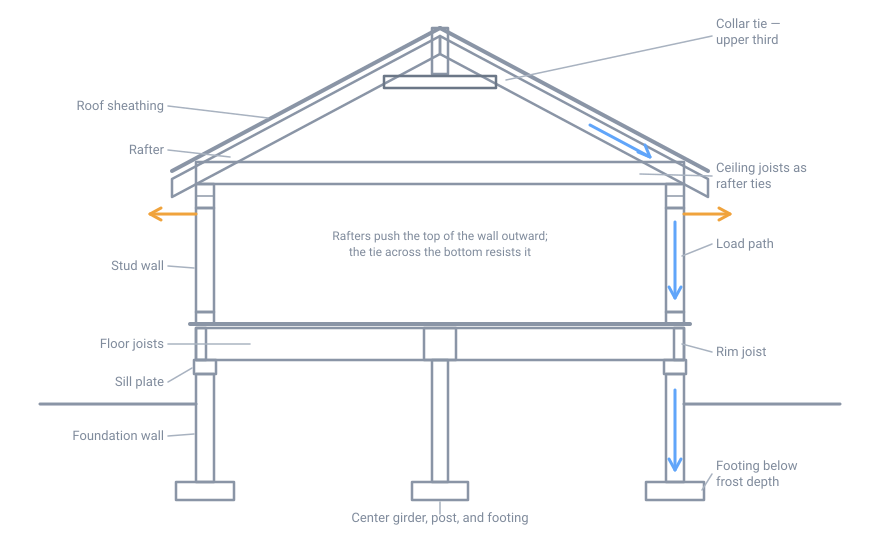
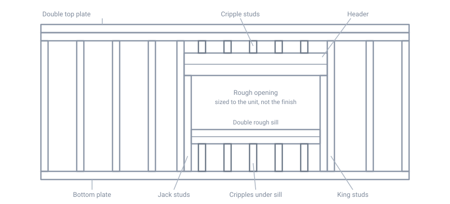

# Framing and Structural Basics

## Summary

Framing is the skeleton. Everything else in a building — sheathing, roofing,
insulation, wiring, finish — hangs on it or is carried by it. The whole job
comes down to one idea: **there must be a continuous, unbroken path for every
force to reach the ground.**

Gravity is only part of it. A frame also has to resist wind trying to lift the
roof off, wind and seismic forces trying to push the building sideways into a
parallelogram, and — in this climate — a roof load of snow that can exceed the
weight of the building materials beneath it.

This page assumes the work in [Site Preparation](10-site-preparation.md) and
[Foundations](20-foundations.md) is done. It covers platform framing in
dimensional lumber, which is what nearly every house and outbuilding in the
Northeast is built from.

!!! warning "Span numbers are not universal"
    This page deliberately does not print span tables. Allowable spans depend
    on species, grade, size, spacing, load, and deflection limit, and the
    published tables and online calculators **frequently disagree with each
    other**. Size structural members from the table in the code edition your
    jurisdiction has actually adopted, or from the American Wood Council's
    span calculator, and have anything unusual designed.

## The load path

{ width="820" }

*Gravity load travels from the roof sheathing into the rafters, down the walls,
through the floor framing into the foundation, and out into the soil. The
orange arrows are the outward thrust the rafters exert on the walls, which the
ceiling joists resist by acting as rafter ties. Not to scale.*

Trace it in order, because a frame fails wherever the path is interrupted:

1. **Roof sheathing** collects snow, wind, and its own weight and delivers it
   to the rafters or trusses.
2. **Rafters or trusses** carry it to the wall top plates. A sloped rafter also
   pushes the wall *outward* — see [Roofs](#roofs) below, because this is the
   most commonly misunderstood thing in residential framing.
3. **Walls** carry it down in the studs. Anywhere a wall is interrupted by an
   opening, a **header** spans the gap and dumps its load onto **jack studs**
   at each end.
4. **Floor framing** carries wall and floor loads to the foundation and to any
   interior girder. Loads from above must land over something that continues
   down — a point load landing in the middle of a joist bay is a defect, not a
   detail.
5. **Foundation and footing** spread it into the soil.

There are two more paths that people forget:

- **Uplift.** Wind over a roof creates suction. The path runs roof sheathing →
  rafter → top plate → stud → sole plate → floor → sill plate → anchor bolt →
  foundation, and it works in *tension*. Toe nails alone are a weak tension
  connection, which is why metal framing connectors exist.
- **Lateral.** Wind pushing on a wall, or an earthquake, tries to rack the
  building. That force is resisted by sheathed **braced wall panels** and
  carried through the floor and roof diaphragms down to the foundation.

## Lumber

### Nominal size is not actual size

A 2×4 has not been 2 inches by 4 inches since the lumber was rough-sawn and
green. Under the American Softwood Lumber Standard (PS 20), surfaced dry
dimension lumber is 1/2 inch under nominal up to 6 inches nominal, and 3/4 inch
under above that:

| Nominal | Actual (surfaced dry) |
|---|---|
| 1× | 3/4 in |
| 2×3 | 1 1/2 × 2 1/2 in |
| 2×4 | 1 1/2 × 3 1/2 in |
| 2×6 | 1 1/2 × 5 1/2 in |
| 2×8 | 1 1/2 × 7 1/4 in |
| 2×10 | 1 1/2 × 9 1/4 in |
| 2×12 | 1 1/2 × 11 1/4 in |

Those dry sizes are defined at a **maximum 19% moisture content**. Lumber sold
green ("S-GRN") is cut slightly larger because it will shrink to roughly these
dimensions as it dries.

### Species and grade

In the Northeast the default framing stock is **spruce-pine-fir (SPF)** — a
marketing group of several similar northern species sold together under one set
of design values. Eastern hemlock and eastern white pine are locally sawn and
common in barns and older buildings. Douglas fir-larch and southern yellow pine
are stronger, cost more here, and show up as beams, headers, and where a span
table will not work out in SPF.

Every piece of structural lumber carries a **grade stamp** giving the grading
agency, mill, species or species group, grade, and moisture condition at
surfacing (S-GRN, S-DRY, or KD for kiln dried). The grade is what the span
tables are keyed to. Common grades, strongest first: Select Structural, No. 1,
No. 2, No. 3, Stud, Utility. **No. 2 is the practical baseline** for joists and
rafters; Stud grade is fine for studs in a wall but is not a joist.

Two consequences worth remembering:

- **Ungraded lumber cannot be used with a span table.** Locally sawn or
  salvaged material may be perfectly sound and still have no legal design
  value. Size it conservatively, or have it graded.
- The code lets **Utility grade studs** be used only at not more than 16 inches
  on center, supporting no more than a roof and ceiling, and not over 8 feet in
  height in exterior walls.

### Moisture and movement

Wood shrinks and swells **across** the grain as its moisture content changes,
and essentially not at all **along** it. A 2×10 floor joist that goes in at 19%
and dries to 9% in a heated house gets measurably shallower; a stud of the same
wood barely changes length. This is why:

- Nail pops, drywall cracks, and squeaks appear in the first two heating
  seasons, and then stop.
- It is worth keeping the amount of cross-grain wood consistent around a
  building, so one part does not settle relative to another.
- Framing dry lumber, and keeping stacks covered and off the ground, avoids
  most of the problem.

Install joists and rafters **crown up** — sight down the edge, find the slight
convex curve, and put it on top. The load flattens it.

### Engineered lumber

| Product | What it is | Typical use |
|---|---|---|
| LVL | Laminated veneer lumber, veneers glued with grain parallel | Headers, beams, rim board |
| PSL / LSL | Strands or veneer strips glued under pressure | Columns, headers, tall studs |
| Glulam | Dimension lumber laminated into a large beam | Long-span beams, ridge beams |
| I-joist | Flanges plus an OSB web | Floor joists, long-span rafters |
| Truss | Sawn lumber joined with metal connector plates | Roofs, floors |

Engineered products are straighter, more dimensionally stable, and span further
than sawn lumber. They come with two hard rules:

1. **Do not cut, notch, or drill them except as the manufacturer allows.** An
   I-joist web has designated knockouts; cutting a flange anywhere ruins the
   joist. A truss cannot be cut, notched, or altered without a design
   professional's approval — including that tempting web member in the way of a
   duct.
2. **They burn through faster than sawn lumber.** The thin web of an I-joist has
   far less material to lose than a solid 2×10. This is why IRC R302.13 requires
   floor assemblies to be protected on the underside with 1/2-inch gypsum board
   or 5/8-inch wood structural panel, with exceptions for sprinklered spaces,
   crawlspaces not used for storage or fuel-fired appliances, up to 80 square
   feet of unprotected area per story, and assemblies that perform at least as
   well as nominal 2×10 sawn lumber. In an unfinished basement this is the
   requirement people are surprised by.

## Platform framing, and the balloon frames you will meet

**Platform framing** is the modern standard: each floor is built as a complete
deck, and the walls for that story stand on it, one story tall. It is safe to
build (you work from a platform), it uses short studs, and every floor line
provides a natural firestop.

**Balloon framing** ran studs continuously from the sill to the roof, two or
three stories, with the floors hung off ledger strips let into the studs. It is
common in Northeast houses built roughly 1880–1940. Two things matter when you
open one up:

- The stud cavities are a **continuous chimney** from the basement to the attic.
  A fire in the basement is in the attic in minutes. Any time you have a balloon
  wall open, fireblock it at each floor line.
- The floor framing is not carrying the wall; the studs are. Do not remove or
  notch them casually.

## Walls

### Anatomy of a framed wall

{ width="820" }

*The members around an opening. King studs run full height; jack (trimmer)
studs are cut to fit under the header and are what actually carries it to the
sole plate. Not to scale.*

- **Sole (bottom) plate** — the wall's base, nailed down through the subfloor.
  On concrete it must be pressure-treated or naturally durable.
- **Studs** — the vertical members. Full-height ones next to an opening are
  **king studs**.
- **Jack or trimmer studs** — cut under the header, carrying its load down.
  The number required comes from the header span table; wide openings need two
  or three per end.
- **Header** — the beam over an opening.
- **Cripple studs** — the short studs above a header or below a sill, which
  continue the stud layout so sheathing and drywall have backing.
- **Rough sill** — usually doubled, under a window opening.
- **Double top plate** — ties walls together and lets studs and joists above
  land anywhere along the wall.

### Size, height, and spacing

Maximum stud height and spacing come from IRC Table R602.3(5). The common
cases:

| Wall | Stud | Maximum spacing |
|---|---|---|
| Bearing, roof and ceiling only | 2×4 | 24 in o.c. |
| Bearing, one floor plus roof and ceiling | 2×4 | 16 in o.c. |
| Bearing, heavier load cases | 2×6 | 24 in o.c. |
| Nonbearing partition | 2×3 or 2×4 | 16–24 in o.c. |

Laterally unsupported bearing-wall stud height is generally limited to **10
feet**. The heights in the table are the distance between points of lateral
support *perpendicular to the plane of the wall* — so a bearing wall must be
sheathed on at least one side, or have bridging not more than 4 feet apart
vertically. A tall open wall in a garage or great room is outside the
prescriptive table and needs to be engineered.

### Plates and bearing

- The **top plate is doubled**, with end joints in the two plates **offset by at
  least 24 inches**, and the splice nailed with 8-16d common nails.
- A single top plate is permitted, but then it must be tied at corners,
  intersections, and splices with steel plates sized by the code table.
- Where joists, trusses, or rafters are spaced more than 16 inches on center and
  the studs below are at 24 inches on center, the members above must **bear
  within 5 inches of a stud**. This is the rule that makes "stacked" or in-line
  framing necessary at 24-inch spacing.
- Studs need **full bearing** on a nominal 2-by plate at least as wide as the
  stud.

### Headers

A header is sized from the span table using three inputs: the **span of the
opening**, the **building width** (which sets how much roof and floor is
tributary to that wall), and the **ground snow load**. The building width term
surprises people — the same 2×8 header that comfortably spans a 5-foot opening
on a narrow building carries barely 3 feet on a wide one, because it is holding
up half the roof either way and the roof got bigger.

Practical points:

- Built-up headers of two 2-by members with a 1/2-inch spacer are nailed with
  16d commons at 16 inches on center along each edge.
- Nonbearing walls do not need a structural header at all. A flat 2× at the top
  of the opening is enough, and it leaves room for insulation.
- An **insulated header** — two members with rigid foam between instead of a
  plywood spacer — removes a solid block of conductive wood from the top of
  every opening. In this climate that is worth doing.

### Corners, intersections, and advanced framing

The traditional three-stud corner and the three-stud partition intersection
leave a cavity that cannot be insulated and often is not. **Advanced framing**
(optimum value engineering) addresses this and reduces lumber use:

- 2×6 studs at 24 inches on center instead of 2×4 at 16.
- Two-stud corners with **ladder blocking** — short horizontal 2× pieces — to
  back the drywall, leaving the corner cavity open to insulate.
- Ladder blocking at interior/exterior wall intersections for the same reason.
- Single top plates, in-line framing, insulated or single headers, minimum jack
  studs, no redundant cripples.

Reported results are on the order of 5–10% less lumber by volume and about 30%
fewer pieces, with whole-wall R-values roughly 10–15% higher than conventional
framing of the same cavity insulation. The trade-off is that 24-inch spacing
demands stacked framing and is less forgiving of sloppy layout, and drywall on
24-inch spacing needs 5/8-inch board on ceilings to avoid sag.

### Drilling and notching studs

| Member | Maximum notch | Maximum bored hole |
|---|---|---|
| Stud in exterior wall or bearing partition | 25% of stud depth | 40% of depth; up to 60% if the stud is doubled, and no more than two successive doubled studs |
| Stud in nonbearing partition | 40% of depth | 60% of depth |

The edge of a bored hole must be at least **5/8 inch** from the edge of the
stud, and a hole may not be in the same section as a cut or notch. A plumber
who centers a 2-inch hole in a 2×4 has removed a bearing stud; the fix is a
steel nail plate at best and a sistered stud in reality.

### Fireblocking

Fireblocking cuts off concealed draft openings so a fire cannot run through the
frame. IRC R302.11 requires it:

1. In concealed spaces of stud walls and partitions — including furred spaces
   and staggered-stud walls — **vertically at the ceiling and floor levels, and
   horizontally at intervals not exceeding 10 feet**.
2. At interconnections between concealed vertical and horizontal spaces:
   soffits, dropped ceilings, cove ceilings.
3. In concealed spaces between stair stringers at the top and bottom of the run.
4. At openings around vents, pipes, ducts, cables, and wires at ceiling and
   floor level.
5. At fireplaces and chimney spaces.

Acceptable materials include 2-inch nominal lumber, two layers of 1-inch
nominal boards with staggered joints, 23/32-inch wood structural panel,
3/4-inch particleboard, 1/2-inch gypsum board, 1/4-inch cement-based millboard,
and unfaced mineral wool or fiberglass batts packed tightly into the cavity.
Ordinary expanding foam is not fireblocking; the fire-rated version is.

## Wall bracing

This is the section most self-taught builders skip and most inspectors fail.
Sheathing is not just a nailing surface — it is what keeps the building from
racking over sideways.

IRC R602.10 works like this: you identify **braced wall lines** (roughly, each
exterior wall and certain interior walls), determine the **required total length
of bracing** in each line from tables keyed to wind speed, seismic category,
number of stories, and wall line length, and then satisfy it with **braced wall
panels** built by one of the code's named methods.

The geometry rules that catch people:

- A braced wall panel must **begin within 10 feet of each end** of the braced
  wall line.
- The distance between adjacent edges of braced wall panels must not exceed
  **20 feet**.
- Intermittent methods generally need panels at least 48 inches wide.

**Continuous sheathing (method CS-WSP)** is the usual answer for a heavily
glazed wall. Sheathe *every* sheathable surface on one side of the braced wall
line — including above and below openings and the gable end — and the code
allows braced panels narrower than 48 inches, with the minimum width depending
on the height of the adjacent opening; a portal frame with hold-downs can go
narrower still. The catch is that you may not mix other bracing methods into a
continuously sheathed wall line.

!!! tip "Let-in bracing"
    Older buildings are braced with 1× boards let into notches in the studs at
    about 45°, and the IRC still recognizes the method. It works, it is slow,
    and it is far weaker than a sheathed panel. If you are re-siding an old
    house and the sheathing comes off, that diagonal board is doing real work —
    do not cut it.

## Floors

### Sizing and span

Floor joists are sized from IRC Tables R502.3.1(1) and R502.3.1(2):

- **Sleeping areas and attics**: 30 psf live load.
- **All other living areas**: 40 psf live load.
- Both at a deflection limit of **L/360**.

L/360 is a *strength-adjacent comfort* limit, not a comfort guarantee. A joist
at exactly its table span is code compliant and will feel springy. Going one
size up, or one spacing tighter, is the cheapest upgrade in the building.

### Bearing and restraint

- Joists need **at least 1 1/2 inches of bearing on wood or metal** and **3
  inches on masonry or concrete**.
- Joists lapping over a girder or bearing wall must **lap at least 3 inches**,
  face nailed with at least three 10d nails.
- Ends must be laterally restrained by **full-depth solid blocking of at least
  2-inch nominal thickness, or by a full-depth rim, band, or header joist**.
  This is what keeps a deep joist from rolling over under load.
- Joists larger than a nominal 2×12 need bridging, blocking, or a continuous
  1×3 strip at intervals not exceeding 8 feet.
- Where a bearing partition runs parallel above the floor, the joists under it
  must be sized for that load — usually doubled. If the doubled joists are
  separated to run a pipe or vent between them, put full-depth solid blocking
  between them at not more than 4 feet on center.

### Drilling and notching joists, rafters, and beams

These limits apply to **sawn lumber only**. Engineered products follow the
manufacturer.

| | Limit |
|---|---|
| Notch depth | ≤ 1/6 the depth of the member |
| Notch length | ≤ 1/3 the depth of the member |
| Notch location | Not in the middle third of the span |
| Notch at the end of a member | ≤ 1/4 the depth |
| Notch on the tension side of a member 4 in or thicker nominal | Not permitted except at the ends |
| Bored hole diameter | ≤ 1/3 the depth of the member |
| Hole clearance | ≥ 2 in from the top and bottom edges, and from any other hole or notch |

A cantilevered rafter tail may be notched provided the remaining depth is at
least 3 1/2 inches and the cantilever does not exceed 24 inches.

### Subfloor

Wood structural panel subfloor is selected by its **span rating** — the numbers
stamped on the panel, such as 24/16 or 48/24 — against the joist spacing, not by
thickness alone. Lay panels with the long dimension across the joists, stagger
the end joints, and leave the manufacturer's recommended gap at the edges so the
panels can swell without buckling.

Code minimum is nails. **Glue and nail** — construction adhesive plus ring-shank
nails or screws — is what actually produces a floor that does not squeak, and it
stiffens the assembly by making the subfloor work with the joist.

## Roofs

In the Northeast the roof is the part of the frame that is genuinely working
hard, because the snow on it can weigh more than everything holding it up.

### Rafters versus trusses

**Stick framing** — rafters, ceiling joists, ridge — is flexible, can be built
by hand from stock lumber, and leaves a usable attic. **Trusses** are engineered,
go up fast, span further, and cost less per square foot, but they are fixed in
shape, need careful handling and temporary bracing during erection, and cannot
be modified afterwards.

### Rafter thrust: the thing to understand

A pair of rafters leaning on a ridge board is **not** a triangle. Under load,
each rafter tries to slide down and out, pushing the top of the wall outward.
Left unresisted, the walls bow out, the ridge sags, and the roof flattens. This
happens slowly, over years, and it is the classic failure of a converted attic
where somebody cut the ceiling joists out for headroom.

There are exactly two ways to deal with it:

1. **Tie the feet together.** Ceiling joists running parallel to the rafters and
   located in the **lower third of the rafter height** are the rafter tie, and
   must be continuous across the building or securely spliced where they meet
   over an interior partition. Where separate rafter ties are used they must be
   at least **2×4 nominal at not more than 24 inches on center**. The
   rafter-to-tie connection is a real calculation — the number of 16d nails
   comes from IRC Table R802.5.2, keyed to roof slope, rafter spacing, ground
   snow load, and roof span, and it ranges from a handful of nails to dozens.
2. **Support the ridge.** If the ceiling joists are not parallel to the rafters,
   or the ties sit above the lower third, the ridge must be designed as a
   **structural ridge beam**, sized as a beam and carried down through posts to
   bearing at each end. A structural ridge carries the rafters instead of just
   spacing them, so there is no thrust to resist.

!!! danger "Raising the tie multiplies the connection"
    Raising ties to gain headroom does not eliminate thrust — it increases the
    force at the heel joint. The code applies a multiplier to the required
    heel-joint nailing based on the ratio of the tie height to the ridge
    height: 1/3 → ×1.5, 1/4 → ×1.33, 1/5 → ×1.25, 1/6 → ×1.2, 1/10 or less →
    ×1.11. Above a raised tie of about one third, you are out of the
    prescriptive tables and into engineering.

### Collar ties are not rafter ties

They are a different member doing a different job, and the terms are used
interchangeably in the field, wrongly.

| | Collar tie | Rafter tie |
|---|---|---|
| Location | Upper third of the attic space | Lower third of the rafter height |
| Minimum size | 1×4 nominal | 2×4 nominal |
| Maximum spacing | 4 ft on center | 24 in on center |
| Resists | Rafters separating at the ridge, mostly under wind uplift | Rafters spreading at the wall |

A collar tie near the ridge does almost nothing about spreading, because it is
close to the pivot. A ridge strap of 1 1/4-inch by 20-gauge steel with at least
three 10d nails each side may be used in place of a collar tie.

### Ridge, and rafter alignment

A ridge board is a spacer, not a beam. It must be at least **1 inch nominal
thickness and not less in depth than the cut end of the rafter**, so the rafter
bears fully. Opposing rafters must be framed either **directly opposite each
other, or offset by not more than 1 1/2 inches**, and where they are offset they
need a collar tie, gusset plate, or ridge strap.

### Reading the rafter span tables

**Rafter span in the IRC tables is the horizontal projection** — the horizontal
distance from the outside of the wall plate to the center of the ridge, not the
sloped length of the stick you cut. Getting this backwards oversizes or
undersizes the roof, depending on which way you err.

There are separate tables for a 20 psf roof live load and for 30, 50, and 70 psf
ground snow loads, and separate tables for rafters with a ceiling attached and
without.

### Snow load in New Hampshire

This is the number that decides the roof, and it is not something to guess.

- ASCE 7 does **not** map New Hampshire. The state is a case-study area, where
  local variation is too large for a map to be meaningful, so the standard
  tabulates values town by town. Those tabulated values span roughly **50 to
  120 psf**.
- The underlying work is CRREL report **TR-02-6, *Ground Snow Loads for New
  Hampshire*** (2002), which established a ground snow load at a reference
  elevation for each of the state's 259 towns, plus a statewide adjustment for
  other elevations in the same town. Two adjacent towns can differ, and so can
  two sites in one town at different elevations.
- Design roof snow load is not the ground snow load. The flat-roof value is
  `pf = 0.7 × Ce × Ct × Is × pg`, and the sloped-roof value is `ps = Cs × pf`.
  A typical house is Risk Category II (Is = 1.0) with a cold ventilated roof
  (Ct = 1.1).
- **Unbalanced loads and drifts must be checked separately.** Snow blows off the
  windward side and piles on the lee side; it drifts against dormers, walls,
  and roof steps; and a lower roof below a higher one gets both a drift and
  anything that slides off. Additions and porch roofs fail at these places far
  more often than main roofs do.

Get the design ground snow load from the building department, in writing, the
same way you get the frost depth.

### Uplift and lateral support

- Roof assemblies must be connected to the wall below to resist wind uplift.
  Toe nails alone rarely satisfy it; metal framing connectors ("hurricane ties")
  at each rafter or truss are the normal solution, and they must continue down
  through the building as a path, not stop at the top plate.
- Rafters and ceiling joists with a depth-to-thickness ratio over 5:1 need
  lateral support at the ends; over 6:1 they need blocking, bridging, or a
  continuous 1×3 strip at intervals not exceeding 8 feet.

### Roof sheathing nailing changed in 2021

Through the 2015 IRC, roof sheathing with 8d common nails was fastened 6 inches
on center at supported edges and **12 inches in the field**. The 2021 IRC
tightened the field spacing for 8d common and RSRS-01 nails to **6 inches on
center at intermediate supports as well**, in response to the higher roof
component-and-cladding uplift loads introduced in ASCE 7-16. The 12-inch field
spacing was retained for 10d common and 8d deformed-shank nails.

RSRS-01 is a roof sheathing ring-shank nail specified in ASTM F1667, developed
for exactly this withdrawal problem. The widely repeated "6 and 12" rule of
thumb is now wrong for the most common nail choice.

## Fasteners and connectors

### Nailing

IRC Table R602.3(1) is the fastener schedule, and a framer who knows it works
faster than one who guesses. The connections you use constantly:

| Connection | Fastening |
|---|---|
| Rafter or roof truss to top plate | 3-16d box toe nails (two one side, one the other), or 3-10d common |
| Ceiling joist to parallel rafter, heel joint | Per Table R802.5.2 — not a fixed number |
| Collar tie to rafter | 4-10d box or 3-10d common, face nail each rafter |
| Stud to sole plate | 4-8d box or 3-8d common toe nail; or 3-16d box / 2-16d common end nail |
| Top plate to top plate | 16d common at 16 in o.c., face nail |
| Double top plate splice | 8-16d common, with a lap of at least 24 in |
| Sole plate to joist or blocking | 16d common at 16 in o.c. |
| Joist to sill, top plate, or girder | 4-8d box or 3-8d common, toe nail |
| Rim or band joist to top plate | 8d box at 4 in o.c., toe nail |
| Built-up girder or beam, 2-in layers | 20d common at 32 in o.c., staggered top and bottom |
| Wall sheathing, 3/8–1/2 in panel | 6d common; 6 in at edges, 12 in in the field |
| Subfloor, 19/32–3/4 in panel | 8d common; 6 in at edges, 12 in in the field |
| Roof sheathing, 8d common or RSRS-01 | 6 in at edges, 6 in in the field (2021 IRC) |

Things that matter more than they look:

- **Box, common, and sinker nails are not interchangeable.** A 16d box nail is
  thinner than a 16d common and carries less, which is why the schedule lists
  different counts for each. Pneumatic "clipped head" gun nails must meet the
  diameter the schedule assumes — check the collation, not the length.
- **Do not overdrive sheathing nails.** A nail head sunk through the face veneer
  of a panel has lost most of its shear value. In a braced wall panel that is a
  structural defect, and it is invisible under siding.
- **Drywall screws and deck screws are not structural fasteners.** They are
  brittle in shear and are not rated for framing connections. Structural screws
  with a published evaluation report are fine where the report allows.
- **Joist hangers need the nails the manufacturer specifies** — usually short
  fat hanger nails in every hole. Roofing nails, drywall screws, or half the
  holes filled will pull a hanger apart.
- **Pressure-treated sill plates corrode ordinary steel.** Modern ACQ and copper
  azole treatments are roughly twice as corrosive as the old CCA. Use hot-dip
  galvanized to ASTM A153 (or G185 sheet) or stainless, keep fasteners and
  connectors in the same metal family to avoid galvanic corrosion, and keep
  aluminum away from treated wood entirely.

## Framing with hand tools

Everything above can be built without electricity. It is slower, not harder.

- **The framing square** is the layout instrument. The rafter tables stamped on
  the blade give the length of common, hip, valley, and jack rafters per foot of
  run for each unit rise. Stepping off a rafter with a square and a pair of
  gauges is accurate and needs no arithmetic.
- **A sharp handsaw** — 8 points per inch crosscut for framing — cuts a 2×10
  about as fast as you can set up a circular saw, once. Sharpening and setting
  a saw is a skill worth having; see [Tools](../tools/index.md).
- **A brace and auger bits** bore plates and joists cleanly. Ship auger bits
  pull themselves through.
- **A water level** — a clear hose full of water — transfers a level mark around
  corners and across a whole building more accurately than any spirit level, and
  costs nothing.
- **A 3-4-5 triangle** squares a deck or a wall layout. Use the largest multiple
  that fits: 9-12-15 or 12-16-20.
- **String lines** straighten walls, plates, and ridges. Crown the top plate to
  a line before sheathing, not after.
- **Clinching** — driving a nail through and bending the protruding point over
  across the grain — makes a far stronger joint than a nail that just stops.
  It is how board-and-batten doors and ledgers were fastened before screws were
  cheap.

Salvaged framing lumber is usable and often better than new, with caveats: pull
every nail before it finds a saw, reject anything with rot or insect galleries,
expect older stock to be closer to full nominal dimension, and remember it has
no grade stamp, so size it generously.

## Safety

- **Falls are the leading cause of death in construction.** Roof work, wall
  raising, and working off the top plate all qualify. Plan the fall protection
  before the first piece goes up, not when you are already up there.
- **Brace walls as they go up, and never leave one unbraced.** A framed wall is
  a sail. Temporary diagonal braces to the deck, at both ends and every 8 to 12
  feet, before the crew lets go.
- **Trusses are unstable until braced.** Truss erection collapses are a
  progressive, domino failure that kills people who were standing well clear of
  the first one. Follow the truss designer's bracing requirements, or the SBCA
  BCSI guidance, for lifting, temporary lateral restraint, and permanent
  bracing.
- **Use a sequential-trip trigger on framing nailers.** The injury risk with a
  contact ("bump") trigger is about **twice** that of a single-shot sequential
  trigger. Nail gun injuries are the most common serious injury in residential
  framing, and most of them are avoidable by a trigger choice.
- **Do not burn pressure-treated wood**, and wear gloves and a dust mask when
  cutting it.
- Eye protection for every cut and every nail. Hearing protection around
  compressors and saws. Lumber stacks banded and blocked so they cannot shift.

## Common failure modes

| Symptom | Usual cause |
|---|---|
| Ridge sagging, walls bowing outward at the top, crack along the wall/ceiling joint | No rafter tie, ties cut out for an attic conversion, or ties raised without the heel-joint increase |
| Rafters pulling away from the ridge after a windstorm | No collar ties or ridge straps in the upper third |
| Floor bounces though nothing is broken | Joist at or near its table span — L/360 met, comfort not |
| Joist split running up from a hole near a pipe | Hole oversized, too near an edge, or in the middle third of the span |
| Whole building leaning, doors and windows binding | Missing or undersized braced wall panels, or sheathing nails overdriven |
| Interior partition drywall cracking at the ceiling every winter, closing in summer | Truss uplift — the bottom chord arching as its moisture content changes seasonally |
| Header sagging over a garage door or wide window | Too few jack studs, or sized without the snow load and building width |
| Roof deck fluttering or nails backing out | Field nailing at 12 in where the current code requires 6 in |
| Sill plate and rim joist soft at the corners | Splashback and no capillary break — a water problem, not a framing one |

## Regional assumptions

This page assumes the northeastern United States, and New Hampshire in
particular: high ground snow load, a short construction season, and
spruce-pine-fir as the default framing stock. The framing geometry is the same
everywhere; the member sizes are not. Snow load and wind exposure are the
inputs that change, and both are set locally.

## Sources

- [2021 IRC R602.3, Design and construction](https://codes.iccsafe.org/s/IRC2021P2/part-iii-building-planning-and-construction/IRC2021P2-Pt03-Ch06-SecR602.3) and [Chapter 6, Wall Construction](https://up.codes/viewer/connecticut/irc-2021/chapter/6/wall-construction) — stud size/height/spacing Table R602.3(5), top plate splices, bearing studs, Table R602.3(1) fastener schedule
- [IRC R602.6, Drilling and notching of studs](https://codes.iccsafe.org/s/IRC2024P2/part-iii-building-planning-and-construction/IRC2024P2-Pt03-Ch06-SecR602.6) — 25% and 40% notch limits, 60% bore limit, 5/8 in edge distance
- [IRC Chapter 5, Floors](https://up.codes/viewer/new_york/irc-2018/chapter/5/floors) — span table load cases, bearing lengths, lateral restraint, R502.8 cutting and notching, R502.11 trusses
- [IRC Chapter 8, Roof-Ceiling Construction](https://up.codes/viewer/connecticut/irc-2021/chapter/8/roof-ceiling-construction) — ridge board, R802.4.5 rafter ties, R802.4.6 collar ties, Table R802.5.2 heel joint connections and the raised-tie multipliers, R802.8 lateral support
- [IRC 2024 rafter span tables explained](https://www.jaspector.com/codes/irc-2024/ch08-roof-ceiling-construction/rafter-span-tables-irc-2024/) — rafter span is the horizontal projection, not the sloped length
- [IRC R602.10.4, Continuous sheathing](https://up.codes/s/continuous-sheathing) and [ABTG, *IRC Wall Bracing Code Compliance Guide for Builders*](https://www.appliedbuildingtech.com/sites/default/files/abtg_irc_2024_wall_bracing_guide_final_secured.pdf) — braced wall lines, panel spacing and location rules, CS-WSP
- [ICC CodeNotes: Cutting, Drilling and Notching](https://www.iccsafe.org/building-safety-journal/bsj-technical/codenotes-cutting-drilling-and-notching/) — consolidated notching and boring limits
- [IRC R302.11, Fireblocking](https://codes.iccsafe.org/s/IRC2018P7/part-iii-building-planning-and-construction/IRC2018P7-Pt03-Ch03-SecR302.11) — required locations and approved materials
- [APA, *Basis of IRC Membrane Protection Provisions*](https://www.apawood.org/Data/Sites/1/documents/fireprotection/basis-of-irc-membrane-protection-provisions.pdf) and [ICC, R302.13 significant changes](https://media.iccsafe.org/news/icc-enews/2017v14n29/2015_irc_sigchanges_R302.13.pdf) — fire protection of floors built with I-joists, and the exceptions
- [Simpson Strong-Tie, *Top Structural and Wood-Related Changes in the 2021 IRC, Part 2*](https://seblog.strongtie.com/2022/12/top-structural-and-wood-related-changes-in-the-2021-irc-part-2/) — roof sheathing field nailing changed from 12 in to 6 in for 8d common and RSRS-01 nails
- [NIST Voluntary Product Standard PS 20, *American Softwood Lumber Standard*](https://www.nist.gov/document/doc-ps-20-20-american-softwood-lumber-standard-revision-1-oct-2021) and [AWC, *Standard Sizes of Structural Lumber*](https://awc.org/wp-content/uploads/2022/01/AWC_STJR2021_20201005_AWCWebsite.pdf) — nominal versus actual sizes, dry sizes at 19% maximum moisture content
- [AWC, *Maximum Span Calculator for Wood Joists and Rafters*](https://awc.org/codes-standards/calculators-software/maximum-span-calculator-for-wood-joists-and-rafters) — free span tool covering all NDS species and grades
- [AWC, *WCD-1: Details for Conventional Wood Frame Construction*](https://awc.org/resources/wcd-1-details-for-conventional-wood-frame-construction/) ([full PDF](https://archive.org/download/ost-engineering-wcd1-300/WCD1-300.pdf)) — the standard reference drawings for conventional framing
- [USACE CRREL TR-02-6, *Ground Snow Loads for New Hampshire*](https://apps.dtic.mil/sti/tr/pdf/ADA399953.pdf) — town-by-town ground snow loads and the statewide elevation adjustment
- [ASCE, Ground Snow Loads for Selected Locations in New Hampshire (Table 7.2-8)](https://amplify.asce.org/asce-lookup/tab-link/t7.2-8/15737) — the tabulated values ASCE 7-22 uses in place of a map
- [AWC, *Snow Provisions in ASCE 7*](https://awc.org/publications/snow-provisions-in-asce-7) — flat-roof and sloped-roof snow load equations, unbalanced and drift loads
- [DOE / ENERGY STAR, *Advanced Wall Framing*](https://www.energystar.gov/ia/home_improvement/home_solutions/doeframing.pdf) and [Building America Solution Center, advanced framing guides](https://basc.pnnl.gov/resource-guides/advanced-framing-insulated-interiorexterior-wall-intersections) — two-stud corners, ladder blocking, insulated headers, reported savings
- [NIOSH / OSHA, *Nail Gun Safety: A Guide for Construction Contractors*](https://www.osha.gov/sites/default/files/publications/NailgunFinal_508_02_optimized.pdf) — contact trigger injury risk roughly double that of a sequential trigger
- [SBCA, Building Component Safety Information (BCSI)](https://www.sbcacomponents.com/) — truss handling, installing, restraining, and bracing
- [American Galvanizers Association, Recommended Connectors with Pressure-Treated Wood](https://galvanizeit.org/knowledgebase/article/recommended-connectors-with-pressure-treated-wood) and [USDA FPL GTR-220, *Corrosion of Fasteners in Wood Treated with Newer Wood Preservatives*](https://www.fpl.fs.usda.gov/documnts/fplgtr/fpl_gtr220.pdf) — ACQ and copper azole corrosivity, hot-dip galvanized and stainless recommendations
