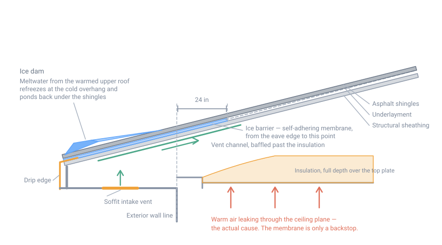

# Roofing and Weatherproofing

## Summary

A building envelope has one job: keep bulk water out of the structure, and let
whatever gets in dry back out. Everything else — insulation, finishes, air
sealing — depends on that job being done. Wet framing rots, wet insulation does
not insulate, and both failures are invisible until they are expensive.

The controlling idea is the **water-management hierarchy**, and roofing and
siding are both applications of it:

1. **Deflect.** Shed as much water as possible before it reaches the assembly —
   slope, overhangs, gutters, flashing.
2. **Drain.** Give whatever gets past the first layer a clear downhill path back
   out — a drainage plane, lapped shingle-fashion, with a gap where practical.
3. **Dry.** Let the residue evaporate, by ventilation or vapor-open materials.

A roof that relies on sealant to stay watertight has skipped step one. Sealant
is a supplement to a lapped, gravity-drained assembly, never a substitute for
it, and its service life is a fraction of the roof's.

In the Northeast the dominant failure is not rain. It is **ice damming**, and
it is a heat problem wearing a water problem's clothes.

## Slope decides the system

Every roof covering has a minimum slope below which it is not a roof but a
gamble. Slope is expressed as units of rise per 12 units of horizontal run.

| Covering | Minimum slope | Note |
|---|---|---|
| Asphalt shingles | 4:12 | Single-layer underlayment |
| Asphalt shingles | 2:12 | Absolute minimum; **double underlayment required** |
| Wood shingles | 3:12 | |
| Wood shakes | 4:12 | |
| Metal shingles | 3:12 | |
| Lapped metal panel, no lap sealant | 3:12 | |
| Lapped metal panel, with lap sealant | 1/2:12 | |
| Standing-seam metal panel | 1/4:12 | |
| Mineral-surfaced roll roofing | 1:12 | |
| Built-up, modified bitumen, single-ply membrane | 1/4:12 | Slope for drainage |

Two practical consequences in snow country:

- **Steeper is better than the minimum.** A steep roof sheds snow, dries faster,
  and needs a narrower band of eave protection because water backing up behind a
  given height of ice travels a shorter distance up the slope.
- **A low-slope roof is a membrane roof.** Below 2:12, shingles of any kind are
  the wrong product. Use a real membrane — EPDM, TPO, or modified bitumen — with
  a positive slope to a drain or edge.

## The assembly, from the deck up

A sloped roof is a stack of layers, each lapped over the one below so that water
always moves downhill onto a surface, never into a seam.

1. **Structural deck.** Usually 1/2 or 5/8 in plywood or OSB over rafters or
   trusses. See [Framing and Structural Basics](30-framing.md) for span, nailing,
   and the 2021 change to field nailing.
2. **Ice barrier** at the eaves, and anywhere else water can back up.
3. **Underlayment** over the rest of the deck, lapped shingle-fashion.
4. **Drip edge** at eaves and rakes.
5. **Flashing** at every penetration, valley, and wall intersection.
6. **Covering** — shingles, panels, shakes, membrane.

The order matters more than the materials. Most roof leaks are not failures of
the covering; they are failures at a transition, installed in the wrong
sequence.

## Ice dams

This is the Northeast's signature roof failure, and it deserves the space.

### What actually happens

An ice dam forms when the upper part of a roof is warm enough to melt snow and
the lower part is not. Meltwater runs down under the snowpack, reaches the cold
overhang — which has no heated space beneath it — and refreezes. The ridge of
ice grows, ponds the meltwater behind it, and that standing water works back up
under the shingles, which are lapped to shed running water, not to resist
hydrostatic pressure.

The roof leaks in the middle of winter, with no rain.

The causes, per Building Science Digest 135, are all ways of creating that
temperature difference:

- **Insufficient insulation or thermal bridging.** Note that snow itself
  insulates: the deeper the snowpack, the warmer the roof-to-snow interface
  gets for the same amount of insulation below. Compressed insulation at the
  truss heel, right at the eave, is the classic weak point.
- **Air leakage into the attic.** Warm indoor air bypasses the insulation
  entirely. Plumbing stacks, recessed lights, chimney chases, attic hatches, and
  unsealed top plates are the usual paths. This is the most common and most
  damaging cause, and it also condenses moisture on the underside of the
  sheathing.
- **Heat sources in the attic** — ducts, hot water piping. Ducts in an unheated
  attic are bad practice for several reasons and this is one.
- **Uneven snow cover plus sun.** Exposed shingles or metal can run 70 °F above
  ambient air temperature. Wind scours the ridge bare, the sun heats it, and it
  melts snow lower down. **This happens on correctly built roofs**, which is why
  eave membrane is a backstop rather than an admission of failure.

### What to do about it

In order of effectiveness:

1. **Air seal the ceiling plane.** Nothing else on this list pays as well. Do it
   before insulating, from the attic side, with foam and caulk at every
   penetration.
2. **Insulate adequately, especially at the eave.** BSD-135 recommends a minimum
   of **R-30 below a ventilated attic, R-35 below a ventilated cathedral
   ceiling, and R-40 below an unventilated cathedral ceiling**, increased for
   DOE Zone 6 and colder — which is most of New Hampshire. Raised-heel
   ("energy heel") trusses exist to get full insulation depth over the top plate
   where a standard truss pinches it to nothing.
3. **Ventilate** — but only as a supplement. Ventilation removes a little heat.
   It cannot offset gross air leakage or missing insulation, and adding vents to
   a leaky attic can make matters worse by giving the leaking air an easier path.
4. **Install eave membrane** as backup against the solar-melt case you cannot
   design out.

!!! warning "Heat cable is not a fix"
    Electric heat cable at the eaves manages the symptom, consumes power
    continuously through the season, and fails exactly when a winter storm takes
    the grid down. Treat it as triage on a building you cannot yet air-seal, not
    as a design decision.

### The ice barrier requirement

Where there is a history of ice forming along the eaves, the code requires an
**ice barrier**: two layers of underlayment cemented together, or a
self-adhering polymer-modified bitumen sheet ("ice and water shield"), extending
from the lowest edge of the roof to a point **not less than 24 inches inside the
exterior wall line** of the building.

This applies to asphalt shingles, metal roof shingles, mineral-surfaced roll
roofing, slate and slate-type shingles, and wood shingles and shakes. Detached
accessory structures with no conditioned floor area are exempt.

Two notes on the detail:

- **24 inches inside the wall line is a minimum, measured from the wall, not
  from the eave.** On a building with a deep overhang and a shallow pitch, that
  can mean two or three courses of membrane. Measure it; do not assume one roll
  width covers it.
- The 2021 and earlier codes carried an additional requirement for roofs of 8:12
  and steeper — the barrier also to extend at least 36 inches measured along the
  slope. **The 2024 IRC removed that provision.** Which applies to you depends
  on the code edition your jurisdiction has adopted, so ask.

{ width="860" }

*The membrane is the backstop, not the fix. Air sealing the ceiling plane and
carrying insulation at full depth over the top plate are what stop the melting
in the first place. Not to scale; the layers are exaggerated.*

Building science gives a design rule that is more useful than either number:
the membrane should extend high enough to resist **6 to 8 inches of standing
water measured above the edge of the wall insulation below**. Work that out
geometrically for your pitch. Shallow roofs need much wider bands than steep
ones.

## Underlayment

Underlayment is the secondary drainage plane — the layer that keeps the deck dry
during construction and after the covering leaks, which it eventually will.

- **Slopes 4:12 and greater:** one layer, lapped 2 in horizontally, starting at
  the eave and working up.
- **Slopes 2:12 to 4:12:** two layers. Start with a 19 in starter strip at the
  eave, then full-width sheets lapped 19 in, so every point on the deck is
  covered twice.
- Synthetic underlayments are lighter, tear-resistant, and far safer to walk on
  than felt when wet. They are also more vapor-closed than #15 felt, which
  matters if the roof assembly needs to dry upward.
- **Do not leave underlayment exposed over a winter.** UV and flapping destroy
  it, and a roof "dried in" in November and covered in April frequently is not.

## Drip edge

Drip edge is a small piece of metal that prevents a large amount of rot. It
carries water off the edge of the deck and away from the fascia instead of
letting it wick back underneath by surface tension.

The code requirements are specific, and the sequencing is the part people get
wrong:

- Required at **both eaves and rake edges**.
- Extends **not less than 1/4 in below the roof sheathing** and back up onto the
  deck **not less than 2 in**.
- Adjacent pieces lapped **not less than 2 in**.
- Fastened to the deck at **not more than 12 in on center**.
- **At the eave, underlayment goes over the drip edge. At the rake, underlayment
  goes under the drip edge.**

That last rule confuses everyone once. The logic is gravity: at the eave, water
on the underlayment must be able to run out onto the metal. At the rake, water
runs sideways off the metal and must not be able to get behind it.

## Flashing

Flashing is where roofs leak. Every one of these is a shingle-fashion lap, not a
caulk joint.

**Step flashing** at a roof-to-wall intersection: one L-shaped piece per course
of shingles, each lapped over the one below, each woven into the course as it is
laid. A single long strip of metal run up the wall — "continuous" or "pan"
flashing — is a guaranteed failure on a shingle roof, because water that gets
under any course has no way back out.

**Kick-out flashing** where a roof edge dies into a wall that continues past it.
Without it, the entire roof's runoff pours into the wall cavity at that point.
This one detail rots more sidewalls than any other single omission, and it is
cheap to add and nearly impossible to retrofit.

**Valley flashing**, either open (exposed metal, best in snow country — it sheds
ice and debris) or closed/woven (shingles carried across). Open valleys with a
membrane underlayment beneath are the durable choice here.

**Counterflashing** at masonry chimneys: base flashing on the roof, separate
counterflashing let into a mortar joint and lapped over the base. Two pieces,
because the chimney and the roof move independently. A chimney also needs a
**cricket** on its uphill side once it gets wide, to split the water and keep
snow and ice from piling against it.

**Vent and pipe penetrations** take a one-piece boot with an integral flange,
lapped over the underlayment below and under the shingles above. The rubber
collar on a standard plumbing vent boot is the part that fails first — inspect
it at about fifteen years.

## Asphalt shingles

The default covering, and the one most likely to be installed by the building's
owner.

- **Fasteners:** galvanized steel, stainless, aluminum, or copper roofing nails,
  minimum 12-gauge shank, minimum 3/8 in diameter head, long enough to penetrate
  through the roofing and **not less than 3/4 in into the sheathing**, or through
  the sheathing where it is thinner than that.
- **Four nails per strip shingle** minimum; **six** in high-wind areas or where
  the manufacturer requires it. Most manufacturers require six above a stated
  design wind speed, and warranty claims turn on it.
- **Nail placement is the most common defect.** Nails must land in the
  manufacturer's nail zone, which also catches the top edge of the course below.
  High-nailed shingles hold on one layer instead of two, and blow off.
- **Do not overdrive.** A nail head that cuts the mat provides no holding power
  and makes a hole.
- **Starter course** at the eave, adhesive strip toward the edge, so the first
  visible course has something to seal to.
- The self-sealing strip needs **warm weather** to bond. Shingles laid in
  November may not seal until spring, and can blow off in the meantime; in cold
  weather, hand-seal with dabs of approved asphalt cement.

## Metal roofing

Worth the premium in this climate. Snow sheds, ice dams form less readily, and
service life is measured in decades rather than years.

- **Standing seam** conceals its fasteners and allows the panel to move with
  temperature; exposed-fastener panels are cheaper and rely on hundreds of
  neoprene washers, all of which age.
- Metal moves a lot thermally. Panels need to be fastened in a way that allows
  it — clips rather than face screws on long runs.
- **Plan for the snow that will slide off**, which arrives all at once in a
  slab. Keep it off entries, meter sets, vent terminations, and anywhere people
  walk. Snow guards hold it on the roof instead, at the cost of reintroducing
  the eave ice problem.
- Metal over an unvented, poorly insulated roof still ice dams. The covering is
  not the fix; the heat flow is.

## Wood shingles and shakes

Relevant here because they can be made on site from local timber with hand
tools, which no other modern covering can claim.

- **Shingles** are sawn and relatively flat; **shakes** are split and irregular.
  Split shakes follow the grain, so they shed water along the fiber and last
  longer than sawn stock of the same species.
- Traditional species: eastern white cedar in New England, northern white cedar,
  or — historically and effectively — riven white oak or chestnut.
- Split with a **froe and mallet** from clear, straight-grained bolts, working
  radially from a quartered round so each shake is close to quartersawn.
- Lay over **spaced sheathing** (skip sheathing) rather than solid deck, so the
  underside can dry. This is a rare case where a vented cavity under the covering
  is essential, not optional.
- Exposure is roughly one-third of the shingle length, giving three layers at
  every point.
- Where wood shingles or shakes are used over an unvented roof assembly, the
  code requires a **minimum 1/4 in vented airspace** between the shakes and the
  underlayment.
- Fasten with **hot-dip galvanized, stainless, or copper** nails only. Cedar's
  extractives are acidic and will destroy plain steel.

## Ventilation

### Vented assemblies

The default. The minimum net free ventilating area is **1/150 of the area of the
vented space**.

That drops to **1/300** only if both of the following are true:

1. In Climate Zones 6, 7, and 8, a Class I or II vapor retarder is installed on
   the warm-in-winter side of the ceiling; **and**
2. Between 40% and 50% of the required ventilating area is provided by
   ventilators in the upper portion of the space, located not more than 3 ft
   below the ridge.

1/300 is an exception you earn, not the baseline — and it is routinely quoted as
if it were the rule.

Practically: continuous soffit intake plus continuous ridge exhaust, with
baffles at every rafter bay keeping the insulation from blocking the intake.
Intake area should equal or exceed exhaust area. A ridge vent with no soffit
intake will pull its makeup air from inside the house, through the ceiling
leaks, which is precisely the mechanism you are trying to stop.

### Unvented assemblies

Permitted, and often the better answer for a cathedral ceiling, but the
condensation rules are strict. The sheathing must be kept warm enough that
indoor moisture cannot condense on it.

Minimum rigid board or air-impermeable insulation R-value for condensation
control, from IRC Table R806.5:

| Climate zone | Minimum R-value |
|---|---|
| 2B and 3B, tile roof only | none required |
| 1, 2A, 2B, 3A, 3B, 3C | R-5 |
| 4C | R-10 |
| 4A, 4B | R-15 |
| 5 | R-20 |
| **6** | **R-25** |
| 7 | R-30 |
| 8 | R-35 |

New Hampshire is Climate Zone 6 (Zone 5 in the southeastern corner), so an
unvented roof here needs **R-25 above the sheathing**, or all air-impermeable
insulation in direct contact with its underside. That is roughly 5 in of
polyiso or 6 in of EPS — a real construction decision, not a detail.

Other conditions: the unvented space must be entirely within the thermal
envelope, no Class I vapor retarder on the attic-floor side, and in Zones 5–8
any air-impermeable insulation must itself be a Class II vapor retarder or be
covered by one.

!!! danger "Do not half-build an unvented roof"
    Filling rafter bays with fiberglass and omitting the exterior rigid
    insulation produces a cold, vapor-loaded sheathing surface with no path to
    dry. It rots from the inside, quietly, over a few winters. Either vent the
    assembly properly or insulate above the deck properly.

## Weatherproofing the walls

The same hierarchy, turned vertical.

**Water-resistive barrier (WRB).** Not fewer than one layer of WRB over the
studs or sheathing of all exterior walls, continuous behind the cladding. The
WRB is the drainage plane — the surface water actually runs down. Lap it
shingle-fashion, upper over lower, always.

**Flashing.** Corrosion-resistant flashing applied shingle-fashion at every
opening and transition, so water is directed out to the face of the cladding or
onto the WRB. Required at window and door heads and sills, at the intersection
of chimneys and walls, at roof-to-wall intersections, at deck ledgers, and at
the bottom of walls.

The sequence at a window is the part to get right: sill pan first (sloped or with
end dams), then the window, then jamb flashing over the window flange, then head
flashing over that, then the WRB lapped over the head flashing. Every layer laps
over the one below. A window taped watertight on all four sides traps whatever
gets in.

**Rainscreen.** A drainage gap between cladding and WRB — furring strips, a
drainage mat, or a manufactured product — lets water drain and the back of the
siding dry. The code requires a drainage space in specific cases, principally
behind stucco and adhered masonry veneer, and the required dimension and the
sections that set it vary between code editions and between the IRC and IBC.
Sources on the exact requirement contradict each other; confirm the section your
jurisdiction has adopted.

Regardless of what is required, a gap of roughly 3/8 in behind wood or
fiber-cement siding is a cheap upgrade with a large effect on paint life and rot
resistance in this climate. Back-primed siding over a vented gap is the durable
assembly.

**Deck ledgers** deserve a specific warning. A ledger bolted flat to a wall with
no flashing is the most common serious rot detail in American residential
construction, and the failures are structural, not cosmetic. Flash it, or
free-stand the deck.

## Without modern materials

If self-adhering membrane and housewrap are not available:

- **Slope harder and overhang further.** Both were the historical answer and
  both still work. A 12:12 roof with a 24 in overhang is forgiving of an
  imperfect covering in a way that a 4:12 roof with a 6 in overhang never is.
- **Split shakes over spaced sheathing** need no underlayment at all if the
  pitch is steep and the exposure short. This is a several-hundred-year-old
  assembly.
- **Standing-seam or soldered-seam metal** in copper or terne has been made by
  hand for centuries; the seams, not sealants, make it watertight.
- **Board-and-batten or clapboard over an air gap** on the walls, back-primed
  with whatever oil or paint is on hand.
- The permanent principle: **lap everything downhill, and give every layer a
  path to dry.** Materials change; that does not.

## Safety

Roofing is the most dangerous work in this section. Falls are the leading cause
of work-related death among residential construction workers.

- OSHA requires fall protection for construction work **6 feet or more above a
  lower level** — guardrails, safety nets, or a personal fall arrest system.
  Residential construction has been enforced under the general rule since 2011.
- A **personal fall arrest system** needs an anchor rated for the job, and it
  must be rigged so the fall distance is actually arrested before you reach the
  ground or the scaffold below. An unattached harness is decoration.
- **Roof jacks and planks** are the practical working platform on a steep roof.
  Use them rather than relying on footing.
- **Ladders** extend at least 3 ft above the landing, are set at about a 4:1
  ratio, and are tied off at the top. Getting on and off the ladder at the eave
  is the moment most falls happen.
- **Frost, dew, and morning shade** make any roof lethal. Synthetic underlayment
  and metal panels are slick even dry.
- **Never work near power lines** with metal panels, ladders, or gutters. Panels
  catch wind like sails.
- **Nail guns** cause a large share of roofing injuries; sequential-trip triggers
  roughly halve the rate compared to contact-trip.
- **Heat.** A dark roof in July runs far above air temperature. Start early.

## Common failure modes

| Symptom | Likely cause |
|---|---|
| Winter leak at exterior walls, no leak in rain | Ice dam — air leakage and insulation at the ceiling plane, not a roofing defect |
| Rotted sheathing along the eave, shingles cupping | Missing or too-narrow ice barrier, or no drip edge |
| Rotted sidewall below a roof-wall intersection | Missing kick-out flashing |
| Leak at a chimney after a few years | Continuous flashing instead of step plus counterflashing, or reliance on sealant |
| Shingles blown off in strips | High nailing, overdriven nails, or four nails where six were required |
| Wet insulation and black sheathing in a cathedral ceiling | Unvented assembly built without the R-value above the deck |
| Frost on the underside of roof sheathing each winter | Attic bypasses; the ventilation is not the problem |
| Ridge vent installed, attic still hot and damp | No soffit intake, or baffles omitted and insulation blocking it |
| Peeling paint on siding, rot at butt joints | No rainscreen gap, siding not back-primed |
| Stains at the rake edge | Underlayment run over the rake drip edge instead of under it |

## Regional assumptions

This page assumes the northeastern United States, New Hampshire in particular:
Climate Zone 6 for most of the state, heavy ground snow load, a long freeze-thaw
season, and ice damming as the governing roof risk. In a mild climate the same
roof would be built with far less attention to the eave and far more to wind.

Snow load, wind speed, and the "history of ice forming along the eaves"
determination are all set locally. Get them from the building department.

## Sources

- [2021 IRC R905.1.2, Ice barriers](https://codes.iccsafe.org/s/IRC2021P2/part-iii-building-planning-and-construction/IRC2021P2-Pt03-Ch09-SecR905.1.2) and [2024 IRC R905.1.2](https://codes.iccsafe.org/s/IRC2024P2/chapter-9-roof-assemblies/IRC2024P2-Pt03-Ch09-SecR905.1.2) — 24 in inside the exterior wall line, covered materials, accessory-structure exception, and the removal of the 8:12 provision in 2024
- [John Straube, *Building Science Digest 135: Ice Dams*](https://buildingscience.com/documents/digests/bsd-135-ice-dams) ([PDF](https://buildingscience.com/sites/default/files/migrate/pdf/BSD-135_Ice%20Dams.pdf)) — causes of differential roof temperature, R-30/R-35/R-40 recommendations, the 70 °F solar gain figure, and the 6–8 in standing-water membrane rule
- [Building America Solution Center, *Attic Air Sealing, Insulating, and Ventilating for Ice Dam Prevention*](https://basc.pnnl.gov/information/attic-air-sealing-insulating-and-ventilating-ice-dam-prevention) — air sealing before insulation, bypass locations
- [2024 IRC R905, Requirements for roof coverings](https://www.jaspector.com/codes/irc-2024/ch09-roof-assemblies/roof-slope-requirements-irc-2024/) — minimum slope by covering
- [2021 IRC R905.10.2, Metal roof panel slope](https://codes.iccsafe.org/s/IRC2021P3/chapter-9-roof-assemblies/IRC2021P3-Pt03-Ch09-SecR905.10.2) — 3:12 lapped, 1/2:12 with lap sealant, 1/4:12 standing seam
- [2021 IRC R905.2.8.5, Drip edge](https://codes.iccsafe.org/s/IRC2021P2/chapter-9-roof-assemblies/IRC2021P2-Pt03-Ch09-SecR905.2.8.5) and [JLC, *Drip Edge and the IRC*](https://www.jlconline.com/how-to/framing/drip-edge-and-the-irc_o/) — dimensions, fastening, and the eave-over / rake-under underlayment sequence
- [2015 IRC R905.2.5, Fasteners](https://codes.iccsafe.org/s/IRC2015NY/chapter-9-roof-assemblies/IRC2015-Pt03-Ch09-SecR905.2.5) — 12-gauge shank, 3/8 in head, 3/4 in penetration
- [IRC R905.2.6, Attachment](https://www.jaspector.com/codes/irc-2018/ch09-roof-assemblies/asphalt-shingle-fastening-code-irc-2018/) — four nails per strip shingle, six in high wind
- [2021 IRC R806.2, Minimum vent area](https://codes.iccsafe.org/s/IRC2021P2/chapter-8-roof-ceiling-construction/IRC2021P2-Pt03-Ch08-SecR806.2) — the 1/150 baseline and the two conditions for 1/300
- [IRC R806.5 and Table R806.5, Unvented attic and unvented enclosed rafter assemblies](https://huntsmanbuildingsolutions.com/en-US/sites/en_us/files/2019-10/2015-IRC-R806.5.pdf) — full conditions and the condensation-control R-values by climate zone (Zone 6 = R-25)
- [2024 IRC R703.2, Water-resistive barrier](https://codes.iccsafe.org/s/IRC2024P2/part-iii-building-planning-and-construction/IRC2024P2-Pt03-Ch07-SecR703.2) and [IRC R703.4, Flashing](https://www.jaspector.com/codes/irc-2018/ch07-wall-covering/exterior-wall-flashing-required-irc-2018/) — continuous drainage plane, shingle-fashion flashing, required flashing locations
- [GreenBuildingAdvisor, *Water-Resistive Barriers and the Building Code*](https://www.greenbuildingadvisor.com/article/water-resistive-barriers-and-the-building-code) — how WRB requirements are written and where the drainage-gap provisions actually apply
- [OSHA, *Fall Protection in Residential Construction*](https://www.osha.gov/residential-fall-protection/guidance) and [29 CFR 1926.501, Duty to have fall protection](https://www.osha.gov/laws-regs/regulations/standardnumber/1926/1926.501) — the 6 ft trigger and acceptable systems
- [NIOSH / OSHA, *Nail Gun Safety: A Guide for Construction Contractors*](https://www.osha.gov/sites/default/files/publications/NailgunFinal_508_02_optimized.pdf) — trigger type and injury rate
