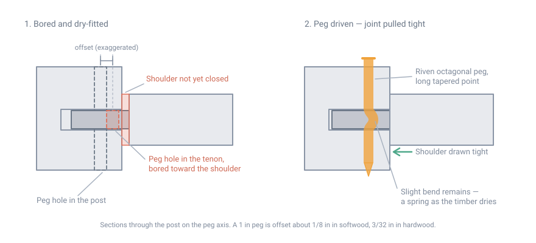

# Joinery and Fastening Without Power Tools

## Summary

There are two ways to hold a wooden building together. **Joinery** shapes the
wood so the members hold each other, using fasteners only to keep the joint
closed. **Fastening** relies on the metal — nails, screws, bolts, framing
connectors — to carry the load across a butt joint.

Modern light framing is almost entirely the second. Every structure built in
North America before roughly 1830 was almost entirely the first, and the
surviving examples are three centuries old. The difference is not
craftsmanship-for-its-own-sake: a timber frame is what you can build with
material you cut yourself, using tools you can sharpen, without a nail
manufacturer.

This page covers the joints, the layout methods, the hand tools, and — because
they are not really separable — the physics of nails and pegs. It assumes you
may have no electricity, and that the timber may be green.

The single idea that governs all of it: **wood moves across the grain and does
not move along it.** Every durable joint either accommodates that movement or
is arranged so the movement does not matter.

## Wood movement

Wood exchanges moisture with the air until it reaches equilibrium. It shrinks
and swells as it does, and it does so very unequally by direction.

- **Fiber saturation point** is about **30% moisture content**. Above that, water
  sits free in the cell cavities and the wood does not change dimension. Below
  it, every change in moisture content changes the size of the piece.
- **Tangential shrinkage** (around the rings) is roughly **twice radial
  shrinkage** (across them). For white oak, green to ovendry: 10.5% tangential,
  5.6% radial. For white ash, 7.8% and 4.9%.
- **Longitudinal shrinkage** (along the grain) is **0.1% to 0.2%** — effectively
  zero. The exceptions are reaction wood and juvenile wood near the pith, which
  can shrink 2% lengthwise and will bow a member badly. Avoid both.

Three consequences that decide joint design:

1. **A timber's length is stable; its width and thickness are not.** Joints are
   laid out from a reference face and arranged so shrinkage closes them rather
   than opening them.
2. **Two pieces pinned across the width of a wide board will split it.** The
   board shrinks, the pins do not move, something has to give. This is why
   traditional joinery elongates holes, uses single pins, or lets panels float
   in grooves.
3. **A frame assembled green will loosen as it dries.** Drawboring exists
   largely to defeat this: the bent peg acts as a spring that keeps taking up
   the slack.

Green timber is far easier to work with edge tools and splits more cleanly, and
historically most frames were cut green and raised within weeks. That is a
legitimate choice, but it must be made deliberately, with the shrinkage designed
into the joints.

## The hand tool kit

| Purpose | Tools |
|---|---|
| Layout | Framing square, try square, bevel gauge, marking or mortise gauge, scratch awl, chalk line, plumb bob, story pole |
| Boring | Brace and auger bits (1 in to 2 in), T-auger, boring machine (a pedal-and-crank mortise borer — a large advantage if one can be had) |
| Mortising | Framing chisels (1½ in and 2 in), corner chisel, slick (a long paring chisel used two-handed, never struck), mallet |
| Sawing | Crosscut and rip handsaws, frame saw, backsaw, two-man crosscut for timbers |
| Shaping | Broadaxe and adze for hewing, drawknife, spokeshave, jack and jointer planes |
| Splitting | Froe and club, wedges, maul, gluts |
| Assembly | Commander (a large wooden mallet), cant hook or peavey, come-along, pike poles |

Sharpening is not an accessory skill; it is the skill. A dull framing chisel
cannot be driven accurately, and inaccuracy in mortising is what makes joints
loose. Budget a coarse stone, a fine stone, and a strop, and expect to use them
every hour of cutting.

## Layout systems

How you transfer the design to the timbers determines how much fitting the
raising day requires.

**Scribe rule.** Every joint is laid out against its actual mating timber. The
pieces are laid out on a level framing floor, the joint is marked from the real
geometry, and the parts fit *that partner only*. It handles irregular,
hand-hewn, or round timber — nothing needs to be uniform. It is also slow,
requires assembling everything once on the ground, and every piece must be
marked so it returns to its exact place. Marriage marks (matched Roman numerals
chiseled into both halves of each joint) exist for this reason and are the
dating fingerprint of a scribed frame.

**Square rule.** The later American system, dominant after about 1800. It
assumes that inside every rough timber there is a perfect smaller timber, and
reduces the timber to that ideal dimension **only at the joints** — a housing.
Every joint is then laid out with a framing square from the reference faces to
standard dimensions. Parts become interchangeable, layout can happen
independently on each stick, and the frame goes together without trial assembly.
This is the system to learn if the timbers are sawn and reasonably true.

**Mill rule** is square rule's degenerate case: timbers dimensioned accurately
enough that no housing is needed.

Whichever system, pick a **face side** — the best face — on every timber, mark
it, and do all layout and boring from it. The TFEC guidance is explicit that
historical framers laid out and bored with the face side up so that any error in
perpendicularity was minimized where it mattered.

## The joints

| Joint | Where used | Resists |
|---|---|---|
| Mortise and tenon | Post-to-beam, brace-to-post, the universal frame joint | Compression, shear; tension only if pegged and detailed for it |
| Housed mortise and tenon | Same, where the timber is oversized or bearing matters | Adds a bearing shoulder so the load does not pass through the pegs |
| Through tenon, wedged | Where real tension must be carried | Tension, via wedges driven outside the far face |
| Tusk tenon | Joist into girt without cutting the girt in half | Shear, with the tusk bearing below the mortise |
| Dovetail lap | Joists to plates, tie beams | Tension in one direction, plus positive location |
| Half lap | Crossing members, plates at corners | Location and shear; weak in tension |
| Bridle joint (open mortise) | Post to plate at a corner | Simple, strong in compression, easy to cut |
| Scarf joint | End-to-end lengthening of a timber | Depends entirely on the scarf; see below |
| Birdsmouth | Rafter to plate | Bearing and thrust transfer |
| Lapped dovetail / anchor beam | Heavy tying joints in Dutch barns | Tension |

### Mortise and tenon proportions

- **Tenon thickness** is conventionally about one third the timber thickness —
  in practice, whatever matches the width of the framing chisel being used.
  Historic frames commonly used 1½ in or 2 in tenons because that was the chisel
  and auger size on hand.
- **Tenon length** for a pegged joint should be **at least twice its thickness**:
  a 2 in tenon wants to be 4 in long. Minimum-length tenons of this kind hold the
  joint closed; they are not designed to carry tension.
- **Relish** — the wood between the peg hole and the end of the tenon — is what
  fails when a tension joint is overloaded, and it fails in shear, suddenly, and
  invisibly inside the mortise. **For a joint loaded in tension, never use an end
  distance less than four peg diameters.** For compression-only joints, relish
  failure is of no structural consequence, which is why old frames get away with
  short tenons and large drawbores.
- **Peg hole placement on the mortise** was traditionally set with the framing
  square: centers 1½ in or 2 in from the face of the mortise — the width of the
  square's tongue or blade — and the same distance from each end.
- Tenons under real tension are usually **through tenons**, often wedged, and
  sometimes dovetailed.

## Drawboring

Drawboring — also called pull boring or draw pinning — is the deliberate
offsetting of the peg hole in the tenon toward the shoulder, so that driving a
tapered peg pulls the joint closed and holds it closed. It is centuries old,
evidenced in English work by the 13th century, and it is the difference between
a frame that stays tight and one that does not.

It is also *faster* than boring straight through an assembled joint, because it
removes the need to haul joints closed with cable pullers on raising day.

{ width="860" }

*The offset is what does the work: the peg cannot follow two misaligned holes,
so the tapered point drags the tenon home. Offset shown exaggerated.*

### How much offset

For a **1 in diameter peg**: about **1/8 in in softwood frames, 3/32 in in
hardwood frames**. Scale roughly proportionally for other peg sizes.

Surviving work shows much larger offsets — a quarter inch on a ¾ in peg in one
documented rafter joint — used successfully in compression-only joints. Do not
imitate that on anything carrying tension.

Two refinements from the historical record:

- **On a brace**, offset along the axis of the brace, so the peg draws the tenon
  both to its shoulder and into the bearing end of the mortise.
- **On joints where two directions matter** — rafters meeting at a ridge, a
  teazle tenon at the top of a jowled post — offset in both directions.
  Offsetting a post-top tenon horizontally anticipates the post's shrinkage and
  helps keep it from splitting.

**Reduce the offset when using turned pegs.** A lathe-turned peg is round and
fills the hole; an octagonal riven peg touches only at its eight arrises and has
clearance to bend into.

### Making pegs

Pegs — historically pins, treenails, or trunnels — are riven, not sawn. The
splitting process itself rejects any billet with cross grain, knots, or shake,
which is why a riven peg is stronger than a turned one of the same species.

1. **Choose the species.** Northern red oak, white ash, and hickory are the
   preferred peg woods. For unheated outbuildings or anywhere damp, use rot
   resistant species: white oak, black locust, black cherry.
2. **Cut billets** from clear, straight-grained, lower-trunk stock above the
   butt flare, from a tree that was not leaning — leaning trees contain reaction
   wood that will not cleave straight. Cut them about **4 in longer than the
   thickest timber they must pass through**: a frame of 8×8s wants 12 in pegs.
3. **Rive with a froe** to a square section **slightly under the peg hole
   diameter** — about 15/16 in square for a 1 in hole.
4. **Shave the four arrises off with a drawknife** to make an octagon. Only the
   octagon's points should touch the hole; a little daylight between the flats
   prevents binding.
5. **Taper all eight faces over the last third to half of the length**, to a
   blunt point of ¼ to 3/8 in, ideally as a convex curve like a bullet nose. The
   long gradual taper is what does the drawing; a stubby point will not pull the
   joint.
6. **Season to about 15% moisture content** in an unheated building. Green pegs
   mushroom when driven; bone-dry pegs snap.

### Driving pegs

- Look through the assembled joint first and judge the actual offset. Choose a
  thinner, more pointed peg where the drawbore is large, a fatter one where it is
  small. This is why hand-riven variation is a feature rather than a defect.
- Make sure the point has passed through the tenon and entered the far side of
  the mortise before driving hard. A misaligned peg will cut its own path through
  softwood and ruin the joint.
- A tapered peg generates enormous leverage. You do not need to swing hard.
- **Stop driving when resistance builds. Do not overdrive a peg to make it
  flush** — cut it off instead. Overdriving is how relish gets split.

### What drawboring does and does not do

A drawbored joint carries an initial prestress: the peg is bent, and its shear
force is balanced by the tenon bearing against the mortise cheeks. As the timber
seasons and the peg creeps, that prestress relaxes.

When such a joint is loaded in tension, the pegs feel no additional load until
the applied force exceeds the prestress — at which point the bearing goes to
zero and the pegs carry the full applied load. **Drawboring therefore does not
increase the tension capacity of a joint.** It keeps the joint tight; it does
not make the pegs stronger. Frames that must carry real tension get through
tenons, wedges, or steel.

## Scarf joints

Joining two timbers end to end is the hardest thing in the craft, because the
joint has to transmit whatever the timber transmits without the benefit of
continuous fibers.

- A **half-lap scarf**, pegged, handles compression and bending over a support.
  Put the scarf **over a post**, never in mid-span.
- A **bladed or tabled scarf with wedges** can carry tension, and is the joint
  used in plates that must act continuously.
- A **stop-splayed scarf with under-squinted butts** is the traditional
  tension-capable form, and it is genuinely difficult to cut well.

The honest guidance: scarf joints are the one place where a modern steel
connection is usually the right answer if you have one. If you do not, locate
every scarf over bearing and design the frame so no scarf is in tension.

## Nails and other metal

Metal fasteners are not the enemy of joinery — they are the appropriate solution
for boards, sheathing, and light work. But their behavior is specific and mostly
counterintuitive.

### How a nail holds

For a bright common wire nail in the side grain of seasoned wood, the Forest
Products Laboratory gives maximum withdrawal load as

> *p* = 1,380 × *G*5/2 × *D* × *L*

where *p* is pounds, *G* is specific gravity, *D* is nail diameter in inches,
and *L* is the depth of penetration into the member holding the point.

The practical readings of that equation:

- **Density dominates.** Withdrawal goes with specific gravity to the 5/2 power.
  A nail in oak holds vastly better than the same nail in white pine.
- **Diameter and depth are linear.** Lighter species compensate by taking bigger,
  longer, more numerous nails without splitting — which denser species will not
  tolerate.

### What destroys and what improves holding power

| Condition | Effect on withdrawal resistance |
|---|---|
| Wood cycles through wetting and drying after nailing | Falls to **as low as 25%** of the initial value for smooth shank nails |
| Nail driven into end grain | **50% to 75%** of side-grain value |
| Annular or helical threaded shank, stable moisture | About **double** a smooth nail of the same diameter |
| Annular or helical threaded shank, changing moisture | About **four times** a smooth nail — the big one |
| Clinched (point bent over), dry or green wood | **45% to 170%** more than unclinched |
| Clinched, driven green and then seasoned | **250% to 460%** more than unclinched |
| Clinched across the grain rather than along it | About **20%** more |
| Lead hole about 90% of shank diameter | Somewhat greater, and much less splitting |

Two practical conclusions. First, **smooth nails in wood that gets wet and dries
are a bad long-term bet** — which is exactly the condition of an outbuilding, a
deck, or sheathing under an imperfect roof. Ring-shank nails are not a
refinement; in that service they are four times the fastener.

Second, **clinching is the cheapest strength available to someone with a hammer
and no hardware.** Bend the protruding point over across the grain. It is why
board-and-batten doors, crates, and barn work were built that way.

### Toe-nailing

Slant-driven nails give stronger and more stable joints than end nailing, and
FPL testing found the maximum strength comes from:

- the largest nail that will not cause excessive splitting;
- an end distance of about **one third the nail's length** from the end of the
  attached member to the point of entry;
- a slope of about **30°** to the attached member;
- burying the full shank without mangling the wood around the head.

### Cut nails

Cut nails — sheared from rolled plate, rectangular in section, tapered on two
faces — were the American standard from roughly 1790 to 1890 and are still
made. They are worth knowing about because they are blacksmith-scale technology
rather than wire-drawing technology.

Driven with the wedge across the grain, a cut nail compresses the fibers rather
than tearing them and develops good holding power in the process; driven the
wrong way round, it splits. Pre-1830 nails were headed by hand and the head
orientation is a dating clue in old buildings.

Wrought nails — hand-forged, square, and soft enough to clinch reliably —
predate those, and are the version a blacksmith can make from bar stock with no
industrial plant at all.

### Screws, bolts, and drift pins

- **Wood screws** develop much higher withdrawal than nails and can be removed,
  but they must be turned into a proper pilot hole — driving a screw like a nail
  destroys the thread's grip and often the screw.
- **Bolts** work in double shear through both members and are the reliable choice
  for heavy connections. They require the hole to be accurate and the washers to
  be generous, or the bolt crushes into the wood.
- **Drift pins** — plain steel rod driven into an undersized hole — are the
  timber-framing equivalent of a large nail and hold well in heavy stock.
- Remember corrosion: in pressure-treated wood, and in oak, use hot-dip
  galvanized or stainless. Oak's tannins will blacken and eat plain steel, and
  the iron stain is permanent.

### Lashing

Where no metal exists at all, lashing (square lashing, diagonal lashing, shear
lashing) makes serviceable light structures — scaffolding, racks, sheds,
bridges. It is not a substitute for structural joinery in a building, because
natural cordage creeps, absorbs water, and rots, but it is the correct answer
for anything temporary and for anything that must be built without cutting
joints. Lashings need to be inspected and re-tensioned; treat them as
maintenance items, not connections.

## Working sequence

1. **Select and sort timber.** Face side chosen and marked on every stick,
   crown noted, reaction wood rejected.
2. **Lay out** by square rule or scribe rule, all from the face side.
3. **Bore first, then chop.** Remove the bulk of every mortise with an auger,
   then pare the walls square with a chisel and slick. Chopping a mortise out
   entirely with a chisel is a great deal of unnecessary work.
4. **Cut tenons** with a saw to the shoulder line, then pare to fit.
5. **Test fit** each joint, mark the mating parts, and bore the drawbore offset.
6. **Assemble into bents** on the deck, pegs started but not driven home.
7. **Raise**, brace temporarily, plumb the frame, then drive the pegs.

Plumb and square the frame *before* driving pegs home. A drawbored frame is very
difficult to adjust afterward, which is the whole point of it.

## Safety

- **Edge tools are the hazard.** A framing chisel or slick driven into your own
  supporting hand is the characteristic injury. Keep both hands behind the edge,
  clamp or block the work, and never pare toward yourself. Sharp tools are safer
  than dull ones — a dull tool needs force, and force is what makes it skid.
- **Sheath and store edges.** A slick left edge-up on a framing floor is a trap.
- **Riving and splitting** throws pieces and can trap a froe under tension.
  Wedge from the end, stand out of the plane of the split, and expect green
  hardwood to move unpredictably.
- **Raising is the dangerous day.** Timbers weigh hundreds of pounds and a bent
  going over is unstoppable. Use adequate temporary bracing at every stage, keep
  everyone out from under, agree on who calls the lift, and never work beneath a
  suspended timber.
- **Hand-loading heavy timber** causes the durable injuries. Use a cant hook,
  rollers, ramps, and more people.
- **Overhead hazards** during raising: dropped tools, pegs, and mallets. Hard
  hats are not optional on a raising.

## Common failure modes

| Symptom | Likely cause |
|---|---|
| Joints visibly open a year after raising | Frame not drawbored, or assembled green with no allowance for shrinkage |
| Split running out of the end of a tenon inside the mortise | Relish failure — peg too close to the tenon end in a tension joint |
| Peg sheared or crushed at the joint line | Joint loaded in tension that was detailed for compression only |
| Split radiating from a peg in a wide member | Pinned across the width with no allowance for cross-grain shrinkage |
| Post split lengthwise at a top joint | Shrinkage restrained by pegs; no horizontal offset allowance |
| Mortise face blown out | Tension overload — generally fails before a riven peg breaks |
| Sheathing nails backing out over years | Smooth shank nails in an assembly that wets and dries |
| Timbers bowed and twisted after seasoning | Reaction or juvenile wood, which shrinks lengthwise up to 2% |
| Black staining and corroded fasteners in oak | Plain steel in a tannin-rich species |

## Regional assumptions

This page assumes the northeastern United States, where the surviving building
tradition is the English-derived braced timber frame, in eastern white pine,
spruce, hemlock, and oak, with riven oak and ash pegs. The joints are
essentially the same across the tradition; the species and their working
properties are not. Eastern white pine is forgiving and stable; oak is strong,
heavy, moves a great deal, and eats plain steel.

## Sources

- [Timber Frame Engineering Council, *Timber Design Guide 2020-20: Draw Boring of Pegged Joints*](https://dcstructural.com/wp-content/uploads/2020/09/TFEC-Timber-Design-Guide-20-Draw-Boring-of-Pegged-Joints.pdf) — Sobon and DeStefano; offset amounts by species and peg diameter, tenon length rule, the four-peg-diameter end distance for tension joints, peg riving procedure, species, sizing, tapering, seasoning, and the prestress analysis of drawbored joints in tension
- [TFEC 1-07, *Standard for Design of Timber Frame Structures and Commentary*](http://dcstructural.com/pdfs/technical/2007_standard_for_design_of_timber_frame_structures.pdf) — the engineering standard for traditional joinery, including peg and joint capacities
- [USDA Forest Products Laboratory, *Wood Handbook* (FPL-GTR-190), Chapter 8: Fastenings](https://www.fpl.fs.usda.gov/documnts/fplgtr/fplgtr190/chapter_08.pdf) — the nail withdrawal equation, effect of seasoning and moisture cycling, threaded shank multipliers, end-grain ratio, lead holes, toe-nailing geometry, and clinching data
- [USDA Forest Products Laboratory, *Wood Handbook* (FPL-GTR-190), Chapter 4: Moisture Relations and Physical Properties of Wood](https://www.fpl.fs.usda.gov/documnts/fplgtr/fplgtr190/chapter_04.pdf) — fiber saturation point, Table 4-3 species shrinkage values, tangential ≈ 2 × radial, longitudinal shrinkage of 0.1–0.2% and the 2% exception for reaction and juvenile wood
- [FPL, *Nail-Withdrawal Resistance of American Woods* (FPL-RN-093)](https://www.fpl.fs.usda.gov/documnts/fplrn/fplrn093.pdf) — species-by-species withdrawal data
- [Jack A. Sobon, *Historic American Timber Joinery: A Graphic Guide*, Timber Framers Guild](https://www.tfguild.org/store/historic-american-timber-joinery) — the standard illustrated catalog of American traditional joints, written under a National Park Service / NCPTT grant
- [ASTM D8023, *Standard Specification for Round Wood Dowels (Pegs) for Use in Wood Construction*](https://www.astm.org/d8023-23.html) — the specification manufactured pegs should comply with
- [AWC, *WCD-1: Details for Conventional Wood Frame Construction*](https://awc.org/resources/wcd-1-details-for-conventional-wood-frame-construction/) — conventional nailed framing practice, for comparison with the joined equivalents
