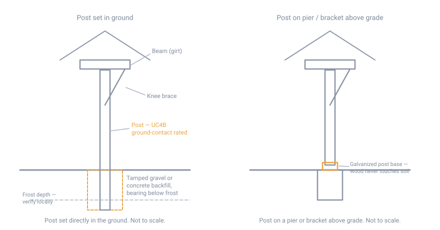
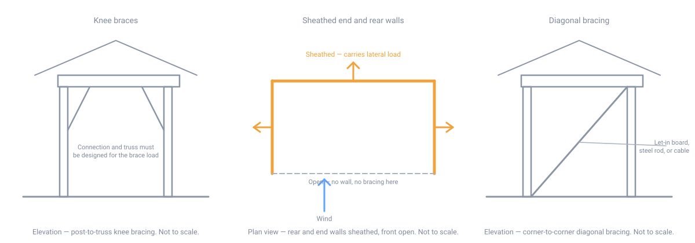

# Sheds and Outbuildings

## Summary

A shed is where the rest of this section comes together on a structure small
enough to build alone, get wrong without ruining a winter, and fix if you do.
This page covers two related but distinct projects.

**A general-purpose shed** — garden shed, workshop, small barn — is a
miniature building: it needs a foundation decision, a frame, a roof, and a
weathertight skin, and every one of those is covered in depth elsewhere in
this section. This page's job for that project is to point at the right
foundation type, the right span table, and the right ice-barrier rule for a
structure this small, not to repeat them.

**A three-sided storage shed** for firewood or machinery is a different
structural animal, not just a smaller building with a wall missing. Removing
one full wall removes the sheathed surface that normally keeps the building
from racking sideways, which is a real structural problem with a real
solution, and it changes the roof's job — an open bay has to shed wind-driven
rain and, in the case of firewood, has to move air through the stack rather
than just keep rain off it. Most of this page is about that second project,
because it is the one where an inexperienced builder's instincts point the
wrong way.

## Permitting and siting

Before anything else, find out which rules actually apply — there are two
separate, easily-confused thresholds, plus zoning.

- **The building-permit exemption** is a floor-area threshold below which no
  permit is required at all. The model International Residential Code exempts
  one-story detached accessory structures — tool and storage sheds,
  playhouses, and similar uses — up to **200 square feet**. This is one of the
  most commonly locally amended sections in the code: many towns cut it to
  **120 square feet**, and some eliminate it for flood zones, historic
  districts, or wildland-urban interface areas. Confirm the number your town
  actually enforces before assuming a project is exempt.
- **The frost-protection exemption is a different threshold entirely, and it
  is larger.** See [Foundations](structure/20-foundations.md)#the-three-ways-to-satisfy-frost):
  a freestanding, light-frame accessory structure up to **600 square feet**
  (400 for other than light-frame), with an eave height of 10 feet or less,
  needs no frost-depth footing at all. A shed can clear the frost exemption at
  a size well above the permit exemption — it is entirely possible to need a
  permit for a structure that still doesn't need a footing below frost. Don't
  assume one threshold implies the other.
- **Zoning setbacks apply independently of both.** A permit-exempt shed still
  has to sit outside the required setback from the property line, and often
  outside a separate, larger setback for anything over a certain height or
  containing power or plumbing. Get the actual setback distances from the
  local zoning office; they are not a building-code number and this page
  cannot print one that is right for your lot.
- **Site it the way you would site a house**, at a smaller scale — see
  [Site Preparation](site-prep/10-site-preparation.md). Keep it clear of the septic
  system and leach field, respect well-separation distances, and put it where
  water drains away from it rather than into it. A shed sited in a wet spot
  rots its sills regardless of how well it is built.
- **Post-frame agricultural buildings** — a true three-sided hay or equipment
  barn built to farm use — often fall outside the IRC's residential scope
  entirely and under a separate agricultural-exemption or state building code
  provision. Whether a given structure counts as "agricultural" for permit
  purposes is a local determination, not a size threshold; ask the building
  department rather than assuming a pole barn is automatically exempt because
  other pole barns in the area are.

## General shed construction

### Foundation

Three realistic options, in increasing order of permanence:

| Type | What it is | Best for |
|---|---|---|
| Skid foundation | Pressure-treated runners (commonly 4×4 or 4×6) laid on a compacted gravel pad, with the floor framed on top | Small, permit-exempt sheds; the default choice, and the reason most sheds never trigger a frost-depth question at all |
| Pier / sonotube | Concrete piers below frost, or bearing on rock — see [Foundations](structure/20-foundations.md)#piers-posts-and-helical-piles) | A larger or heavier shed, or a sloped site where a skid pad isn't practical |
| Monolithic slab | See [the Alaskan slab detail](structure/20-foundations.md)#monolithic-slab-the-alaskan-slab) | A workshop or garage-scale outbuilding wanting a hard floor, where the structure qualifies under the frost-exemption size above |

A skid foundation is not a foundation in the code sense at all — it isn't
attached to the ground and isn't trying to resist frost, it floats on top of
it. That is a feature, not a shortcut: excavate and level a gravel pad (4 to 6
inches of compacted crushed stone is typical), lay the skids across it,
check them for level and for square, and the whole assembly is free to move a
little with frost and settle back without cracking anything, because nothing
is rigidly fixed to the ground. The trade-off is that it does move a little,
which is why it belongs under a small, unheated, code-exempt structure and not
under anything with a rigid finish, plumbing, or a foundation-anchored deck.

### Framing, roofing, and weatherproofing

Nothing about framing a shed is structurally different from framing a house at
the same wall height and roof span — use
[Framing and Structural Basics](structure/30-framing.md)) for the load path, wall
bracing, and header sizing, and
[Material Selection, Dimensions, and Span Tables](70-materials-and-spans.md)
for the actual joist, rafter, and header spans against your local ground snow
load. A small shed frequently qualifies for the lighter end of those
tables — but the ground snow load that drives the rafter table is a town-by-
town number in this region, same as it is for a house, and a shed roof is not
exempt from it.

For the roof itself, see [Roofing and Weatherproofing](structure/40-roofing.md) for
slope-by-covering, underlayment, and flashing. One shed-specific detail worth
knowing from that page: **the code's ice-barrier requirement at the eaves does
not apply to detached accessory structures with no conditioned floor area** —
an unheated shed can skip the ice-and-water shield that a house eave requires,
though there is nothing wrong with installing it anyway on a shed you'd rather
not re-roof in ten years.

Siding and door/window rough openings follow the same water-management
hierarchy — deflect, drain, dry — covered on that same roofing and
weatherproofing page. A shed built without a water-resistive barrier behind
the siding, on the theory that "it's just a shed," rots the same way a house
does; it just takes longer to notice.

## Three-sided storage sheds

A three-sided (open-front) shed is the standard shape for both firewood and
machinery storage: one long wall — usually the rear — and both end walls are
closed, and the front is open for loading, stacking, or driving in. Almost all
of them are built as **post-frame (pole barn) construction** rather than
platform-framed on a continuous foundation, because post-frame goes up fast
at this scale, needs no continuous footing, and puts the structural posts
exactly where the open bay needs clear space.

### Setting the posts

Two ways to hold a post up, with a real durability trade-off between them:

- **Posts set directly in the ground**, backfilled with tamped gravel,
  concrete, or a concrete collar around the base — the traditional pole-barn
  method, and still the cheapest. The post must be rated for **ground
  contact**, and for a structural post that is expensive or disruptive to
  replace, that means going a step beyond the general-purpose ground-contact
  category. AWPA's Use Category system (see the
  [treated-wood table](70-materials-and-spans.md#preservative-treated-wood))
  runs UC4A (general ground contact), **UC4B** (heavy duty — explicitly
  including building poles and other critical, hard-to-replace structural
  members), and UC4C (extreme duty — permanent foundations and pilings).
  **Specify UC4B at minimum for a structural post carrying a roof**, not the
  UC4A rating that is adequate for a fence post. Even at the right use
  category, a buried post is still wood in the ground, and it is the
  building's structure — the part of a pole barn most likely to need
  replacing decades before anything else fails.
- **Posts on a bracket or pier above grade** — a concrete pier or a
  galvanized post base holding the post's end clear of the soil — avoids
  direct wood-to-soil contact entirely, which is the more durable approach
  even though it costs more and is slower to build than digging a hole. Keeping
  wood out of the ground is the same permanent principle stated elsewhere in
  this section for sills and posts generally: species and treatment help, but
  staying dry beats both.

Either way, set the post to bear on undisturbed soil or a footing pad at the
bottom of the hole, not on loose backfill — a post that settles takes the
building's frame out of level with it, and a post that heaves with frost
because it was set on frost-susceptible soil with no footing below frost line
does the same thing in the other direction.

{ width="880" }

### Lateral bracing on the open side — the thing that gets skipped

This is the single most important structural idea on this page. A fully
sheathed wall does double duty: it encloses the building, and it is also the
**braced wall panel** that keeps the whole frame from racking sideways under
wind or an unbalanced load (see
[wall bracing](structure/30-framing.md)#wall-bracing) for how that works on an ordinary
framed wall). An open-front pole barn has no wall on that line at all, which
means the racking resistance that line would have provided has to come from
somewhere else — it does not simply go away as a requirement because there is
no wall to put it in.

The usual sources, alone or combined:

- **Knee braces** from each post up to the truss or roof beam it carries,
  triangulating the post-to-roof connection. Knee braces are the standard
  detail and the one every pole-barn plan shows — but the National Frame
  Building Association's own guidance is blunt about their limits: a knee
  brace helps only if the loads and connections through it are actually
  designed for, with the truss itself built to accept the load the brace
  delivers. A knee brace nailed on as an afterthought, on a truss not designed
  to receive it, is decoration, not a load path.
- **A fully sheathed rear wall and end walls**, carrying the lateral load for
  the whole building on the three lines that do have material to sheathe.
  This is the most reliable answer at small scale and the reason most
  three-sided sheds keep their end walls fully closed rather than partially
  open for extra ventilation — every square foot of closed end wall is doing
  structural work, not just blocking wind.
- **Diagonal bracing** — let-in boards, steel rod, or cable, run corner to
  corner between posts or between posts and girts — is the traditional answer
  for a short, open bay such as a single-bay pavilion or the open side of a
  three-sided shed, and is explicitly called out in agricultural-extension
  guidance as more important, not less, on a short-span open structure.

An inexperienced builder tends to frame a three-sided shed exactly like an
enclosed one with a wall left off, sizing posts and roof members for gravity
load and calling it done. That building stands under its own weight, and
often for several years of ordinary wind, which is exactly what makes the
mistake dangerous: it fails in a wind event, not on the day it's built, and by
then the load path was never there to fail gracefully.

{ width="1200" }

### Roof: pitch, overhang, and uplift

- **A deeper overhang or a steeper pitch than an equivalent enclosed
  building.** Wind-driven rain travels further into an open bay than it does
  into one blocked by a wall, so the roof has to do more of the water-shedding
  work that a fourth wall would otherwise share.
- **Wind uplift is a bigger risk on an open structure than an enclosed one**,
  for a specific mechanical reason: with no wall to block it, wind can get
  underneath the roof deck from the open side and push up on it directly, in
  addition to the suction an enclosed roof already experiences from above. An
  open pole barn or carport failing by having its roof lift off, rather than
  by racking over, is a well-documented failure mode, and the fix is the same
  one framing pages elsewhere in this section already emphasize: a **continuous,
  designed uplift path** — hurricane-tie-grade connectors at every post-to-
  truss connection, carried down through the post to its footing or ground
  anchor — not toe-nails and gravity. This is not a place to under-detail
  because the structure "is just a shed."
- Practical field checks recommended by agricultural-extension inspection
  guidance: there should be **no gap opening up between a post's skirt board
  and the ground** (a sign the post is being pulled upward), and posts set
  directly in the ground should bear in a hole of meaningful depth with the
  soil around it undisturbed and well tamped, not loosely backfilled.

### Firewood storage

- **Leave an air gap**, don't stack tight against the closed rear wall.
  Airflow through the stack is what actually seasons wood; a tight stack
  against a solid wall dries far slower on its shaded, unventilated face.
- **Keep the bottom course off the ground or off a solid slab.** Gravel,
  pallets, or a raised deck of pressure-treated joists let air under the
  lowest layer; wood in direct contact with bare dirt or an unvented slab
  stays damp at the base, rots first, and draws insects. This is the same
  keep-wood-dry principle behind every other durability rule in this section,
  applied to fuel instead of framing.
- **Size the structure in cords.** A cord is 128 cubic feet of stacked wood —
  conventionally 4 ft high by 4 ft deep by 8 ft long, though any stack
  dimensions multiplying out to 128 cubic feet qualify. Air gaps between
  split pieces mean a cord occupies more volume than the solid wood in it, so
  size the bay to the stacked dimension, not to a calculation from board feet
  of solid wood.
- **Orient the open face away from the prevailing winter weather** — in this
  region, generally not the north or northwest side — the same siting logic
  used for the building itself (see
  [Site Preparation](site-prep/10-site-preparation.md)). This is a balance, not an
  absolute: the open face still needs enough sun and wind exposure to season
  wood, so a bay closed up entirely to weather also stops drying the stack.
  For how dry firewood actually needs to be and how long that takes, see
  [Wood Stove Installation and Clearances](../shelter/30-wood-stove-installation-and-clearances.md#creosote-and-chimney-fire-prevention) —
  this page is about building the structure that makes that seasoning
  possible, not about the moisture target itself.

### Machinery storage

- **Size the clear height and door bay to the equipment**, not to a generic
  number — a tractor, a full-size pickup, and a garden tractor or ATV want
  very different bay heights and widths, and equipment varies enormously even
  within one category. Measure the actual machine, including any raised
  attachment (a loader bucket, a snowblower chute) at its highest travel
  position, and add clearance rather than building to the machine's resting
  dimensions.
- **A slab floor is usually worth it under stored machinery**, unlike under
  firewood — it carries concentrated point loads (jack stands, a machine's
  wheels or tracks) better than a gravel pad, and it contains fuel and oil
  drips instead of letting them soak into the ground. Size it as a
  [monolithic slab](structure/20-foundations.md)#monolithic-slab-the-alaskan-slab) if
  the structure qualifies under the frost exception, or on a proper footing
  if it doesn't.
- **Stored fuel is a fire-code question, not a framing question, and this
  page will not print a number that might be wrong for your town.** Small
  quantities of gasoline or other flammable liquid for stored equipment are
  limited by quantity and container type under fire codes that trace back to
  NFPA 30 and NFPA 58 — commonly implemented locally through the adopted
  International Fire Code. A frequently cited residential figure is on the
  order of **25 gallons total** in an unattached accessory structure, in
  approved safety containers, but jurisdictions vary and some set it lower.
  Confirm the actual limit and approved container requirements with the local
  fire marshal before treating a shed as bulk fuel storage.

## Safety

- **An unbraced open front fails in wind, not on the day it's built.** See
  *Lateral bracing on the open side*, above — treat knee braces as a detail
  that must be engineered into the connection and the truss, not a part that
  makes a structure wind-safe by its presence alone.
- **Roof uplift on an open structure is a real, documented failure mode**,
  not a theoretical one — carports and open pole barns lose roofs to uplift
  more readily than enclosed buildings of the same size, precisely because
  nothing blocks wind from getting underneath the deck. Detail the uplift
  path from sheathing to footing, the same as any other roof in this section.
- **A buried structural post is wood in the ground carrying a roof.** Use the
  right AWPA use category (UC4B minimum for a critical, hard-to-replace post),
  set it on a footing rather than loose backfill, and check periodically for
  the skirt-board gap or lean that signals it is heaving or rotting at grade.
- **Stored fuel and flammables in an accessory structure are limited by fire
  code for a reason** — confirm and respect the quantity and container limits
  above rather than treating a shed as unregulated storage.
- **Check the floor and foundation against the actual load before parking
  heavy equipment on it.** A gravel pad or a light slab sized for a garden
  shed is not sized for a tractor, and point loads from jack stands or
  outriggers concentrate far more than the same weight spread over a footprint.

## Regional assumptions

This page assumes the northeastern United States, the same as the rest of
this section: deep frost depth driving the foundation decision, and a ground
snow load that is very often the dominant structural load on a shed roof, not
just a house roof — see
[Framing and Structural Basics](structure/30-framing.md)#snow-load-in-new-hampshire) for
why that number has to come from the building department rather than a
generic table. A three-sided storage shed sited for firewood seasoning also
assumes the prevailing northwesterly winter wind discussed in
[Site Preparation](site-prep/10-site-preparation.md); a different regional wind pattern
would change which side should stay open.

## Sources

- [2021 International Residential Code, R105.2, Work exempt from permit](https://codes.iccsafe.org/s/IRC2021P3/chapter-1-scope-and-administration/IRC2021P3-Pt01-Ch01-SubCh02-SecR105.2) — the 200 sq ft one-story detached accessory structure permit exemption, and the class of structures (tool and storage sheds, playhouses) it covers
- [2021 IRC R403.1.4.1, Frost protection](https://codes.iccsafe.org/s/IRC2021P3/chapter-4-foundations/IRC2021P3-Pt03-Ch04-SecR403.1.4.1) — the separate, larger 600/400 sq ft accessory-structure frost-protection exception, already cited in [Foundations](structure/20-foundations.md))
- [American Wood Protection Association, *Specifying with AWPA Use Categories for Construction*](https://preservedwood.org/wp-content/uploads/PS_UC_Residential.pdf) and [AWPA Standard U1 excerpt](https://awpa.com/images/standards/U1excerpt.pdf) — UC4A/UC4B/UC4C ground-contact use categories, and the recommendation that critical structural posts and building poles be specified UC4B or higher
- [National Frame Building Association, *Knee Braces in Post*](https://nfba.org/aws/NFBA/asset_manager/get_file/846017?ver=0) — knee braces as a supplemental lateral-resistance detail that requires designed connections and a truss built to receive the load, not a stand-alone fix
- [SDSU Extension, *Wind Damage to Pole Barns: Things To Know*](https://extension.sdstate.edu/wind-damage-pole-barns-things-know) — post uplift and the skirt-board gap as a field sign of it, wind bracing to stabilize trusses/walls/columns as a system, and the factors governing a pole barn's wind vulnerability
- [Insurance Institute for Business & Home Safety, *Attached Structures High Wind Research*](https://ibhs.org/wp-content/uploads/member_docs/Attached-Structures-High-Wind-Research_IBHS.pdf) — wind uplift mechanics on open, attached, and post-supported roof structures
- [*Cord (unit)*, Wikipedia](https://en.wikipedia.org/wiki/Cord_(unit)) — the 128 cubic foot definition and the 4×4×8 ft conventional stack, and that any dimensions multiplying to that volume qualify
- [Bluffdale, Utah, *Home Fuel Storage Limits*](https://bluffdale.gov/880/Home-Fuel-Storage-Limits) — a representative municipal implementation of International Fire Code residential flammable-liquid storage limits (commonly cited around 25 gallons in a detached accessory structure), presented here as an example of a locally set number, not a universal one — confirm with the local fire marshal
