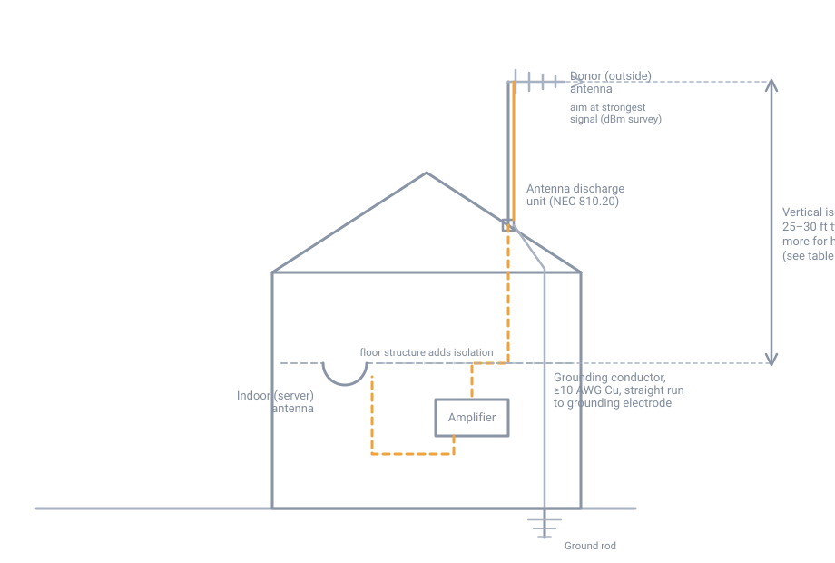

# Cell Signal Boosters and Antennas

## Summary

Much of rural New Hampshire has weak-but-present cell signal rather than no
signal at all — hills, tree cover, and distance from the nearest tower knock a
usable signal down to one flickering bar. A signal booster (also called a
repeater) picks up that weak outdoor signal, amplifies it, and rebroadcasts it
indoors. **It cannot create signal from nothing.** If there is genuinely zero
signal outside — no bars anywhere on the property, including the roof — a
booster has nothing to amplify and will not help. Everything below assumes
some usable signal already reaches the property outdoors.

This page covers how a booster works, how to choose and install one, and the
FCC rules that apply to every consumer booster sold in the United States —
including a mandatory registration step that is easy to skip and is not
optional.

## How a booster works

A consumer booster system has four parts:

1. **Donor (outside) antenna** — mounted outdoors, aimed at or exposed to the
   distant cell tower.
2. **Coax cable** carrying signal down to the amplifier.
3. **Amplifier** — boosts the signal in both directions (tower-to-phone and
   phone-to-tower).
4. **Indoor (server) antenna** — rebroadcasts the boosted signal inside the
   building.

{ width="760" }

*Donor antenna and grounding at the roofline, amplifier indoors, server
antenna separated by height from the donor antenna. Click to enlarge.*

The failure mode to design around is **oscillation**: if the indoor antenna's
signal leaks back into the donor antenna, the amplifier re-amplifies its own
output in a feedback loop. FCC-certified boosters are required to detect this
and cut gain automatically, and if that is not enough, shut themselves off
completely within a fraction of a second — this is a compliance feature, not a
malfunction. The fix is **isolation**: enough physical separation and building
material between the two antennas that the leak-back stays below the
threshold that triggers it. Isolation, not raw amplifier power, is usually
what makes or breaks an install.

## Materials

- FCC-certified **Consumer Signal Booster** — verify certification (an FCC ID
  printed on the unit, searchable at the FCC's [equipment authorization
  database](https://www.fcc.gov/oet/ea/fccid)) before buying; uncertified or
  modified units are illegal to operate
- Donor (outside) antenna:
    - **Omnidirectional**, ~2–5 dBi — use when the strongest signal doesn't
      clearly favor one direction, or multiple towers matter
    - **Directional** (yagi or panel), roughly 7–15 dBi — use when one
      direction is clearly strongest; must be aimed and re-checked
- Indoor (server) antenna:
    - **Dome** (ceiling-mounted, omnidirectional) — open floor plans, single
      large room
    - **Panel** (wall-mounted, ~45–70° cone) — hallways, multiple rooms or
      floors, or directing signal at one specific area
- Low-loss coax, e.g. **LMR-400** or equivalent — not RG-6 (built for
  cable-TV frequencies, far lossier at cellular frequencies)
- Mast and mounting hardware rated for the site's actual wind and ice load,
  not just the manufacturer's minimum bracket
- Antenna discharge unit (lightning arrestor) and a minimum 10 AWG copper
  grounding conductor
- Weatherproofing: self-amalgamating tape, a coax entry boot/seal, and a
  drip loop at the wall penetration
- A phone with field-test mode access, to read actual signal strength in dBm
  rather than bars (see step 1)

If the mast will be ground-mounted rather than attached to the building, its
footing needs to be set below the local frost depth like any other post — see
[Site Preparation](../../building/site-prep/10-site-preparation.md) for how
to get that number for your town, since it varies enough town to town that
printing one figure here would be misleading.

## Procedure

1. **Survey the actual outdoor signal**, in dBm, not bars. Bars are a
   relative, phone-specific scale; dBm is the number a booster's spec sheet
   is written against.
      - iPhone: dial `*3001#12345#*` and press call to open Field Test Mode,
        then read RSRP.
      - Android: path varies by manufacturer, typically under Settings →
        About Phone → SIM/Network status.
      - Roughly: **-50 to -90 dBm** is usable to good signal; approaching
        **-110 dBm** is very weak and marginal even for a booster to work
        with. Walk the roofline and yard perimeter and note where the
        reading is strongest, and whether it's clearly stronger toward one
        compass direction — that's your cue for whether a directional
        antenna is worth the extra aiming effort.
2. **Choose the antenna pair** based on the survey: directional/panel if one
   direction is clearly best, omnidirectional/dome otherwise.
3. **Mount and aim the outside antenna** as high as practical and clear of
   obstructions. Aim a directional antenna at the strongest reading found in
   step 1. In NH, size the mast and hardware for full winter ice and wind
   load, not just calm-weather wind rating — a mast that survives October
   will not necessarily survive a February ice storm.
4. **Ground the mast before connecting anything else.** This is not optional
   for an outdoor antenna and mast. Under NFPA 70 (NEC) Article 810:
      - Install a listed antenna discharge unit on the lead-in, as close as
        practicable to where the cable enters the building, away from
        combustible material (810.20).
      - Run the grounding conductor in as straight a line as practicable —
        lightning will jump a sharp bend rather than follow it — using
        minimum 10 AWG copper (or 17 AWG copper-clad steel/bronze), securely
        fastened and protected from physical damage (810.21).
      - Keep the lead-in clear of power circuits: at least 2 ft from
        conductors under 250 V, 10 ft from conductors over 250 V, and 6 ft
        from lightning-protection system conductors. Never attach the mast
        to the electrical service mast.
      - Bond the discharge unit's ground conductor to the building's
        grounding electrode system at the nearest accessible point.
5. **Run the coax indoors** by the shortest practical path. Avoid tight
   bends and unnecessary connectors or splices — each one adds loss on top
   of the cable's own (see the cable loss table below). Seal the wall
   penetration against water intrusion, with a drip loop so water runs off
   the cable before it reaches the wall. In cold weather, handle coax
   gently — the jacket stiffens well below freezing and is easier to crack
   with a sharp bend during a winter install than it would be in summer.
6. **Mount the amplifier** indoors, in a conditioned space near where the
   coax enters, and connect power.
7. **Position the indoor antenna** with enough isolation from the outdoor
   antenna to avoid oscillation. Vertical separation (a floor or more of
   structure between them) is worth more than the same horizontal distance,
   because it adds building material in the RF path, not just air. As a
   starting point:

    | Booster gain | Minimum separation |
    |---|---|
    | 20 dB | 2–3 ft |
    | 30 dB | 4 ft |
    | 40 dB | 6 ft |
    | 45 dB | 15 ft |
    | 55 dB | 55 ft |
    | 65 dB | 70 ft |
    | 70 dB | 110 ft |
    | 80 dB | 125 ft |

    Manufacturer guidance for typical home units centers on roughly
    **25–30 ft of vertical separation**, or up to 50 ft horizontal if
    vertical isn't achievable. Dense material (concrete, masonry) between
    the antennas reduces the distance needed; thin drywall increases it.
8. **Power on**, then **register the booster with your wireless carrier**
   before relying on it (step 9 explains why this is a legal requirement,
   not a suggestion). AT&T, Verizon, and T-Mobile all offer free online
   registration.
9. **Verify.** Re-check dBm with field-test mode, indoors and out, at the
   locations that actually matter (where the phone sits, not just where the
   installer stood). Check the amplifier's status indicator — most units
   show a distinct pattern (often alternating red/yellow) when oscillation
   or overload is detected. If you see it, increase isolation before
   trusting the install.

## Frequency bands and carrier compatibility

Consumer boosters sold today are almost all **wideband/cellular** units that
amplify the whole cellular spectrum across carriers, rather than the older
carrier-specific boosters tuned to one provider only. That said, not every
wideband booster supports every band in use, and carriers periodically
refarm spectrum, so **verify current band support with the manufacturer and
your specific carrier before buying** — treat any band list below as a
starting point, not a guarantee.

For rural, tree-covered, hilly terrain like most of NH, the lower cellular
bands matter most because they propagate farther and penetrate foliage and
terrain better than the higher bands used for urban capacity:

- **Band 12/13/14 (700 MHz)** and **Band 26 (850 MHz)** — the bands most
  likely to be carrying the one weak bar you're starting from in a fringe
  location.
- **Band 71 (600 MHz)**, used by T-Mobile, is a known gotcha: many boosters
  do not amplify it. If your carrier is T-Mobile, confirm Band 71 support
  explicitly rather than assuming a "supports all bands" claim covers it.

## Cable loss budget

Every foot of coax between the antennas and the amplifier eats into the
booster's total gain. From the Times Microwave LMR-400 datasheet, a common
low-loss cable choice for this kind of run:

| Frequency | Loss per 100 ft (LMR-400) |
|---|---|
| 450 MHz | 2.7 dB |
| 900 MHz | 3.9 dB |
| 1500 MHz | 5.1 dB |
| 1800–1900 MHz | 5.7–6.0 dB |

At cellular frequencies, 100 ft of LMR-400 costs roughly 3.5–6 dB — a real
fraction of what the amplifier is providing. Keep runs as short as the
install allows, avoid unnecessary connectors and splices (each is another
loss point and another place for water to get in), and don't substitute
RG-6: it's built for cable-TV frequencies and loses substantially more at
cellular frequencies over the same run.

## Safety

- **Registration is legally required, not optional.** Under 47 CFR § 20.21,
  every consumer signal booster must be FCC-certified, and the specific unit
  must be registered with your wireless carrier (make, model, serial
  number, and install location) before use. The FCC's stated reason is that
  an unregistered or malfunctioning booster can interfere with the
  carrier's network — potentially including nearby 911 calls, not just your
  own service.
- **Oscillation shutdown is the system working as designed.** A certified
  booster that cuts gain or shuts off is detecting insufficient isolation,
  not failing. Fix the antenna placement rather than looking for a way
  around the shutdown.
- **A booster amplifies existing signal; it does not create it.** Don't
  expect one to produce service where there is truly no outdoor signal at
  all.
- **E911 location accuracy can degrade** for a call carried through a
  booster — this is disclosed on FCC-required packaging and labeling. Don't
  treat a boosted connection as equivalent to native signal for emergency
  location accuracy.
- **A booster cannot legally serve an unauthorized device** — it only
  re-amplifies signal for handsets already legitimately authorized on that
  carrier's network.
- **Lightning risk is real for any roof- or mast-mounted outdoor antenna.**
  Grounding per NEC Article 810 (Procedure step 4) is a safety requirement,
  not a formality, and is the step most likely to be skipped under time
  pressure.

## Sources

- [FCC — Signal Boosters](https://www.fcc.gov/wireless/bureau-divisions/mobility-division/signal-boosters)
- [FCC — Consumer Signal Boosters](https://www.fcc.gov/wireless/bureau-divisions/mobility-division/signal-boosters/consumer-signal-boosters)
- [FCC — Signal Boosters FAQ](https://www.fcc.gov/wireless/bureau-divisions/mobility-division/signal-boosters/signal-boosters-faq)
- [47 CFR § 20.21, Cornell Legal Information Institute](https://www.law.cornell.edu/cfr/text/47/20.21)
- [NFPA 70, National Electrical Code, Article 810](https://www.nfpa.org/codes-and-standards/nfpa-70-standard-development/70) — Radio and Television Equipment: 810.20 (antenna discharge units) and 810.21 (grounding conductors). Current edition requires purchase or NFPA free-access viewing; verify current text before relying on section numbers here.
- [EC&M, "Article 810 — Radio and Television Equipment"](https://www.ecmweb.com/national-electrical-code/code-basics/article/20891084/article-810-radio-and-television-equipment) — trade-press summary of Article 810, used to cross-check the grounding steps above
- [Times Microwave LMR-400 datasheet](https://timesmicrowave.com/wp-content/uploads/2022/06/lmr-400-datasheet-1.pdf)
- [weBoost — Antenna Separation and Why It's Important](https://www.weboost.com/blog/antenna-separation-and-why-its-important)
- [signalbooster.com — How Much Separation Is Required Between Inside/Outside Antennas](https://www.signalbooster.com/pages/how-much-separation-is-required-between-inside-outside-antennas)
- [Wilson Amplifiers — Panel vs. Dome Antennas](https://www.wilsonamplifiers.com/blog/panel-vs-dome-antennas-which-indoor-antenna-do-you-need/)
- [Waveform — Field Test Mode Guide](https://www.waveform.com/guides/field-test-guide)
