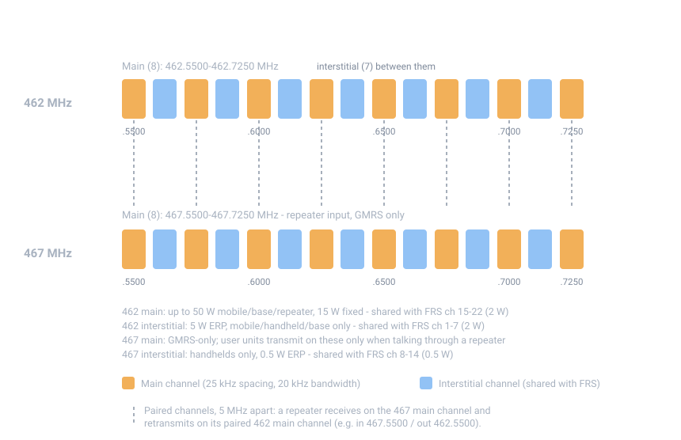

# GMRS Frequencies and Power

## Summary

GMRS occupies **30 channels in the 462–467 MHz UHF band**: eight "main"
channels and seven narrower "interstitial" channels on each of two sides, five
megahertz apart. The 462 side is where direct (simplex) conversations happen;
the 467 side exists mostly so **repeaters** can receive on one channel and
retransmit on its paired partner. Power runs from 0.5 W on the narrowest
channels up to 50 W from a vehicle, base, or repeater on the main channels.

Every GMRS frequency is also an FRS channel — unlicensed walkie-talkies may be
on the same frequencies at up to 2 W — so expect shared traffic and keep power
disciplined.

## The channel plan

{ width="860" }

The service is "allotted 30 channels—16 main channels and 14 interstitial
channels" ([§95.1763](https://www.ecfr.gov/current/title-47/section-95.1763)).
Main channels are spaced 25 kHz apart; the interstitials sit in between them:

| Group | Center frequencies (MHz) | Who may transmit | Power limit |
|---|---|---|---|
| **462 main** (8) | 462.5500, .5750, .6000, .6250, .6500, .6750, .7000, .7250 | mobile, handheld, base, fixed, repeater | 50 W output (mobile/base/repeater); 15 W (fixed) |
| **462 interstitial** (7) | 462.5625, .5875, .6125, .6375, .6625, .6875, .7125 | mobile, handheld, base | 5 W ERP |
| **467 main** (8) | 467.5500, .5750, .6000, .6250, .6500, .6750, .7000, .7250 | mobile, handheld, control, fixed — but mobile/handheld/control **only when talking through a repeater** (or brief tests) | 50 W output; 15 W (fixed) |
| **467 interstitial** (7) | 467.5625, .5875, .6125, .6375, .6625, .6875, .7125 | handheld only | 0.5 W ERP |

The practical reading of that table:

- **Direct conversation** happens on the 462 channels. A handheld or vehicle
  radio transmits and receives on the same 462 frequency (simplex).
- **Repeater access** uses a *pair*: you transmit on a 467 main channel and
  hear the repeater back on the paired 462 main channel — e.g., transmit
  467.5500, receive 462.5500. "Transmit high, receive low." The FCC's own
  description of the plan calls the eight 467 main channels the *repeater input
  channels*, and they are the only GMRS frequencies **not** shared with FRS.
- The **467 interstitial** channels are a low-power handheld-only corner,
  shared with FRS channels 8–14.

## Power limits

From [§95.1767](https://www.ecfr.gov/current/title-47/section-95.1767):

| Station type | Main channels (462 & 467) | 462 interstitial | 467 interstitial |
|---|---|---|---|
| Mobile (vehicle) | ≤ 50 W output | ≤ 5 W ERP | — |
| Handheld | as certified (typically a few watts) | ≤ 5 W ERP | ≤ 0.5 W ERP |
| Base | ≤ 50 W output | ≤ 5 W ERP | — |
| Fixed | ≤ 15 W output | — | — |
| Repeater | ≤ 50 W output | — | — |

Notes:

- **ERP vs. output power.** ERP is transmitter output multiplied by antenna
  gain. With the ~0 dBi whip antenna built into most handhelds, ERP and output
  are nearly identical; with a higher-gain base antenna they diverge. The
  rules cap *output* on main channels and *ERP* on interstitials — for typical
  equipment the distinction rarely matters, but it's why a 5 W radio with a
  high-gain antenna is not automatically legal on an interstitial channel.
- **Handhelds on main channels** have no explicit wattage cap in §95.1767;
  their power is whatever the certified model puts out (commonly 4–6 W).
- **Use the minimum power necessary.** Outside of emergencies you must use the
  least power that gets the job done ([§95.367](https://www.ecfr.gov/current/title-47/section-95.367)); for an emergency message, maximum power is allowed.

## Sharing with FRS

All 22 FRS channels sit on top of GMRS frequencies
([§95.563](https://www.ecfr.gov/current/title-47/section-95.563)):

| FRS channels | Frequencies (MHz) | FRS power limit | Underlying GMRS group |
|---|---|---|---|
| 1–7 | 462.5625 – 462.7125 | 2 W ERP | 462 interstitial |
| 8–14 | 467.5625 – 467.7125 | 0.5 W ERP | 467 interstitial |
| 15–22 | 462.5500 – 462.7250 | 2 W ERP | 462 main |

Consequences worth knowing:

- FRS users can talk **to** you on any 462 channel (and hear everything there),
  but they **cannot access your repeater** — FRS equipment may not transmit on
  the 467 main channels.
- A GMRS/FRS "combo" radio that stays at ≤ 2 W ERP and never touches the 467
  main channels is legally just an FRS radio; the moment it transmits above
  2 W or on a 467 main channel, it's a GMRS station and needs your license.
- The 467 main channels are the only part of the plan where you have the band
  to yourself (modulo out-of-service interference).

## MURS — the unlicensed alternative

MURS (Multi-Use Radio Service) is worth a paragraph: five **VHF** channels
(151.820, 151.880, 151.940, 154.570, 154.600 MHz), 2 W output, no license, no
repeaters or signal boosters allowed ([§95.2763](https://www.ecfr.gov/current/title-47/section-95.2763)).
VHF (150 MHz) propagates a bit farther than UHF (460 MHz) over open flat
ground, but in the rolling, forested terrain of the northeastern United States
both are line-of-sight-limited, and MURS's five shared channels at 2 W with no
repeater option make it the weaker preparedness choice. GMRS — licensed, up to
50 W, repeater-capable, 30 channels — is the better service for this region;
MURS is fine as a cheap backup that needs no license at all.

## Technical parameters (what certified equipment must do)

- **Emissions**: analog FM voice (F3E); digital data (G3E) from handhelds only
  — see [Operating Procedure](50-operations.md#digital-data).
- **Occupied bandwidth**: 20 kHz on main channels and the 462 interstitials;
  12.5 kHz on the 467 interstitials ([§95.1773](https://www.ecfr.gov/current/title-47/section-95.1773)).
- **Frequency stability**: ±5 ppm for wide emissions, ±2.5 ppm for narrow
  ([§95.1765](https://www.ecfr.gov/current/title-47/section-95.1765)).
- **No digital voice.** DMR/TDMA-style digital voice was explicitly *not*
  authorized in the 2017 reorganization; GMRS is analog voice plus limited
  data.
- **No voice scramblers** on newly certified equipment (existing ones may be
  used, but the FCC advises not to rely on them for privacy).

## Practical notes for this region

Assumptions: northeastern United States, New Hampshire in particular — dense
forest, rolling terrain, no long flat sight lines.

- **Handheld-to-handheld** range is line-of-sight-limited: expect roughly
  1–3 miles under tree cover and more on ridgelines with clear sight. These are
  rules of thumb, not guarantees; test your actual routes.
- **Vehicle or base with an elevated antenna** extends direct range
  substantially — tens of miles between high points is achievable, but a
  forested valley in between will still block you.
- **A repeater on high ground** is the single biggest range upgrade available
  in GMRS; see [Repeaters](40-repeater-use.md).

## Sources

- [47 CFR 95.1763 (GMRS channels)](https://www.ecfr.gov/current/title-47/section-95.1763) —
  the 30-channel allotment and per-channel station restrictions.
- [47 CFR 95.1767 (transmitting power limits)](https://www.ecfr.gov/current/title-47/section-95.1767).
- [47 CFR 95.1765 (frequency accuracy)](https://www.ecfr.gov/current/title-47/section-95.1765) and
  [95.1773 (authorized bandwidths)](https://www.ecfr.gov/current/title-47/section-95.1773).
- [47 CFR 95.563 (FRS channels)](https://www.ecfr.gov/current/title-47/section-95.563) and
  [95.567 (FRS transmit power)](https://www.ecfr.gov/current/title-47/section-95.567).
- [47 CFR 95.2763 (MURS channels)](https://www.ecfr.gov/current/title-47/section-95.2763) and
  [95.2767 (MURS transmitting power limit)](https://www.ecfr.gov/current/title-47/section-95.2767).
- FCC, *Personal Radio Service Reform*, Report and Order, CG Docket 02-147,
  [82 FR 41104 (Aug. 29, 2017)](https://www.federalregister.gov/documents/2017-08-29/2017-17395/personal-radio-service-reform) —
  explains the realigned plan: "all FRS frequencies will now be shared with
  GMRS, while the eight GMRS 467 MHz main channels (repeater input channels)
  will remain exclusively GMRS."
