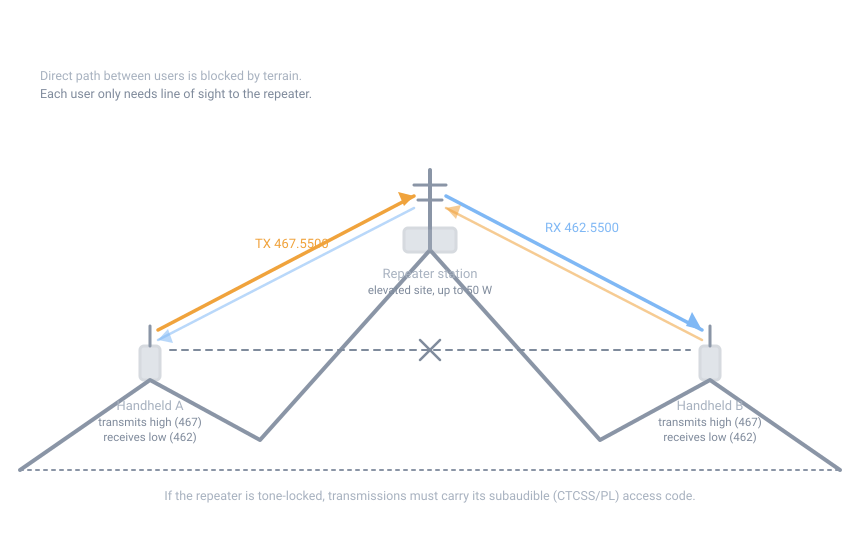

# GMRS Repeaters

## Summary

A repeater is a receiver and transmitter on a hill that hears you on one
channel and retransmits you on another, so your range becomes "line of sight to
the repeater" instead of "line of sight to the other person." In GMRS a
repeater receives on a **467 MHz main channel** and transmits on its paired
**462 MHz main channel** — users transmit high (467) and receive low (462).
Running one is completely legal under your ordinary individual license: up to
50 W, automatic control allowed, remote control allowed.

## How it works

{ width="860" }

There are eight channel pairs, offset exactly 5 MHz:

| Repeater receives (input) | Repeater transmits (output) |
|---|---|
| 467.5500 | 462.5500 |
| 467.5750 | 462.5750 |
| 467.6000 | 462.6000 |
| 467.6250 | 462.6250 |
| 467.6500 | 462.6500 |
| 467.6750 | 462.6750 |
| 467.7000 | 462.7000 |
| 467.7250 | 462.7250 |

Your radio, set for a repeater channel, transmits on the 467 frequency and
listens on the paired 462 frequency. The repeater does the reverse. Because
each user only needs line of sight to the repeater site — not to each other —
two users in separate valleys can talk freely.

**Tones.** A repeater may be "locked" with a subaudible (CTCSS/PL) access code:
transmissions must carry the correct continuous tone below 300 Hz or the
repeater won't key. Subaudible tones may run continuously during a session;
*audible* tones (above 300 Hz) are limited to 15 seconds at a time
([§95.377](https://www.ecfr.gov/current/title-47/section-95.377),
[§95.1777](https://www.ecfr.gov/current/title-47/section-95.1777)). Tone-locking is legal — the rules explicitly let a licensee limit repeater use to specific persons (see below) — but an open repeater serves more people and is friendlier in an emergency.

**One limitation:** digital data (location sharing, text pings) may not be
transmitted on the 467 main channels ([§95.1787(a)(5)](https://www.ecfr.gov/current/title-47/section-95.1787)), so data features work only direct, not through a repeater.

## Using someone else's repeater

- **Programming.** Most GMRS radios ship with common repeater pairs
  pre-programmed (often labeled by output frequency, e.g. "462.5500 RPT"). Set
  the pair and, if the repeater is locked, its PL tone. If your radio lets you
  edit memory channels within the certified set, you can add any of the eight
  pairs.
- **Finding local repeaters.** There is no official FCC directory of GMRS
  repeaters — ask other local GMRS users, or simply listen: a strong signal on
  one of the paired 462 frequencies that repeats whatever you say (after a
  short delay) is a working repeater. Note its output frequency and whether it
  requires a tone.
- **Etiquette.** Listen before keying; keep transmissions short — a repeater is
  a shared resource, and one person holding the channel blocks everyone else.
  If it's tone-locked and you don't have the code, contact the owner by direct
  (simplex) frequency and ask.

## Operating your own repeater

Your individual GMRS license already covers repeaters — no separate
application. The rules that matter:

| Requirement | Rule |
|---|---|
| Maximum output power | 50 W ([§95.1767(a)(1)](https://www.ecfr.gov/current/title-47/section-95.1767)) |
| Automatic control (no operator present) | Permitted — repeaters are the one station type GMRS allows under automatic control ([§95.1747](https://www.ecfr.gov/current/title-47/section-95.1747)) |
| Remote control (e.g., monitoring from home) | Permitted for repeater, base, and fixed stations ([§95.1745](https://www.ecfr.gov/current/title-47/section-95.1745)); a network connection is allowed **solely** for remote control ([§95.1749](https://www.ecfr.gov/current/title-47/section-95.1749)) |
| Station identification | At least every 15 minutes — automatic ID is fine ([§95.1751](https://www.ecfr.gov/current/title-47/section-95.1751)). **Exempt** if the repeater retransmits only stations operating under your own license and those stations identify properly |
| Who may use it | You decide: you "may allow any person to use (i.e., benefit from the operation of) its GMRS repeater, or alternatively, may limit the use of its GMRS repeater to specific persons," and may disallow specific persons ([§95.1705(d)(2)–(3)](https://www.ecfr.gov/current/title-47/section-95.1705)) |
| Antenna height | Must not be a menace to air navigation: [§95.1741](https://www.ecfr.gov/current/title-47/section-95.1741) points to §95.317 and 47 CFR Part 17 (FAA registration/painting for tall structures near airports) |

### Site selection

Elevation is everything; the rest is details. In the northeastern United
States — dense forest, rolling terrain — a repeater on a hilltop with 200–400
ft of height above the surrounding land can serve handhelds within roughly
15–30 miles in all directions under good conditions (rule of thumb; test your
actual area). Users still need line of sight *to you*: a strong repeater signal
doesn't help anyone buried in a bowl with no view of your mast.

Practical checklist:

- **Power and protection.** Clean, surge-protected power; UHF masts are
  lightning targets in New England. A quality surge arrestor at the antenna
  feedpoint and again at the equipment is not optional on a rooftop or tower.
- **Antenna.** A simple high-gain omnidirectional (e.g., a collinear) on the
  output frequency, matched feedline kept short and dry. The input can be the
  same antenna with a diplexer, or a second antenna.
- **Keep it simple.** One channel pair, open access or a single PL tone,
  automatic ID every 15 minutes (or rely on the same-license exemption if only
  your household uses it). Every added feature is another thing to fail in a
  storm when you need it most.
- **Announce it.** Tell local GMRS users what you've put up, on which pair,
  and whether it's tone-locked. A mystery repeater gets blamed for interference
  it didn't cause.

### What a repeater is not

- Not a telephone: no voice over IP, no internet bridging of conversations —
  the network connection exception covers remote *control* only.
- Not a signal booster for other services: GMRS frequencies in, GMRS
  frequencies out.
- Not exempt from interference rules: if your repeater causes harmful
  interference to another service (e.g., amateur radio or Part 90 users), you
  must stop and fix it — see [Operating Procedure](50-operations.md#interference-and-malfunctioning-equipment).

## Sources

- [47 CFR 95.1763 (GMRS channels)](https://www.ecfr.gov/current/title-47/section-95.1763) —
  which station types may transmit on each channel group; the 467 main
  channels are usable by mobile/handheld/control stations only when
  communicating through a repeater.
- [47 CFR 95.1745, 95.1747, 95.1749](https://www.ecfr.gov/current/title-47/section-95.1745) —
  remote control, automatic control, and the network-connection limitation.
- [47 CFR 95.1751 (station identification)](https://www.ecfr.gov/current/title-47/section-95.1751) —
  the 15-minute rule and the same-license repeater exemption.
- [47 CFR 95.1705(d) (licensee duties)](https://www.ecfr.gov/current/title-47/section-95.1705) —
  the right to open or restrict repeater access.
- [47 CFR 95.377 (tones and signals)](https://www.ecfr.gov/current/title-47/section-95.377) and
  [95.1777 (GMRS tone transmissions)](https://www.ecfr.gov/current/title-47/section-95.1777).
- [47 CFR 95.1787 (handheld digital data)](https://www.ecfr.gov/current/title-47/section-95.1787) —
  data prohibited on the 467 main channels.
- FCC, *Personal Radio Service Reform*, Report and Order, CG Docket 02-147,
  [82 FR 41104 (Aug. 29, 2017)](https://www.federalregister.gov/documents/2017-08-29/2017-17395/personal-radio-service-reform) —
  identifies the eight 467 MHz main channels as the GMRS-exclusive "repeater
  input channels."
