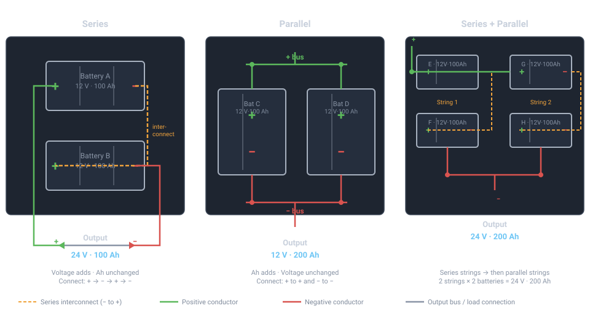

# Battery Bank Design and Maintenance

## Summary

A battery bank is the part of an off-grid or backup power system that fails
quietly for months and then fails all at once. Panels and generators are easy
to inspect — you can see whether they're making power. A battery bank hides
its condition: a cell can be sulfated, a lithium pack's BMS can be silently
throttling, or a bank can be three winters past a safe equalization, and none
of it shows until the night you actually need the reserve.

This page covers sizing a bank, wiring it safely, charging it correctly for
its chemistry, and the recurring maintenance that keeps it alive — for the two
chemistry families you'll actually encounter at a fixed dwelling: **lead-acid**
(flooded/wet, AGM, and gel) and **lithium iron phosphate (LiFePO4)**. It
assumes you've already worked out your daily load from
[Solar Panel Sizing and Installation](10-solar-sizing.md) and that your
interconnects will be sized and fused per
[Basic DC Wiring and Safety](40-dc-wiring-safety.md) — this page does not
repeat wire-gauge or fusing tables.

!!! danger "This is not a place to improvise"
    A lead-acid bank can deliver short-circuit currents in the **thousands of
    amps** for a fraction of a second — enough to vaporize a dropped wrench and
    weld a ring to a terminal. A damaged lithium cell can go into thermal
    runaway that a fire extinguisher will not stop. Read Safety before you work
    on a bank, not after.

## Regional constraints: why New Hampshire changes the design

Cold is not a minor derate here — it changes which chemistry, which charging
routine, and which physical protection are correct.

- **Lead-acid loses capacity in the cold**, roughly on the order of 1% per
  °F below its rated temperature (typically 77°F/25°C), meaning a battery
  rated 100 Ah at 25°C may only deliver on the order of 80 Ah at 32°F (0°C)
  and considerably less near 0°F (-18°C).[^1] Size for the coldest week you'll
  actually cycle the bank, not the nameplate rating.
- **A lead-acid cell's electrolyte can freeze — but only if it's discharged.**
  Sulfuric acid depresses the freezing point, so a fully charged flooded cell
  (specific gravity ~1.265) won't freeze until roughly **-92°F (-69°C)**, while
  a fully discharged cell (electrolyte diluted toward water) can freeze at
  around **32°F (0°C)**, and a cell around 40% state of charge can freeze
  near **16°F (-9°C)**.[^2] A frozen cell can crack its case. **The practical
  rule: a lead-acid bank left at a low state of charge through a New Hampshire
  winter is a bank you may find cracked in the spring** — keep flooded/AGM/gel
  banks charged, especially in unheated spaces.
- **LiFePO4 generally cannot be charged below freezing without damage.**
  Charging a lithium cell below about **32°F (0°C)** risks lithium plating on
  the anode — a permanent, unsafe degradation, not a temporary limitation — so
  quality LiFePO4 packs and BMS units block or throttle charging below roughly
  0°C.[^3] **Discharging is far more tolerant of cold**: many manufacturers
  rate discharge down to around **-4°F (-20°C)**, sometimes lower.[^3] If you
  install lithium in an unconditioned space in this climate, plan for battery
  heating (heat pads gated by the BMS, or bringing the bank into a
  conditioned space) — don't assume the pack will simply charge whenever the
  sun is out.
- Both effects compound in an unheated shed or crawlspace bank: a lead-acid
  bank that's been drawn down overnight in January is now both weaker *and*
  closer to its freezing point at the same time.

## Chemistry comparison

| | Flooded (wet) lead-acid | AGM | Gel | LiFePO4 |
|---|---|---|---|---|
| **Usable depth of discharge** | ~50% for cycle life | ~50% (some makers allow more) | ~50% | 80–100% |
| **Typical cycle life at usable DoD** | ~300–500 cycles at 50% DoD (varies a lot by plate design/quality)[^4] | ~400–1,000 cycles at 50% DoD[^4] | ~500–1,200 cycles at 50% DoD[^4] | ~2,000–6,000+ cycles at 80% DoD, manufacturer-dependent[^4] |
| **Ventilation required** | Yes — vents freely, hydrogen released continuously during charge, more during equalization | Recombinant; low off-gassing in normal use but still vents under overcharge — treat the space as if it needs ventilation | Same as AGM, and more sensitive to overcharge gassing | No hydrogen; still ventilate to remove heat and to vent smoke if a cell fails |
| **Cold-weather charging** | Reduced acceptance and capacity in the cold; will not freeze if kept charged (see above) | Same as flooded | Same as flooded | Charging below ~32°F (0°C) risks permanent damage; needs BMS low-temp cutoff or heating |
| **Maintenance** | Regular watering, terminal care, periodic equalization | Sealed — no watering; terminal care only | Sealed — no watering; terminal care only; most sensitive to overcharge | No watering, no equalization; BMS handles cell balancing |
| **BMS required** | No (external charge controller stages only) | No | No | **Yes, effectively mandatory** — LiFePO4 has no inherent overcharge/over-discharge tolerance and cells drift out of balance without one |
| **Relative up-front cost per rated Ah** | Lowest | Higher than flooded | Higher than AGM | Highest per rated Ah, but far more usable Ah per rated Ah and far more cycles — narrows or reverses on a lifetime-cost basis |

Sources disagree on exact cycle-life numbers because they depend heavily on
plate/AGM construction quality, charge regimen, and temperature — treat the
figures above as ballpark and read your specific battery's datasheet before
sizing around a cycle count.

## Sizing methodology

The starting number — daily load in watt-hours — comes from the load worksheet
in [Solar Panel Sizing and Installation](10-solar-sizing.md); don't duplicate
that exercise here. Once you have a daily Wh figure, battery sizing is:

```
Required capacity (Ah) = (Daily load, Wh × Days of autonomy)
                          ÷ Usable DoD
                          ÷ System voltage (V)
```

**Worked example** — a cabin drawing 3,000 Wh/day, wanting 2 days of autonomy,
on a 24V lead-acid bank limited to 50% usable DoD:

```
(3,000 Wh × 2 days) ÷ 0.50 ÷ 24 V = 500 Ah at 24V
```

The same load on a 24V LiFePO4 bank at 90% usable DoD:

```
(3,000 Wh × 2 days) ÷ 0.90 ÷ 24 V = 278 Ah at 24V
```

Notice the lithium bank needs roughly half the rated Ah to deliver the same
usable energy — this is the DoD difference from the comparison table showing
up directly in the size (and cost) of the bank you have to buy.

Two adjustments worth making before you commit to a number:

- **Derate lead-acid capacity for winter operating temperature** (see Regional
  constraints above) if the bank lives in an unheated space — add margin
  rather than sizing to the 77°F nameplate rating.
- **Round up to standard battery capacities and voltages**, then check the
  resulting series/parallel string count below — the math rarely lands on a
  clean number of physical batteries.

## Series and parallel wiring

Most batteries are sold in a single voltage — commonly 6 V or 12 V for
lead-acid, and 12 V or 24 V for LiFePO4 modules. Your system voltage and
capacity target almost never match that out of the box, so you need to
combine individual batteries using one or both of two wiring methods.

{ width="960" }

### Series wiring — voltage adds, Ah stays the same

In a **series string**, you connect the positive terminal of one battery to
the negative terminal of the next. The voltages of all batteries in the
string add together; the amp-hour (Ah) capacity stays equal to one battery.

**How to wire it:**
1. Connect the **positive terminal of Battery A** to the **negative terminal
   of Battery B** (the series interconnect — shown dashed orange in the
   diagram above).
2. Your output leads are the **free positive terminal of Battery A** and the
   **free negative terminal of Battery B**.

**Result (example):** Two 12 V · 100 Ah batteries in series → **24 V · 100 Ah**.

**When you use it:** You need a higher system voltage than any single battery
provides. A 24 V system requires two 12 V batteries in series. A 48 V system
requires four 12 V batteries (or two 24 V batteries) in series. Higher system
voltages allow thinner wire for the same power — see
[Basic DC Wiring and Safety](40-dc-wiring-safety.md).

!!! warning "All batteries in a series string must be identical"
    Voltage, capacity, chemistry, age, and ideally manufacturer batch must
    match. The weakest battery in the string sets the capacity ceiling for
    the whole string, and it will be over-stressed every cycle while its
    neighbors are under-stressed.

### Parallel wiring — Ah adds, voltage stays the same

In a **parallel group**, you connect all positive terminals together (to a
positive bus) and all negative terminals together (to a negative bus). The
voltages remain the same as one battery; the amp-hour capacity sums.

**How to wire it:**
1. Connect both **positive terminals** to a shared positive bus bar or
   junction. The positive output lead comes off that bus.
2. Connect both **negative terminals** to a shared negative bus bar.
   The negative output lead comes off that bus.
3. Wire lengths from each battery to the bus must be **equal in length and
   gauge** so that current is drawn equally from each battery, not
   preferentially from the one physically closest to the load.

**Result (example):** Two 12 V · 100 Ah batteries in parallel → **12 V · 200 Ah**.

**When you use it:** You have enough voltage already but need more capacity
(runtime). Adding a second battery in parallel doubles the amp-hours while
keeping the voltage unchanged.

!!! warning "All batteries in a parallel group must be identical"
    Parallel batteries share current continuously. A stronger battery will
    try to charge a weaker one, creating circular currents and heat. Mismatched
    ages or capacities cause the weaker unit to cycle harder than the stronger
    one — accelerating both batteries' degradation.

### Combining series and parallel (the common real-world case)

Most practical banks combine both methods: build series **strings** to reach
the target voltage, then connect multiple strings in **parallel** to reach
the target capacity.

**Always wire series first, then parallel.** This means:
1. Wire each series string completely (e.g., two 12 V batteries in series
   to make 24 V per string).
2. Verify that each completed string measures the correct terminal voltage
   before connecting strings in parallel.
3. Connect the positive output of String 1 to the positive output of
   String 2 (and so on), and similarly for the negative outputs.

**Result (example):** Two strings, each made of two 12 V · 100 Ah batteries
in series → each string is 24 V · 100 Ah → connect both strings in
parallel → **24 V · 200 Ah**. This is the "2S2P" case shown in the right
panel of the diagram.

**Scaling up:** The pattern extends directly. A 48 V · 400 Ah bank built
from 12 V · 100 Ah batteries needs 4 batteries per series string (4 × 12 V
= 48 V) and 4 parallel strings (4 × 100 Ah = 400 Ah) — 16 batteries total.

### Interconnect wiring rules

Once the topology is clear, the physical wiring has a few firm requirements:

- **Equal-length, equal-gauge cables between batteries and between strings.**
  Unequal lengths mean unequal resistance, which means unequal current
  sharing — the lower-resistance path carries more current, overworking some
  batteries while underutilizing others. Cut all interconnect cables to the
  same length even if a shorter cable would physically fit.
- **Match cable gauge to the fault current, not just the load current.**
  A battery bank can deliver thousands of amps into a dead short. Wire
  sizing and fuse placement for the bank's interconnects is covered in full
  in [Basic DC Wiring and Safety](40-dc-wiring-safety.md) — do not skip
  that section when building a bank.
- **Fuse each parallel string** at its positive terminal, as close to the
  battery as practical, before the strings join at the bus. This protects
  against a string fault becoming a cross-string fault.
- **Use a bus bar, not daisy-chained terminals, for parallel connections.**
  Running a single cable from Battery 1 to Battery 2 to Battery 3 creates
  unequal impedance paths — Battery 1 is closest to the load on one side
  and farthest on the other. A dedicated bus bar gives each battery
  equal, independent connections to the output.

!!! warning "Do not mix batteries of different age, capacity, or chemistry in one bank"
    A bank is only as good as its weakest battery, and mismatched batteries
    make each other worse:

    - **Different ages/capacities in the same string or parallel group** cause
      the weaker battery to be over-discharged and over-charged relative to
      its healthier neighbors every single cycle, accelerating its failure and
      dragging the whole bank's usable capacity down to the worst unit.
    - **Different chemistries in the same bank** (e.g., an old flooded battery
      "helping out" a lithium bank) is worse than useless — the charge
      voltages and profiles are incompatible, and neither will be charged
      correctly.
    - **For lithium specifically, mixing damaged, mismatched, or unmatched
      cells/modules raises the risk that one failing cell drags others into
      thermal runaway**, since a cell in runaway dumps heat into its
      neighbors. Stationary lithium ESS safety testing (UL 9540A) exists
      specifically to characterize whether and how fast that propagation
      happens in a given battery/enclosure design.[^5]
    - When one battery in a bank fails, the safe fix is to replace the whole
      string (or the whole bank, for a small system) with matched, same-age
      units — not to patch in a single new battery next to old ones.

## Charging

### Lead-acid: bulk / absorption / float / equalization

A lead-acid charge controller or charger moves through stages:

1. **Bulk** — maximum safe current until the bank reaches absorption voltage.
2. **Absorption** — voltage held roughly constant while current tapers, to
   finish the charge without gassing excessively.
3. **Float** — a lower holding voltage that maintains a full charge without
   overcharging, for a battery sitting idle.
4. **Equalization** (flooded only, periodic) — a deliberately controlled
   *overcharge*, at a higher voltage than absorption, held for a set time.
   It intentionally drives gassing to stir the electrolyte, reversing acid
   stratification (heavier acid settling toward the bottom of the cell) and
   helping dissolve early sulfate crystals on the plates. Manufacturer
   guidance for flooded batteries typically calls for roughly **2.5–2.66
   volts per cell** (about 15–16V for a nominal 12V battery), held for a few
   hours, on a schedule of roughly monthly to quarterly depending on use and
   the manufacturer's own recommendation — check your specific battery's
   datasheet rather than assuming a schedule.[^6]

!!! danger "Do not equalize sealed (AGM/gel) batteries without manufacturer sign-off"
    Equalization deliberately overcharges the battery and drives gas
    production. A flooded cell has open vents and (mostly) tolerates this.
    AGM and gel batteries are sealed with only a pressure relief valve and a
    limited internal ability to recombine gas back into water; forcing
    additional gassing vents electrolyte you cannot replace, permanently
    drying out the cell. **Most manufacturers state gel batteries must never
    be equalized, and most state the same for AGM** — but this is a case
    where sources genuinely disagree: at least one major AGM manufacturer
    (Lifeline) explicitly recommends periodic equalization for its own AGM
    line, while others (e.g., Trojan) explicitly do not.[^7] **Follow the
    charge profile in your specific battery's datasheet, not a generic rule**,
    and when in doubt, don't equalize a sealed battery.

### Lithium (LiFePO4): BMS-managed, no equalization

Lithium charging is a fundamentally different model:

- There is **no equalization stage** — a healthy LiFePO4 pack does not need
  the periodic deliberate overcharge that flooded lead-acid uses to fight
  stratification and sulfation, because those failure modes don't apply to
  lithium the same way.
- The **usable voltage window is much narrower** than lead-acid's, and the
  **battery management system (BMS), not the external charger, is what
  actually protects the cells** — it enforces per-cell high/low voltage
  cutoffs, balances cells against each other, enforces charge/discharge
  current limits, and (in a good BMS) enforces the temperature cutoffs
  described in Regional constraints above. This is why a BMS is treated as
  mandatory for LiFePO4 rather than optional: without one, nothing stops an
  individual cell from being driven outside its safe range even if the pack
  terminal voltage looks fine.
- A solar charge controller or DC charger charging LiFePO4 needs a charge
  profile set for lithium (typically no float stage, or a very low one) —
  using a lead-acid charge profile on lithium, or vice versa, will
  undercharge or damage the pack.

## Ventilation for lead-acid (hydrogen gas)

Charging — and especially equalizing — a flooded or AGM/gel lead-acid battery
electrolyzes some water and releases **hydrogen gas**. Hydrogen is flammable
across an unusually wide range: **about 4% to 75% by volume in air**, and it
can detonate (not just burn) within roughly 18–59% by volume — a far wider and
more dangerous window than gasoline vapor or propane.[^8]

Code and standard guidance is consistent on the controlling number even though
it comes from several different documents:

- The **NEC (NFPA 70) Article 480.9(A)** requires "sufficient diffusion and
  ventilation of the gases from the battery... to prevent accumulation of an
  explosive mixture," without itself giving a numeric ventilation rate — the
  numeric target is implemented via the fire code and industry ventilation
  guidance below.[^9]
- The consistent numeric target across NFPA 1 (Fire Code) and standard battery
  ventilation practice is to keep hydrogen concentration below **25% of its
  lower explosive limit, i.e., about 1% hydrogen by volume in the room** — a
  4:1 safety margin below the 4% LEL.[^10]
- **IEEE 484** (vented lead-acid) and **IEEE 1635 / ASHRAE Guideline 21**
  (ventilation and thermal management of stationary batteries) are the
  standards written specifically to size that ventilation.[^11] (Note: there
  is no "IEEE 1145" — if you've seen that number cited elsewhere, it's a
  mix-up; IEEE 484 and 1635 are the relevant documents.)
- A commonly used design rule of thumb to meet the above without gas
  monitoring is continuous ventilation at roughly **1 cfm per square foot of
  battery room floor area**, which — for a typical residential battery
  closet — is achievable with a small exhaust fan and a low intake vent, but
  size it for your actual room and charge current rather than assuming the
  rule of thumb covers an undersized, sealed closet.[^11]

Practically, for a residential installation:

- Never install a flooded or AGM/gel lead-acid bank in a fully sealed
  cabinet or a habitable, unventilated room.
- Provide a vent path — a low intake and a high exhaust, since hydrogen is
  far lighter than air and collects at the ceiling.
- If the bank lives in an enclosed box or cabinet, vent that enclosure
  directly, not just the room around it.
- LiFePO4 produces no hydrogen in normal operation and does not carry this
  requirement — but see Safety below on venting for a failed cell.

## Maintenance procedure

### Flooded-cell electrolyte: checking and topping off

1. Check level only when the battery is at or near full charge — electrolyte
   level rises when charged and falls when discharged, and topping off a
   discharged cell can cause overflow once it's recharged.
2. Electrolyte should cover the plates, typically up to the fill-ring or
   split-ring level marked inside the cell opening. Never let plates be
   exposed to air.
3. Top off with **distilled or deionized water only — never tap water**.
   Tap water carries dissolved minerals (calcium, magnesium, chlorine
   compounds) that react with the sulfuric acid, form deposits on the
   plates, and accelerate capacity loss; distilled water adds back only what
   evaporated (water), leaving the acid concentration to re-equalize
   correctly.[^12]
4. Never add acid to top off a cell — only water evaporates during normal
   operation. If specific gravity is low across the board after correct
   watering, the cause is undercharging or a failing cell, not lost acid.
5. Recheck level after the next full charge/equalization cycle, since gassing
   during equalization consumes more water than normal cycling.

### Terminal cleaning and corrosion

1. **Disconnect the negative terminal first**, then the positive, before
   working on terminals (see Safety below for why).
2. White/blue-green corrosion at the terminals is typically lead sulfate and
   corroded metal from acid vapor. Neutralize it with a paste of **baking
   soda (sodium bicarbonate) and water** (roughly 1 part baking soda to 3
   parts water), applied with a stiff brush.
3. **Keep the baking soda solution off the cell caps and never let it enter
   a filler opening** — baking soda is a base and will neutralize (and
   ruin) the sulfuric acid electrolyte inside the cell it contacts. Cap the
   vents or cover them before scrubbing terminals, then rinse the neutralized
   residue away with clean water and dry the area.
4. Once clean and dry, reconnect and apply a thin coat of terminal grease or
   anti-corrosion spray to slow future buildup.
5. **Torque terminal connections to the battery/lug manufacturer's spec.**
   Generic guidance is not a substitute here — undertorqued lugs heat up
   under load and can arc; overtorqued lugs crack posts or strip threads.
   Check the datasheet for your specific battery and lug hardware.

### State-of-charge monitoring

- **Flooded lead-acid: hydrometer specific gravity**, temperature-corrected.
  Typical reference values at 80°F (26.7°C) run roughly 1.265 at 100% state
  of charge, descending through the 1.12–1.28 range as the battery
  discharges — exact numbers vary slightly by manufacturer, so use your
  battery's own chart if it publishes one, and always apply the temperature
  correction (specific gravity reads artificially high when cold, low when
  hot).[^13]
- **AGM, gel, and LiFePO4: rest voltage**, since there's no accessible
  electrolyte to sample. Let the battery rest with no load or charge current
  for at least 30 minutes to an hour before reading voltage — a
  voltage reading taken under load or immediately after charging reflects
  the load/charge, not the true state of charge. LiFePO4's voltage curve is
  notably flat across most of its usable range, which makes voltage alone
  a poor SoC indicator for lithium in daily use — a dedicated
  battery monitor that integrates current (a "coulomb counter"/shunt-based
  monitor) is far more useful for lithium banks than a voltmeter.
- A whole-bank voltage reading hides a single bad cell or battery. Where
  practical, check individual cell/battery voltages (or specific gravity per
  cell), not just the bank terminal voltage.

### Maintenance schedule

| Interval | Flooded lead-acid | AGM / gel | LiFePO4 |
|---|---|---|---|
| Monthly | Visual check for leaks, swelling, corrosion; check electrolyte level | Visual check for leaks, swelling, terminal corrosion | Check BMS status/fault log if available; visual check for swelling or damage |
| Quarterly | Check specific gravity per cell; clean/torque terminals | Check terminal torque and cleanliness; check rest voltage | Check rest voltage and cell-balance status |
| As specified by manufacturer (often monthly–quarterly) | Equalize per datasheet schedule | Equalize **only** if the specific manufacturer explicitly calls for it | Not applicable — no equalization |
| Annually | Full capacity/load test if feasible; inspect and re-torque all interconnects | Full capacity/load test if feasible; inspect and re-torque all interconnects | Inspect all interconnects; verify BMS temperature cutoffs still function |

## Safety

!!! danger "Sulfuric acid"
    Flooded (and, if the case is breached, AGM/gel) electrolyte is dilute
    sulfuric acid — it causes chemical burns to skin and eyes and can damage
    fabric and concrete. OSHA's construction standard for battery charging
    areas (29 CFR 1926.441) requires facilities for quick drenching of eyes
    and body within the work area, and requires acid-resistant PPE — face
    shield, apron, and rubber gloves — when handling batteries or
    electrolyte.[^14] At a residential scale, that means: keep eyewash-quality
    water or a squeeze bottle nearby, wear splash goggles and gloves when
    working on flooded cells, and know where a sink is. **When mixing or
    diluting acid, add acid to water, never water to acid** — adding water to
    concentrated acid can cause violent spattering/boiling.

!!! danger "Hydrogen gas ignition sources"
    Given the 4%–75% flammable range described above, treat any lead-acid
    battery space as a location where an ignition source can cause an
    explosion, not just a fire:

    - No smoking, open flame, or spark-producing tools in the battery space.
    - Mount switches, relays, and non-battery-rated equipment outside the
      space, or use equipment rated for the location — a switch making or
      breaking contact is a spark source.
    - Don't create a spark at the battery terminals themselves (see below).
    - Ventilate before and during charging/equalizing, not just after.

!!! warning "Short-circuit and tool-drop hazard"
    A lead-acid bank is a low-impedance source that can deliver a
    short-circuit current in the **hundreds to low thousands of amps** —
    commonly-cited figures put a single automotive-class 12V battery's dead-
    short current above 1,000A; a multi-battery bank is higher still.[^15]
    That current, driven through a dropped wrench, a wedding ring, or a
    metal watchband bridging a terminal, generates heat fast enough to melt
    metal and cause severe burns in an instant — there is no meaningful time
    to react. Remove rings/watches/metal jewelry before working in a battery
    space, use insulated tools, and cover exposed terminals when not actively
    working on them.

!!! danger "Lithium thermal runaway"
    A damaged, swollen, punctured, or internally shorted LiFePO4 cell can
    enter thermal runaway — an internal exothermic reaction that generates
    its own heat and can propagate to neighboring cells and modules. LiFePO4
    is markedly more thermally stable than other lithium chemistries (e.g.,
    NMC/cobalt types used in consumer electronics and EVs), but "more
    stable" is not "immune," which is exactly why stationary lithium ESS
    products are tested under **UL 9540A** for whether and how fast a single
    cell's failure propagates through the pack and enclosure, and why
    **NFPA 855** governs spacing, detection, and suppression for installed
    systems.[^5][^16] **Never charge, discharge, or store a swollen, leaking,
    or physically damaged lithium battery** — isolate it (ideally outdoors,
    away from combustibles) and treat it as a fire hazard until disposed of
    properly. A standard fire extinguisher will not reliably stop a lithium
    thermal-runaway fire; the practical response for a residential-scale
    incident is evacuate, prevent spread to other flammables, and let it burn
    out or use large amounts of water for cooling if it can be done safely
    from a distance.

**Disposal and recycling.** Never discard lead-acid or lithium batteries in
household trash. Lead-acid batteries have a very high recycling rate in the
US (on the order of 98%) precisely because retailers and scrap dealers are
set up to take them back — most jurisdictions also require this by law; take
spent batteries to a retailer or recycling center that accepts them.[^17]
Lead-acid and lithium batteries can both be managed as "universal waste"
under EPA/RCRA rules (40 CFR Part 273), which simplifies handling compared to
full hazardous-waste rules but still requires proper accumulation and
routing to a permitted recycler — do not landfill either chemistry.[^18][^19]
Damaged lithium batteries specifically may need to be handled by a hazardous
materials-aware recycler rather than a standard drop-off bin — check locally.

## Sources

- [NEC/NFPA 70, Article 480 — Storage Batteries](https://www.nfpa.org/product/nfpa-70-standard/p0070code) — the diffusion/ventilation requirement (480.9(A)) for battery gases; free online access available through NFPA
- [NFPA 855 — Standard for the Installation of Stationary Energy Storage Systems](https://www.nfpa.org/product/nfpa-855-standard/p0855code) — placement, spacing, detection, and fire-protection requirements for lithium and other ESS installations
- [IEEE 484 — Recommended Practice for Installation Design and Installation of Vented Lead-Acid Batteries for Stationary Applications](https://standards.ieee.org/ieee/484/1993/) — ventilation and installation design for flooded stationary batteries
- [IEEE 1635-2022 / ASHRAE Guideline 21 — Guide for the Ventilation and Thermal Management of Batteries for Stationary Applications](https://standards.ieee.org/ieee/1635/11557/) — ventilation sizing guidance bridging electrical and HVAC design
- [OSHA 29 CFR 1926.441 — Batteries and Battery Charging](https://www.osha.gov/laws-regs/regulations/standardnumber/1926/1926.441) — PPE, eyewash/drench facility, and ventilation requirements for battery charging areas
- [OSHA 29 CFR 1910.178(g) — Powered Industrial Trucks, Battery Charging](https://www.osha.gov/laws-regs/regulations/standardnumber/1910/1910.178) — battery handling and acid-mixing safety practice (add acid to water)
- [UL Solutions — UL 9540A Test Method for Battery Energy Storage Systems](https://www.ul.com/services/ul-9540a-test-method) — thermal runaway fire propagation test method for lithium ESS, referenced by UL 1973 and NFPA 855
- [Wikipedia — Hydrogen safety](https://en.wikipedia.org/wiki/Hydrogen_safety) — flammability range (4%–75% by volume) and detonation range, citing primary combustion-safety literature
- [Wikipedia — Lead–acid battery](https://en.wikipedia.org/wiki/Lead%E2%80%93acid_battery) — general chemistry, specific gravity, and freeze-point background
- [Wikipedia — VRLA battery](https://en.wikipedia.org/wiki/VRLA_battery) — AGM/gel construction and recombination behavior
- [Wikipedia — Depth of discharge](https://en.wikipedia.org/wiki/Depth_of_discharge) — DoD/cycle-life relationship across chemistries
- [Rolls/Surrette Battery User Manual](https://www.surrette.com/wp-content/uploads/2024/09/Rolls-Battery-User-Manual-V7.4-0824.pdf) — manufacturer engineering guidance on equalization voltage/duration, temperature-vs-capacity, and specific gravity for flooded batteries
- [Rolls Battery — Temperature vs. Capacity (Flooded Lead-Acid)](https://support.rollsbattery.com/en/support/solutions/articles/5860-temperature-vs-capacity-flooded-lead-acid-batteries) — manufacturer capacity-derating data
- [Trojan Battery — Battery Maintenance](https://www.trojanbattery.com/resources/battery-maintenance) — manufacturer maintenance and equalization guidance (flooded)
- [RedARC Electronics — Why you should not charge a lithium battery below 0°C/32°F](https://us.support.redarcelectronics.com/hc/en-us/articles/13856244101007-Why-you-should-not-charge-a-lithium-battery-below-0-C-or-32-F) — low-temperature charge damage mechanism (lithium plating) and typical BMS cutoffs
- [EPA — Lithium-Ion Battery Recycling FAQ](https://www.epa.gov/hw/lithium-ion-battery-recycling-frequently-asked-questions) — disposal/recycling regulatory framework for lithium batteries
- [eCFR — 40 CFR Part 273, Standards for Universal Waste Management](https://www.ecfr.gov/current/title-40/chapter-I/subchapter-I/part-273) — universal waste handling rules covering batteries
- [eCFR — 40 CFR Part 266, Subpart G, Spent Lead-Acid Batteries Being Reclaimed](https://www.ecfr.gov/current/title-40/chapter-I/subchapter-I/part-266/subpart-G) — alternative federal standard specific to lead-acid battery recycling

[^1]: Lead-acid capacity derates with cold roughly on the order of 1%/°F below rated temperature; see Rolls Battery's temperature-vs-capacity data and general lead-acid references above. Exact derating curves vary by manufacturer and plate design — use your battery's datasheet for design margin.
[^2]: Freeze point vs. state of charge for flooded lead-acid electrolyte (approximate, varies slightly by specific gravity formulation): ~-92°F/-69°C fully charged, ~16°F/-9°C at ~40% state of charge, ~32°F/0°C fully discharged. See Wikipedia, Lead–acid battery, and Rolls Battery's state-of-charge documentation.
[^3]: LiFePO4 low-temperature behavior: charging below ~32°F/0°C risks lithium plating and permanent damage; many manufacturers/BMS units cut off charging near 0°C while permitting discharge down to roughly -4°F/-20°C or lower. See RedARC Electronics source above; specific cutoffs vary by manufacturer and BMS — check your pack's datasheet.
[^4]: Cycle-life figures at stated DoD are ranges compiled from multiple manufacturer and industry sources and vary significantly by build quality, charge regimen, and operating temperature; verify against your specific battery's published cycle-life curve before sizing a replacement schedule around it.
[^5]: UL Solutions, UL 9540A Test Method — thermal runaway fire propagation testing for battery energy storage systems.
[^6]: Equalization voltage/duration figures are drawn from the Rolls/Surrette Battery User Manual and Trojan Battery maintenance guidance, both manufacturer engineering documents; follow your specific battery's datasheet, since figures vary by manufacturer.
[^7]: Equalization guidance for AGM batteries is a documented point of disagreement between manufacturers — Lifeline recommends periodic equalization for its AGM line, while Trojan and others do not recommend equalizing AGM batteries. Always follow your specific battery's own documentation.
[^8]: Wikipedia, Hydrogen safety — flammability limits 4%–75% by volume in air, detonation range roughly 18.3%–59%.
[^9]: NFPA 70 (NEC), Article 480.9(A) — diffusion/ventilation requirement for battery gases.
[^10]: The 25%-of-LEL (≈1% hydrogen by volume) target is implemented via NFPA 1 (Fire Code) and industry ventilation design practice referencing NEC 480.9(A); see the IEEE/ASHRAE and OSHA-adjacent industry sources cited above.
[^11]: IEEE 484 and IEEE 1635/ASHRAE Guideline 21 are the standards specifically addressing ventilation design and sizing (including the commonly cited 1 cfm/sq ft rule of thumb) for stationary lead-acid battery rooms.
[^12]: Tap water minerals (calcium, magnesium, chlorides) react with battery electrolyte and accelerate plate degradation; use distilled or deionized water only. See general lead-acid maintenance guidance from Rolls/Surrette and Trojan sources above.
[^13]: Specific gravity reference values vary slightly by manufacturer; always apply temperature correction and consult your specific battery's chart. See Rolls Battery, State of Charge — Flooded Lead-Acid Batteries.
[^14]: OSHA 29 CFR 1926.441 — battery charging PPE and eyewash/drench facility requirements.
[^15]: Short-circuit current figures for lead-acid batteries are commonly cited in the hundreds to low thousands of amps for a single automotive/deep-cycle battery, scaling up with bank size; exact peak current depends on internal resistance and state of charge, so treat the figure as an order-of-magnitude hazard indicator rather than a precise design value.
[^16]: NFPA 855 — Standard for the Installation of Stationary Energy Storage Systems.
[^17]: US lead-acid battery recycling rate figures (commonly cited around 98–99%) reflect industry/EPA historical reporting; see eCFR Part 266 Subpart G background and industry recycling-rate reporting.
[^18]: EPA, Lithium-Ion Battery Recycling FAQ.
[^19]: eCFR, 40 CFR Part 273 — Universal Waste Management Standards.
