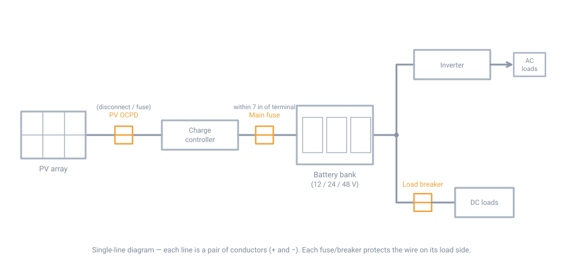
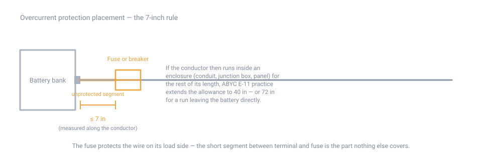
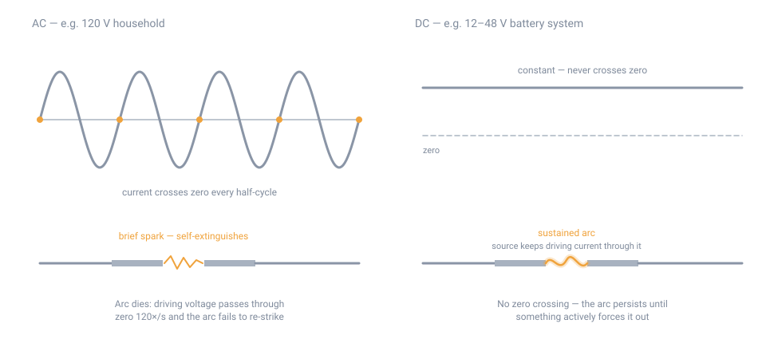

# Basic DC Wiring and Safety

## Summary

Low-voltage DC — 12V, 24V, or 48V — is how off-grid solar, battery banks, and
backup power move electricity around a building. It looks simple: two wires,
no neutral, no phase. It is not simple to get *right*, and getting it wrong is
a fire and burn hazard in ways household 120V AC wiring is not.

Three things make DC different enough to deserve its own reference page:

1. **An arc that forms in a DC circuit doesn't self-extinguish** the way an AC
   arc does. This alone is why switches, breakers, and fuses need a real DC
   rating rather than being interchangeable with AC hardware.
2. **A battery is a near-zero-impedance source.** A car battery can put out
   over 1,000 A into a dead short; a bank of them can go far higher, briefly.
   There is no household AC equivalent to what a wrench dropped across
   battery terminals can do.
3. **Voltage drop, not wire ampacity, is usually the limiting factor at 12V
   and 24V.** A drop that would be trivial at 120V can stall a charge
   controller or starve a load at 12V, and it takes much fatter wire than
   ampacity tables alone would suggest.

This page is the shared reference for wire sizing, overcurrent protection,
grounding, and connectors that the solar (`10-solar-sizing.md`) and battery
bank (`20-battery-banks.md`) pages point back to. Read it once for the
concepts; come back to the tables when you're sizing an actual run.

!!! warning "Not a substitute for a licensed electrician"
    This page covers general, widely-applicable practice for low-voltage DC
    circuits. It is not a code course and it does not replace an inspection
    where one is required. Follow your local electrical code and, for
    anything permitted or grid-interactive, use a licensed electrician.

## A typical off-grid DC system

{ width="960" }

A small off-grid installation carries more overcurrent protection than it first looks like, because there are **two independent energy sources** (the array and the battery bank) feeding **multiple load paths** (DC loads directly, AC loads through the inverter). The diagram above is a single-line drawing — every line represents a pair of conductors (+ and −).

Reading left to right, the protection points are:

- **PV OCPD / disconnect.** The array can produce current whenever there is light, including when everything else is off. A PV disconnect (required by NEC 690.11 for safe shutdown) plus a fuse where the code requires one on the module conductors (NEC 690.9 — typically when parallel strings push conductor current above its ampacity) sit between the array and the charge controller.
- **Main battery fuse.** The single most important protection point in the system. It sits as close to the battery terminal as the placement rule allows (see below), is sized to the battery-cable ampacity, and covers the heavy cable run from the bank to the distribution point or inverter. A dropped wrench across those terminals is a thousands-of-amps event; this fuse is what makes it survivable.
- **Load breakers.** Each DC load circuit gets its own breaker at the distribution point, sized to *that circuit's* wire. This protects the load-side wire and gives you a serviceable disconnect per load without touching the main fuse.

The governing principle: **every segment of wire is protected by the nearest upstream device sized for that wire.** Protection cascades from source outward — the main fuse covers the big cable, each branch breaker covers its own run. If any segment of wire has no upstream device rated at or below its ampacity, that segment is unprotected, and a fault there is limited only by what the source can deliver.

## Quick reference

### Wire ampacity by size (copper)

The table below is the commonly used **NEC Table 310.16** ampacity values
for insulated copper conductors, which is the baseline most off-grid
literature and calculators build from. It applies under **specific stated
conditions** — it is not a universal number for a given gauge:

- Ambient temperature of **30°C (86°F)**
- **No more than three current-carrying conductors** bundled together in a
  raceway, cable, or direct burial
- The column you're allowed to use is capped by your **insulation rating**
  (60/75/90°C) *and* by the temperature rating of the terminals/lugs at each
  end — a 90°C-rated wire landed on a 75°C-rated terminal is limited to the
  75°C ampacity

| AWG | 60°C insulation (e.g. TW) | 75°C insulation (e.g. THWN) | 90°C insulation (e.g. THHN, XHHW-2) |
|---|---|---|---|
| 14 | 15 A | 20 A | 25 A |
| 12 | 20 A | 25 A | 30 A |
| 10 | 30 A | 35 A | 40 A |
| 8  | 40 A | 50 A | 55 A |
| 6  | 55 A | 65 A | 75 A |
| 4  | 70 A | 85 A | 95 A |
| 2  | 95 A | 115 A | 130 A |
| 1/0 | 125 A | 150 A | 170 A |
| 2/0 | 145 A | 175 A | 195 A |
| 4/0 | 195 A | 230 A | 260 A |

More than three current-carrying conductors bundled together, or ambient
temperatures above 30°C (a hot attic, an enclosed battery box, direct
sun on conduit) require the correction factors in NEC Table 310.15(B)(1) —
the number on this table is a starting point, not the final answer.

**ABYC E-11** (the marine DC standard, and the most rigorous public reference
for low-voltage DC practice on land as well) uses a parallel but not
identical framework: separate columns for wire *inside* an engine space
versus outside it, and its own insulation-temperature classes. If you're
following ABYC E-11 directly, use its tables rather than mixing them with
NEC 310.16 — the two are close but not numerically identical.

### Voltage drop governs more often than ampacity

At 12V, a voltage drop that would be unnoticeable at 120V can be the
difference between a charge controller reaching absorption voltage or not,
or a load running noticeably underpowered. **Size for voltage drop first,
then check that the result also clears the ampacity table above — use
whichever gauge is larger.**

ABYC E-11's rule of thumb: **3% maximum drop for critical circuits** (charge
controllers, electronics, anything voltage-sensitive) and **10% maximum**
for non-critical circuits (many lighting and resistive loads). Both are
judgment thresholds, not hard physical limits — tighter is always better at
low voltage.

Sizing formula (copper):

```
required circular mils = (K × Amps × round-trip feet) / allowed drop in volts
```

Where **K ≈ 10.75** (circular-mil-ohms per foot for copper, the constant used
throughout marine/off-grid wire-sizing references) and **round-trip feet** is
the *out-and-back* distance — double the one-way run, because current has to
return through the negative conductor too.

**Worked example — 12V, 20A load, 25 ft one-way run (50 ft round trip),
critical circuit (3% limit):**

- Allowed drop = 12V × 0.03 = 0.36V
- Required CM = (10.75 × 20 × 50) / 0.36 ≈ **29,900 circular mils**
- 6 AWG (26,240 CM) falls short; **4 AWG (41,740 CM)** clears it

Compare that to the ampacity table above: a straight 20A load only *needs*
12 AWG for ampacity (25A at 75°C). Sizing by ampacity alone would leave you
with roughly a 4% actual drop at that current and distance — over the
critical-circuit threshold. **This is the pattern to expect at 12V: the
voltage-drop answer is almost always the bigger wire.** At 24V the same load
and distance halves the current for the same power, which roughly halves the
required wire size — one practical reason higher-voltage battery banks are
easier to wire economically.

The same calculation across system voltages makes the trade concrete. Required gauge for a **25 ft one-way run (50 ft round trip) at a 3% drop limit**, copper — in every cell the voltage-drop answer is at least as large as the ampacity answer from the table above, which is exactly why drop governs:

| Load current | 12 V | 24 V | 48 V |
|---|---|---|---|
| 10 A | 8 AWG | 10 AWG | 14 AWG |
| 20 A | 4 AWG | 8 AWG | 10 AWG |
| 30 A | 2 AWG | 6 AWG | 8 AWG |
| 50 A | 1/0 | 4 AWG | 6 AWG |
| 100 A | 3/0 | 1/0 | 4 AWG |

For the same power, a 48 V system needs roughly three to four gauge sizes less wire than a 12 V system — and cable cost scales with cross-sectional area, so this is usually the dominant hardware-cost difference between low- and high-voltage battery banks. (Re-run both checks for your actual run length and drop limit; these numbers are the worked case, not a universal table.)

For a second-opinion check, NEC Chapter 9 Table 8 gives DC resistance per
1,000 ft for uncoated copper (approximately 1.21 Ω/kft for 10 AWG, 0.308
Ω/kft for 4 AWG); multiplying resistance by round-trip length and by current
gives the same answer by a different route and is worth doing once to build
intuition for how fast resistance stacks up on small gauges.

### Overcurrent protection: type and placement

| Fuse/breaker type | Typical AIC (interrupt rating) | Notes |
|---|---|---|
| **ANL** | Commonly ~5,000–6,000A AIC | Bolt-on, up to ~750A rated current; common as a main/house fuse |
| **MRBF** (mini battery fuse) | Commonly ~10,000A AIC at 12V | Mounts directly on the battery terminal; capped around 300A; AIC is not guaranteed at 24V/48V — check the manufacturer's voltage-derated rating before using on a multi-battery series string |
| **Class T** | Commonly ~20,000A AIC | Fully enclosed, very fast-clearing; many inverter manufacturers require it on the DC input, and it's the type called out for lithium battery installations in ABYC's lithium guidance |
| **MIDI / AMI** | Commonly ~5,000A AIC at 12V | Blade-style, compact; similar role to ANL in smaller form factor |
| **DC-rated circuit breaker** | Lower and more variable than the fuse types above | Resettable and useful as a manual disconnect, but confirm it's rated for your DC voltage and has an interrupt rating adequate for your bank's short-circuit current — an AC-only breaker is not a substitute (see the arc-flash section below) |

AIC figures vary by manufacturer and by voltage — treat the numbers above as
"this is the rough tier each type occupies," and always check the
manufacturer's datasheet for your exact part and voltage before relying on
it for a fault-current calculation.

**Placement**, per the widely-cited ABYC E-11 rule (verify against the
current edition of the standard for a permitted installation — the standard
itself is a paid publication and the figures below are as consistently
reported across ABYC-based marine and off-grid electrical references):

- Each ungrounded conductor leaving a battery must have overcurrent
  protection within **7 inches** of the battery terminal, measured along the
  conductor
- If that conductor runs the rest of its length inside a sheath or enclosure
  (conduit, junction box, enclosed panel), the allowance extends to
  **40 inches** for a non-battery source or **72 inches** for a conductor
  run directly from the battery
- The fuse or breaker protects **the wire**, sized to the wire's ampacity —
  not the device at the far end. Size it at or below what the wire can carry
  continuously, and high enough to clear the load's actual current without
  nuisance tripping.

{ width="960" }

### Polarity marking and color

| Convention | Rule |
|---|---|
| **NEC-required marking** | Positive conductor: "+", "POSITIVE", or "POS". Negative conductor: "−", "NEGATIVE", or "NEG". This symbol/text marking is what code actually requires, not a color. |
| **White or gray insulation** | Reserved *exclusively* for a **grounded** conductor in a system that has one. Do not use white/gray for a negative conductor in an **ungrounded** (floating, two-wire) PV array or battery system — that is a code violation and a real hazard, because it breaks the one universal DC convention that white ever means "grounded," not "negative." |
| **Red = positive / black = negative** | A long-standing field convention, **not** an NEC requirement. Treat it as a helpful habit, not proof of polarity — always confirm with a meter and the +/− markings before connecting. |

## Why DC arcs are a different animal

!!! danger "DC arcs don't self-extinguish"
    Household AC current reverses direction 120 times a second (in the US),
    which means it passes through **zero volts** every half-cycle. An arc
    that forms when an AC switch or breaker opens loses its driving energy
    at each zero-crossing, and if the contact gap has opened far enough and
    the arc chamber has cooled and de-ionized the air by that instant, the
    arc simply fails to re-strike. That's what makes an ordinary AC switch
    able to interrupt current with a small, brief spark.

    **DC current never crosses zero.** Once an arc ignites between opening
    contacts, the source keeps pushing current through the ionized arc path
    continuously, and the arc will happily sustain itself — stretching,
    burning, and heating the contacts — until something actively forces it
    out. That "something" is deliberate design: magnetic blowout coils that
    stretch and deflect the arc, longer contact gaps, and arc chutes that
    cool and de-ionize the arc column enough to push its voltage above what
    the circuit can sustain.

    **This is why a device has to be DC-listed, not just "rated for the
    voltage."** An AC-rated switch or breaker opened at 12–48VDC may not
    develop enough contact gap or cooling to clear the arc — it can weld
    itself in a partially-open state, continue arcing, and become an
    ignition source exactly when you're trying to de-energize something.
    Only use switches, breakers, disconnects, and fuses that carry an
    explicit DC voltage and current rating for the circuit you're
    protecting.

{ width="960" }

The same physics is why DC arc flash and DC arc-fault behavior differ from
AC — an arc across DC battery terminals or a failed DC connector can sustain
itself and continue dumping heat into the fault point for as long as the
source can supply current, not for a fraction of a cycle.

## Overcurrent protection: what it's actually for

A fuse or breaker's job is to protect **the wire**, not the device at the
far end. This reframes a few decisions:

- Size the overcurrent device to the ampacity of the wire it protects — at
  or below what the wire can carry continuously — then confirm that rating
  also clears the load's actual running current without nuisance tripping.
- Place it as close to the source (the battery) as practical, per the
  placement figures in the Quick Reference above. The reasoning: the segment
  of wire between the battery and the fuse is **unprotected** — if it
  shorts, nothing limits the current until you reach the next protection
  point, and a battery's short-circuit current is large enough that even a
  few unprotected inches of wire can vaporize or ignite insulation before
  a downstream fuse elsewhere in the circuit ever sees the fault.
- Continuous loads get headroom. Following the same logic NEC 690.8 applies
  to PV circuits (size conductors and overcurrent devices for at least 125%
  of the calculated continuous current), don't run a breaker or fuse at
  100% of a load's steady-state draw — leave margin so ordinary operation
  doesn't ride the trip point.

## Grounding and bonding, at the basic-safety level

Grounding and bonding on a DC system does two distinct jobs, and it's worth
keeping them separate in your head:

- **System grounding** intentionally ties one current-carrying conductor (or
  a defined reference point) to earth, to stabilize the system's voltage
  relative to ground. Many modern off-grid inverters and charge controllers
  are "ungrounded" (functionally floating) by design and rely on other
  means — internal ground-fault detection, isolation — instead of a
  solidly grounded conductor. NEC 690 Part V (690.41, 690.45) covers when
  and how a PV/battery DC system is grounded; follow your equipment
  manufacturer's grounding diagram, because grounding a system that's
  designed to float (or vice versa) can defeat the equipment's own
  protection.
- **Equipment grounding/bonding** is separate and always applies: exposed
  metal that isn't supposed to carry current — module frames, metal racking,
  enclosures, disconnect boxes — gets bonded together and connected to an
  equipment grounding conductor (NEC 690.43). The point is that if internal
  insulation ever fails and a live conductor touches the frame, the fault
  current has a low-impedance path to trip the overcurrent device or bleed
  off safely, instead of leaving the rack or enclosure sitting at a
  dangerous voltage relative to the ground someone is standing on.

For a basic fixed-dwelling installation, this means: bond all metal
racking/frames together (many racking systems use UL 2703-listed bonding
hardware that does this as you assemble it), run an equipment grounding
conductor from the array/rack back to the same grounding point as the
battery/inverter enclosures, and land that at your building's grounding
electrode system rather than a separate, unbonded ground rod. Multiple,
unbonded ground points is a bigger latent hazard than it looks — during a
fault or a lightning event, ungrounded metal parts at different potentials
create the shock path. This is a large topic in full code terms; treat the
above as the basic-safety floor, not the whole of NEC 690 Part V.

## Connectors and terminations

**Crimped lugs, done correctly, are not optional.** A twisted wire jammed
into a lug and squeezed with the wrong tool — or worse, just soldered at the
end with no mechanical crimp — leaves a connection whose resistance rises
over time as it vibrates loose or the solder joint work-hardens and cracks.
Rising resistance under load means rising heat at exactly the point you can't
see it, inside an insulated boot or under a bus bar cover. Loose or
poorly-made DC power connections are a genuinely common start point for
electrical fires in battery-based systems.

- **Use the lug sized for the wire and the correctly-sized crimp die** —
  not a generic pliers-style crimper. A proper crimp deforms the barrel
  uniformly around every strand; a bad crimp leaves voids that arc and heat
  under load.
- **Solder-only terminations on large power cables are discouraged** in
  marine/off-grid practice: solder wicks up into the strands beyond the
  barrel and creates a stiff transition point that's more prone to
  fatigue-cracking under vibration than a properly crimped joint. A crimp
  plus solder as a belt-and-suspenders step is sometimes used, but crimp is
  the mechanical connection doing the real work — never solder as a
  substitute for a crimp.
- **Torque matters, and the number is connection-specific.** Under-torquing
  a lug-to-busbar or lug-to-battery-terminal bolt leaves a connection that
  loosens with thermal cycling; over-torquing can deform the lug or strip
  threads. Use the torque value published for your specific terminal,
  lug, and stud size — there is no single universal torque figure for "DC
  power connections," despite what a quick internet search might suggest.
- **MC4 connectors** (or listed equivalents) are the standard for PV module
  interconnects: keyed, weatherproof when fully mated, and rated for outdoor
  UV/moisture exposure. Don't mix connector brands even when they look
  compatible — mating tolerances between manufacturers aren't guaranteed,
  and a connector that looks seated but isn't fully locked can arc under
  load, which — per the arc-flash discussion above — will sustain and heat
  rather than self-extinguish. **Never unmate an MC4 connector under load**;
  disconnecting a live PV circuit at the connector can draw a sustained DC
  arc across the pins.
- **Strain relief and weatherproofing outdoors.** Support cable weight at
  the connector so the termination isn't bearing tension, and use
  glands/boots rated for outdoor exposure at any junction box entry.
  Cold-climate note (NH/northeastern US): ordinary building-wire insulation
  (THWN-2 and similar) stiffens and can crack when flexed in cold weather —
  commonly cited around 14°F (-10°C) and below — while UL 4703-listed PV
  wire is specifically tested for flexibility down to -40°C and is the
  better choice for exposed outdoor array-to-controller runs in this
  climate. Snow and ice loading on any unsupported outdoor cable run is
  also worth planning for physically, not just electrically. The solar and
  battery pages carry the fuller cold-climate discussion; this is the
  wiring-specific piece of it.

## Procedure: running a basic DC circuit

1. **Measure the run.** Get the actual one-way cable path length, not
   straight-line distance — include every bend, rise, and service loop.
   Double it for the round-trip figure the voltage-drop formula needs.
2. **Establish the load's current.** Use the equipment's rated continuous
   current, not a guess. If the circuit will run continuously (hours, not
   minutes), plan headroom the way NEC 690.8 does for PV circuits — size for
   at least 125% of that current.
3. **Size the wire.** Run both checks from the Quick Reference above —
   ampacity table and voltage-drop formula — and use whichever gives the
   larger gauge. At 12V and 24V, expect voltage drop to win most of the
   time.
4. **Protect exposed runs physically.** Use conduit, split loom, or a
   properly clamped cable run anywhere the wire could see abrasion, sun, or
   physical damage. Outdoors in this climate, favor UV- and cold-rated
   jacketing (see the cold-climate note above) and support the run so ice
   and snow load don't hang weight on a connector or a single clamp point.
5. **Terminate with correctly-sized, correctly-crimped lugs** at both ends,
   torqued to the terminal manufacturer's spec. Heat-shrink the lug barrel
   if the lug doesn't come pre-insulated.
6. **Install overcurrent protection at the source end**, within the
   placement distance from the Quick Reference above, sized to the wire's
   ampacity.
7. **Label polarity at both ends** using +/POS and −/NEG markings — don't
   rely on color alone, and never use white/gray for a negative conductor
   on an ungrounded system (see the polarity table above).
8. **Verify before energizing.** Check voltage and polarity with a meter at
   the load end, and check for unintended continuity to chassis/ground,
   before connecting the load or closing the source-end disconnect.

## Safety

!!! danger "A battery bank can deliver an enormous short-circuit current"
    A single automotive-class 12V battery can source **over 1,000 amps**
    into a dead short; scaled-up battery banks used for off-grid and backup
    power can go well into the thousands of amps, briefly, before any
    protection clears the fault. That current doesn't ramp up — it's
    available the instant a low-resistance path (a dropped wrench, a metal
    watchband, a stray strand of wire) bridges the terminals.

    That's why the standard practice before working on a battery bank is:
    **remove rings, watches, bracelets, and anything metal on your hands and
    wrists.** A ring bridging a battery terminal and any grounded metal can
    heat to skin-burning temperature in a fraction of a second and cannot be
    pulled off with a burned finger. This is one of the most common serious
    injuries around battery work, and it's entirely preventable by taking
    metal off before you start.

- **Work de-energized where practical.** Open the source-end disconnect or
  pull the fuse before working on a circuit, and verify with a meter that
  it's actually de-energized — don't trust a switch position alone.
- **Use the one-hand rule** when you must work near live DC terminals: keep
  one hand in a pocket or behind your back so a slip doesn't create a path
  across your chest.
- **Use insulated tools** rated for the voltage present, and cover any
  exposed live terminal or bus bar you're not actively working on.
- **Treat inverters and charge controllers as potentially energized** for a
  period after shutdown — internal capacitors can hold a charge.
  Manufacturer documentation will state the discharge time; respect it.
- **Wear eye protection** at minimum any time you're working near battery
  terminals — a arcing short can throw molten metal, and a shorted
  lead-acid battery can vent gas or, in the worst case, rupture.
- **Arc flash from a DC source is real and sustained**, not the brief pop
  you might expect from household wiring — see the arcing discussion above.
  This is the underlying reason for DC-rated switchgear, correct fusing, and
  not defeating a fuse or breaker "just to get past a nuisance trip."

### Common mistakes that start fires and injuries

The failure patterns below are the ones that actually show up in damaged
installations — each maps to a rule on this page:

- **Sizing 12 V wire by ampacity alone.** A 12 AWG "20 amp" wire running a
  20 A load for 25 ft drops ~4% and runs hot; the voltage-drop answer (4 AWG)
  is the correct one. Ampacity-only sizing is the single most common wiring
  error at low voltage.
- **Using AC-only breakers or switches on DC circuits.** They may hold the
  voltage rating on paper but lack the contact gap and arc-quenching design,
  so they can weld shut mid-open while arcing — an ignition source exactly
  when you're trying to de-energize.
- **Unmating MC4 connectors under load, or mixing connector brands.** A live
  PV circuit disconnected at the connector draws a sustained DC arc across
  the pins; mismatched brands may not fully lock and can arc under normal
  operation.
- **Omitting the main battery fuse — or placing it at the panel instead of
  the battery.** The whole point is that the short segment between terminal
  and fuse is the only unprotected part; moving the fuse to the panel makes
  the entire battery cable unprotected against a terminal short.
- **White wire as negative on an ungrounded system.** It breaks the one
  universal DC convention (white/gray = grounded conductor only) and will
  mislead the next person who works on the system, possibly you.
- **Solder-only lugs, or lugs crimped with the wrong die.** Both produce a
  connection whose resistance creeps up over time — heat at a point you can't
  see until it's too late.
- **"Upgrading" a blown fuse to a bigger rating to get past a nuisance trip.**
  The fuse was sized for the wire; a bigger one removes the wire's protection.
  Find and fix the actual fault, or upsizing the *wire and* the protection
  together as an intentional design change.
- **Torquing by feel instead of the terminal's published spec.**
  Under-torqued connections loosen with thermal cycling; over-torqued ones
  deform lugs and strip threads. The number is connection-specific — it's on
  the terminal or lug documentation, not a universal constant.

## Sources

- [NFPA 70, National Electrical Code, Article 690](https://www.nfpa.org/codes-and-standards/nfpa-70-standard-development/70) — Solar Photovoltaic (PV) Systems: 690.8 (circuit sizing and the 125% continuous-current factor), 690.9 (overcurrent protection), 690.31 (wiring methods and conductor identification/marking), 690.41/690.43/690.45 (system and equipment grounding/bonding). The current edition requires purchase or library/NFPA free-access viewing; treat section numbers here as the pointer, and verify current text before a permitted installation.
- **ABYC E-11, AC and DC Electrical Systems on Boats** — the most rigorous public standard for low-voltage DC wire sizing, ampacity, voltage-drop practice, and overcurrent placement, and the source of the wire-gauge/voltage-drop method and the 7"/40"/72" overcurrent placement figures used above. It is a paid standard; the figures here are as consistently reported across ABYC-based marine/off-grid references such as [Blue Sea Systems' DC Circuit Protection guide](https://www.bluesea.com/support/articles/Circuit_Protection/98/DC_Circuit_Protection) and [DC Main Overcurrent Protection Requirements](https://www.bluesea.com/support/articles/Circuit_Protection/99/DC_Main_Overcurrent_Protection_Requirements). Verify against the current published standard where precision matters for a permitted or insured installation.
- [NEC Table 310.16 ampacity values, as reproduced with stated conditions](https://www.voltagelab.com/nec-table-310-16/) — ampacities assume 30°C ambient and no more than three current-carrying conductors; insulation-temperature column use is further limited by terminal temperature ratings.
- [NEC Chapter 9, Table 8 — Conductor Properties](https://www.buildmyowncabin.com/nec/nec2014_chap9_table8.html) — DC resistance per 1,000 ft for uncoated copper conductors, used above as a cross-check on the voltage-drop worked example.
- [Blue Sea Systems, "Broad Range of Fuses and Fuse Blocks"](https://www.bluesea.com/support/articles/Circuit_Protection/1442/Broad_Range_of_Fuses_and_Fuse_Blocks_From_Blue_Sea_Systems) — ANL/MRBF/Class T/MIDI fuse type comparison and typical AIC ratings; AIC figures are manufacturer- and voltage-specific, confirm against the exact part's datasheet.
- [Viox Technologies, "Why DC Contactors Need Special Arc Extinction"](https://viox.com/dc-contactor-arc-extinction-zero-crossing-magnetic-blowout/) — mechanism of AC zero-crossing arc quenching versus sustained DC arcing, and why DC switchgear needs magnetic blowout/arc-chute design.
- [Mike Holt's Code Forum, "Color of positive and negative string wiring"](https://forums.mikeholt.com/threads/color-of-positive-and-negative-string-wiring.115733/) — discussion confirming NEC does not mandate red/black for PV polarity and that white/gray is reserved for a grounded conductor only.
- [ecmweb.com, "Wiring Methods for PV Systems and the NEC"](https://www.ecmweb.com/national-electrical-code/article/20897202/wiring-methods-for-pv-systems-and-the-nec) — PV conductor identification and marking requirements under 690.31.
- [Van Meter Inc., "Cold Weather Wire Pulling: Minimum Installation Temperatures"](https://www.vanmeterinc.com/blog/tips-for-pulling-wire-in-cold-weather) — thermoplastic (THHN/THWN-2) insulation stiffening/brittleness in cold temperatures, cited around -10°C (14°F).
- [PhotovoltaicCable.com, "UL 4703 PV Wire: Why It Matters"](https://www.photovoltaiccable.com/blogs/news/ul-4703-pv-wire) — UL 4703 PV wire's low-temperature flexibility rating versus standard building wire, relevant to outdoor array-to-controller runs in cold climates.
- [SELTERM, "Crimping vs. Soldering: Choosing the Right Method for Battery Cable Lugs"](https://selterm.com/blogs/selterm/crimping-vs-soldering-choosing-the-right-method-for-battery-cable-lugs) — mechanical and thermal reasoning for preferring crimped over solder-only terminations on large DC power cable.
