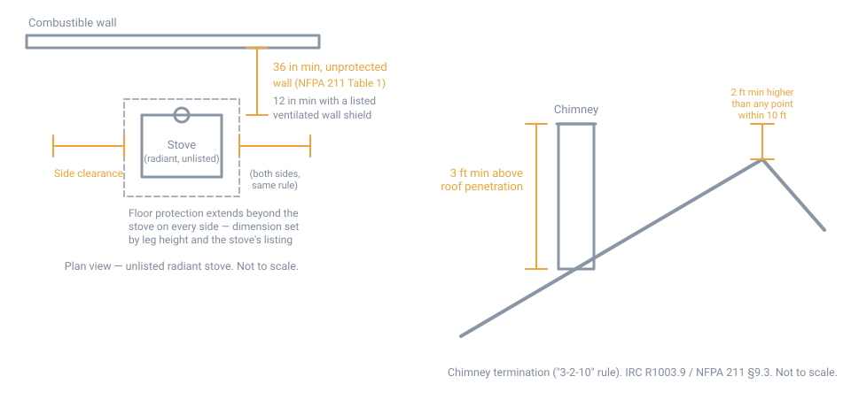

# Wood Stove Installation and Clearances

## Summary

A wood stove is the single most common way a house in this region burns down
from a heating system, and nearly every case traces back to one of a small
number of mistakes: too little clearance to a combustible surface, a chimney
that was never lined or was undersized, a connector pipe cobbled together out
of the wrong parts, or a flue clogged with creosote from a smoldering fire fed
wet wood. None of these mistakes look dangerous while the stove is working
normally. They fail years later, at 2 a.m., in the coldest week of the year.

**The single most important rule on this page: for a listed (UL- or
ULC-tested) stove, the clearances and hearth dimensions on the manufacturer's
rating label and in the owner's manual govern — full stop.** A listed stove is
tested as a complete system, and its tested clearances are frequently much
smaller than the generic numbers below, because the manufacturer paid to prove
a tighter number is safe for that specific model. Installing a listed stove to
the generic clearances in this page when the label specifies something
different is itself a code violation.

The generic clearances below, drawn from NFPA 211 (the national installation
standard for chimneys, vents, and solid-fuel appliances) as reproduced in a
state fire marshal's public installation guide, apply to **unlisted stoves**
and to any situation — a home-built or antique stove, a lost manual, an
unusual configuration — where no tested listing exists. They are the fallback,
not the first choice. NFPA 211 itself is a paywalled standard; the numbers
here are drawn from a state fire marshal's official public reproduction of its
tables and are noted as such throughout. Treat this page as a way to sanity
check a listed installation and as the standard to design to when no listing
exists — not as a substitute for reading the actual standard or the actual
manual in hand.

## Before you begin

- **Confirm EPA certification.** Under the current EPA New Source Performance
  Standard (NSPS), a wood heater sold since May 2020 must emit no more than 2.0
  g/hr of particulate matter (tested with crib wood) or 2.5 g/hr (tested with
  cord wood) — roughly half the 4.5 g/hr limit that took effect in 2015.
  Stoves made before 1988 were unregulated; this page does not have a verified
  emissions figure for that era, but the qualitative difference is large: an
  old uncertified stove burns less completely, produces more smoke and
  creosote per pound of wood, and is far more likely to be operated by
  damping the air down to "coast," which is the single behavior most
  responsible for chimney fires. An old stove is not automatically unsafe to
  install, but it is not a listed appliance, and its clearances default to the
  unlisted numbers in this page rather than to a label.
- **Size the stove to the space**, using the manufacturer's rated heating
  area — printed on the same label as its clearances — rather than by eye.
  An oversized stove run damped down to avoid overheating the room creates
  exactly the low-temperature, incomplete-combustion fire that deposits
  creosote fastest.
- **Get the permit before the stove goes in.** Nearly every jurisdiction
  treats a solid-fuel appliance as a permitted installation requiring
  inspection, and requirements vary town to town — confirm with the local
  building department or fire marshal rather than assuming. An unpermitted
  installation can also void a homeowner's insurance claim even in a fire
  unrelated to the stove.
- **Call the insurer before, not after.** Most homeowner insurers require
  notice of a wood stove and, increasingly, a compliance inspection or
  certificate before they will cover it. Canada has a formal national
  standard for this — a WETT (Wood Energy Technology Transfer) inspection —
  but that program is Canadian; in the US, insurers typically ask for
  inspection by the local fire department, code official, or a
  CSIA-certified chimney sweep, and a signed certificate of compliance. Ask
  what your specific insurer wants, in writing, before the inspection.
- **Have the chimney inspected before, not after, connecting a stove to it.**
  If it is an existing masonry chimney, confirm it is lined, sized correctly
  for the new appliance, and sound before running a stove into it.

## Clearances to combustibles

### Wall and ceiling clearances, unlisted stoves

Table 1 below reproduces NFPA 211's minimum clearances from an unlisted,
**unprotected** solid-fuel stove to a combustible wall or ceiling, as codified
in the Maine State Fire Marshal's installation standard. "Combustible wall"
here has a specific, narrower meaning than it sounds like: **only solid
masonry or corrugated steel counts as non-combustible.** Nailing a sheet of
tile or cement board over a wood-studded wall does not make it a
non-combustible wall — it makes it a protected combustible wall, which is a
different, and reduced, clearance category (see below).

| | Radiant | Circulating | Cookstove, clay-lined firepot | Cookstove, unlined firepot | Stovepipe |
|---|---|---|---|---|---|
| Ceiling | 36 in | 36 in | 30 in | 30 in | 18 in |
| Front | 36 in | 24 in | — | — | 18 in |
| Side | 36 in | 24 in (firing side), 18 in (opposite side) | — | — | 18 in |
| Rear | 36 in | 12 in | 24 in | 36 in | 18 in |

A **listed stove installs per the manufacturer's label instead of this
table** — full stop, as above.

Clearance in front of the loading door or ash-removal door must never be less
than **18 inches**, regardless of stove type.

### Reducing clearance with wall protection

An unlisted stove's clearance can be reduced below Table 1 if the
combustible surface is protected with one of the constructions NFPA 211
specifies, each rated for a maximum percentage reduction:

| Protection | Max. reduction, wall | Max. reduction, ceiling |
|---|---|---|
| 3½ in masonry wall, no air space | 33% | — |
| ½ in noncombustible insulation board over 1 in mineral wool, no air space | 50% | 33% |
| 24-gauge sheet metal over 1 in mineral wool, with ventilated air space | 66% | 50% |
| 3½ in masonry wall, with ventilated air space | 66% | — |
| 24-gauge sheet metal alone, with ventilated air space | 66% | 50% |
| ½ in noncombustible insulation board, with ventilated air space | 66% | 50% |

The reduced clearance is `C = C₀ × [1 − (R/100)]`, where `C₀` is the Table 1
clearance and `R` is the percent reduction — but **regardless of the
calculation, an unlisted stove's clearance may never be reduced below 12
inches to a wall or 18 inches to a ceiling.** For the common case of a 36 in
Table 1 clearance, those floor values happen to equal the result of the 66%
reduction, which is why 12 in and 18 in are the numbers usually quoted.

Details that make a protective shield actually work, not just look right:

- A **ventilated air space** needs at least a 1 in gap between the shield and
  the combustible surface, open at top and bottom (or top and one side, for a
  flat wall away from a corner) so convection actually moves air through the
  gap. A shield fastened flush to the wall with no air movement does not get
  the higher reduction percentage.
- Spacers and fasteners holding the shield off the wall must be
  **noncombustible**, and none may be placed directly behind the appliance or
  connector, where they would short-circuit the air gap exactly where it
  matters most.
- Sheet metal shielding is minimum 24-gauge (0.024 in); mineral wool batts
  need a minimum density of 8 lb/ft³ and a 1,500 °F melting point.
- All of this is a fallback for an **unlisted** appliance. A listed stove's
  own tested clearance, whatever it is, controls instead.

{ width="760" }

## Hearth and floor protection

- A stove **listed for installation on a combustible floor** uses whatever
  floor protection its listing specifies — often a thinner hearth pad than
  the fallback numbers below, because it was tested as a system.
- For an **unlisted** stove, floor protection is set by the height of the
  stove's legs, per the table below.

| Leg length | Required floor protection |
|---|---|
| Less than 2 in | Fire-resistant floor (noncombustible) |
| 2–6 in | 4 in of hollow masonry, laid to allow air circulation through it, covered by 24-gauge sheet metal |
| Over 6 in | 2 in of masonry over a sheet of 24-gauge sheet metal |

Independent of the leg-length table, **any floor assembly, slab, or hearth
extension must extend not less than 18 inches beyond the appliance on every
side** — front, sides, and rear alike.

!!! note "Sources disagree here — read the label"
    Many retail and installer sites quote a hearth footprint of roughly 16–18
    in in front of the loading door and 8 in to the sides for a stove with
    legs 6 in or taller. That figure describes a *typical listed stove's*
    tested hearth pad spec, not the NFPA 211 fallback for an unlisted
    appliance, and it is not a single fixed number — it is whatever that
    specific stove's listing says. The only generically-mandated minimum for
    an unlisted stove's floor protection is the 18-inches-on-every-side rule
    above. **For a listed stove, the number printed on the hearth pad's own
    listing or the stove's manual is the one that governs**, and it can
    legitimately be smaller than 18 in in front, larger, or asymmetric.

A stove can also be installed with no added floor protection at all if it
sits on a concrete slab or masonry arch with no combustible material attached
to its underside, on a properly engineered 2-hour fire-rated noncombustible
assembly, or on properly stabilized ground — none of which describes a wood
floor over joists.

## Connector pipe (stovepipe)

- The connector pipe (also called stovepipe) links the stove's flue collar to
  the chimney. It is not chimney and should never be mistaken for one — it is
  not rated for the temperatures a chimney fire reaches, and it is not
  weathertight.
- Minimum steel thickness is **24 gauge**; lower gauge numbers are thicker.
- **Single-wall connector**: minimum clearance to a combustible surface is
  three times the pipe's diameter (a 6 in pipe wants 18 in clear, which is
  where the commonly quoted "18 inches for single-wall pipe" figure comes
  from). That clearance reduces under the same Table 2 percentages as wall
  protection, applied around the pipe.
- **Listed double-wall connector pipe** is tested and labeled for a specific,
  reduced clearance by its own listing — commonly a good deal less than the
  single-wall figure, but the number is set by that product's listing, not by
  a single NFPA figure. Use the clearance printed on the pipe or its
  documentation, not a number remembered from a different product.
- Keep the connector **as short and as straight as possible**: no more than
  two right-angle elbows, and total length no more than about 75% of the
  vertical chimney height above the point the connector enters it. Every
  additional foot of pipe and every extra elbow is more surface for creosote
  to condense on.
- Any horizontal run should rise **¼ inch per foot** toward the chimney, so
  the whole system drafts uphill.
- Join sections with at least a **2 in overlap**, crimped end pointing down
  (so condensate and creosote drip back into the stove, not out through the
  joint), secured with at least three sheet-metal screws per joint.
- The connector must **never pass through a ceiling or a closet** — a closet
  fire around a connector can smolder and spread unnoticed. Where a
  connector must cross to an upper floor, that transition is a job for a
  listed factory-built, all-fuel chimney section, installed per its listing,
  not for stovepipe.
- The **entire length must stay accessible** for inspection and cleaning, and
  the connector must not project into the chimney flue itself, which chokes
  the draft.

## Chimney

- **Line every masonry chimney.** An unlined masonry flue is not acceptable
  for a solid-fuel appliance. Acceptable linings are clay flue tile or
  fireclay brick, a listed chimney-lining system, a factory-built chimney
  unit listed for installation inside a masonry chimney, or another approved
  material that resists corrosion, erosion, softening, and cracking from flue
  gases and condensate up to 1,800 °F.
- **Factory-built (Class A) chimney** is the other common path, especially
  where there is no existing masonry chimney to reuse. It must be listed for
  use with solid-fuel appliances specifically — a gas-only prefabricated
  chimney is not interchangeable — and installed exactly per its listing.
  Even a listed metal chimney can fail structurally under the heat of a
  genuine chimney fire, which is a reason creosote control (below) matters as
  much for a Class A installation as for masonry.
- **Size the flue to the appliance**, not the other way around. The flue
  area should not be smaller than the stove's flue collar or the connector
  pipe; an oversized flue on the other hand cools the flue gases faster and
  encourages creosote deposition, so match the manufacturer's specified flue
  size rather than using whatever chimney happens to already be there.
- **Never connect two solid-fuel appliances, or an appliance and a
  fireplace, to a single flue** unless the appliance is specifically listed
  for that shared connection.

### Termination height: the "3-2-10" rule

A chimney needs enough height above the roof to draft reliably and to keep
sparks and embers away from the roof surface. The rule, stated identically in
the International Residential Code (R1003.9) and in NFPA 211, has three
numbers:

- At least **3 feet** above the point where the chimney passes through the
  roof.
- At least **2 feet higher than any part of the building within 10 feet**
  of the chimney, measured horizontally — a nearby ridge, dormer, or adjacent
  roof section included.
- Whichever of the two requirements demands more height controls.

{ width="760" }

## Permits, inspection, and insurance

- **Confirm requirements with the local building department or fire
  marshal.** As with frost depth elsewhere in this wiki, this is a
  jurisdiction-set number (here, a process, not a distance) and this page
  cannot print a figure that is right for every town.
- **Chimney inspection level.** Before connecting a new appliance to an
  existing chimney, have it inspected — NFPA 211 sets this at a minimum Level
  2 inspection, the tier that includes a video scan of the flue interior, not
  just a visual look from the top and bottom. During the heating season, the
  flue should be visually checked at least monthly.
- **Document the installation.** Photos of the clearances, the connector
  routing, and the chimney before it is closed up are worth having the day an
  inspector, an insurer, or a future buyer's home inspector asks.

## CO and smoke detectors

- Install carbon monoxide detection on the ceiling of the same room as any
  permanently installed fuel-burning appliance, per NFPA 720 guidance, in
  addition to CO detection centrally located on every habitable level of the
  home.
- Smoke alarms belong on every level and outside every sleeping area, per
  ordinary residential code — a wood stove does not change this baseline, it
  makes it more important.
- **State and local adoption of these placement rules varies**; confirm the
  specific requirement with the local code official the same way you would
  for any other code number in this wiki.

## Creosote and chimney fire prevention

- **Burn seasoned wood — roughly 15–20% moisture content**, checked with a
  moisture meter on a freshly split face, not the weathered outer surface.
  Wetter wood burns cooler and less completely, and the EPA estimates it can
  produce on the order of 50% more smoke and creosote than properly seasoned
  wood burned in the same appliance.
- **Season for the full timeline**: a minimum of about 6 months for softwood
  and 12 months for hardwood, split, stacked off the ground, top-covered, and
  with the sides open to wind and sun.
- **Hot fires beat smoldering ones.** A fire damped down to "coast" overnight
  burns at a lower temperature, which condenses more creosote in the flue
  than a smaller, hotter fire. Undersizing the stove to the space, so it can
  run open more of the time, does more for creosote control than any single
  maintenance habit.
- **Sweep and inspect at least annually**, and more often if visual
  inspection during the season shows heavy buildup. A chimney fire announces
  itself with a loud roar, dense sustained smoke or sparks from the top, and
  sometimes a shaking or rumbling stack — if that happens, close the stove's
  air intake and call the fire department even if the fire appears to burn
  itself out; the heat can have already damaged the flue liner or a
  factory-built chimney's structural rating.

## Safety

- **Never burn trash, painted or treated lumber, or use a flammable liquid to
  start or revive a fire.** Treated wood and painted surfaces release toxic
  compounds when burned, and starting fluid on an already-hot stove is a
  flash and burn hazard.
- **Ash is dangerous for days, not hours.** Embers can stay live under a bed
  of ash for a surprisingly long time. Store ash in a metal container with a
  tight lid, set on a noncombustible surface outdoors, away from the house
  and anything combustible — a large share of wood-heat house fires start
  from ash disposed of "cold" that was not.
- **Keep furniture, bedding, curtains, and stored wood outside the
  clearance zone**, not just at its edge. The clearance numbers above are
  tested minimums to fixed building surfaces, not a safe distance for
  anything that can be shoved closer by accident.
- **CO poisoning kills without warning.** It is colorless, odorless, and the
  early symptoms — headache, fatigue, nausea — are easy to mistake for
  something else. Test detectors, and do not assume draft is normal during a
  power outage or a downdraft event without checking.
- **Check the floor structure** before installing a heavy stove or any
  masonry chimney component on an upper floor. Clearance and hearth rules say
  nothing about whether the framing below can carry the load.
- Keep a **UL-rated fire extinguisher** near the stove, not in a closet down
  the hall.

## Regional assumptions

Wood heat is a common primary or backup heat source in this region, including
as a resilience measure when the grid or a fuel-delivery supply chain is
down — which is exactly the situation this wiki is written for. That context
does not relax any rule on this page; if anything it raises the stakes, since
an amateur installation failure that burns down the house removes the shelter
you were trying to protect, at the moment you can least afford to lose it.
Clearances, hearth protection, and creosote management here assume the
heating-season length and negative design temperatures typical of the
Northeast, where a stove runs hot and hard for months at a time rather than
occasionally on a cool evening.

## Sources

- [Office of Maine State Fire Marshal, *Recommended Standards for the Installation of Solid Fuel Burning Stoves*](https://www.maine.gov/dps/fmo/sites/maine.gov.dps.fmo/files/inline-files/standardsfor_solidfuel_stoves.pdf) — a state fire marshal's public reproduction of NFPA 211 (2006 ed.) Table 1 (wall/ceiling clearances), Table 12.6.2.1 (clearance reduction with specified protection), Table 3 (floor clearance by leg length), the 18-in-on-all-sides floor extension rule, connector installation details (gauge, overlap, elbow count, 75% length rule, rise per foot), the masonry chimney lining and inspection requirements, and the chimney height diagram. NFPA 211 itself is a paywalled standard; this document is the verifiable public source used for the table values on this page.
- [2021 International Residential Code, R1003.9, Termination](https://codes.iccsafe.org/s/IRC2021P2/chapter-10-chimneys-and-fireplaces/IRC2021P2-Pt02-Ch10-SecR1003.9) — the chimney termination height rule (3 ft above roof penetration, 2 ft above any part of the building within 10 ft), independently confirming the same figures reproduced from NFPA 211 above
- [EPA, *Fact Sheet: Summary of Requirements for Woodstoves and Pellet Stoves*](https://www.epa.gov/stationary-sources-air-pollution/fact-sheet-summary-requirements-woodstoves-and-pellet-stoves) — the 2015 Step 1 (4.5 g/hr) and 2020 Step 2 (2.0 g/hr crib / 2.5 g/hr cord wood) New Source Performance Standard emission limits
- [EPA, *EPA-Certified Wood Stoves*](https://www.epa.gov/burnwise/epa-certified-wood-stoves) — the purpose and scope of EPA certification for new wood heaters
- [Cornell Cooperative Extension, *Storing and Drying Firewood*](https://warren.cce.cornell.edu/natural-resources/heating-with-wood/storing-and-drying-firewood) — seasoning timelines and stacking practice for the Northeast
- [NFPA 720, *Standard for the Installation of Carbon Monoxide (CO) Detection and Warning Equipment*](https://www.nfpa.org/codes-and-standards/nfpa-720-standard-development/720) — CO detector placement near permanently installed fuel-burning appliances
- [Chimney Safety Institute of America](https://www.csia.org/) — professional certification body for chimney sweeps and inspectors, referenced for annual inspection and sweeping practice

Note: the EPA's consumer-facing Burn Wise program, previously a source of
installation and maintenance guidance, ended October 30, 2025; its pages are
cited above where still published as a historical record, and its
NSPS-related regulatory fact sheets remain independently current.
