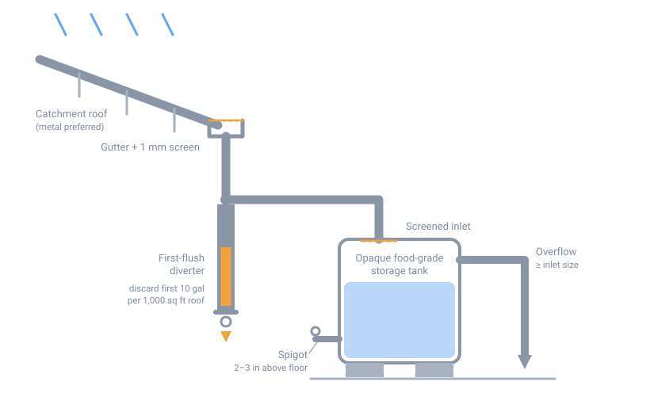

# Rainwater Collection

## Summary

Roof catchment is usually the highest-yield water source available at a fixed
dwelling, because the collection surface already exists. Roughly 0.6 gallons of
water falls on each square foot of roof per inch of rain, so a 1,000 sq ft roof
yields about 620 gallons per inch — call it 500 after losses to splash,
evaporation, and first-flush diversion.

Collected rainwater is **not potable as collected.** It carries roof debris,
bird droppings, and whatever the roofing material sheds. Treat this page as
covering collection and storage only; purification is a separate step.

{ width="760" }

*Roof catchment through a first-flush diverter into screened storage. Click to enlarge.*

## Materials

- Food-grade barrel or tank, 55 gal or larger (HDPE, opaque)
- Gutter and downspout serving the catchment roof
- First-flush diverter (commercial, or a capped vertical pipe section)
- Fine mesh screen, 1 mm or smaller, for every opening
- Bulkhead fitting and spigot for the barrel outlet
- Overflow line sized at least as large as the inlet
- Level base capable of carrying the filled weight

!!! warning "Weight"
    Water weighs 8.34 lb per gallon. A full 55 gal barrel is about 460 lb, and a
    275 gal IBC tote is over 2,300 lb. Build the base for the filled weight, not
    the empty one, and never place a tank on an untested elevated platform.

## Procedure

1. **Assess the roof material.** Metal, clay tile, and slate are the safest
   catchment surfaces. Asphalt shingle sheds granules and petroleum compounds.
   Avoid any roof with lead flashing, lead-based paint, chemically treated wood
   shakes, or copper treated with algaecide.
2. **Clean the gutters** and set the slope to about 1/4 inch of fall per 10 feet
   of run, draining toward the downspout.
3. **Screen the gutter** along its full length. This keeps out leaves and,
   critically, blocks mosquito access to the system.
4. **Install the first-flush diverter** in the downspout, upstream of the tank.
   Divert and discard the first 10 gallons per 1,000 sq ft of roof area — this
   carries the bulk of accumulated contaminants. The diverter must drain itself
   between rain events or it will go stagnant.
5. **Set the barrel on its base**, positioned so the outlet clears whatever
   container you will fill from it. Height above the draw point is the only
   pressure you get without a pump.
6. **Connect the inlet**, with screen at the barrel opening as a second barrier.
7. **Plumb the overflow** away from the building foundation. This line runs full
   during heavy rain, so it must be at least as large as the inlet.
8. **Install the spigot** using a bulkhead fitting, positioned 2–3 inches above
   the barrel floor so settled sediment stays behind.

## Safety

- **Mosquito breeding.** Any unscreened opening will be colonized within days.
  Inspect screens after every storm. This is the most common failure.
- **Stagnation.** Water stored in light grows algae. Use opaque tanks, keep them
  shaded, and cycle the stored volume.
- **Roof contaminants.** Runoff from an asphalt or treated-wood roof is fine for
  irrigation of non-edible plants and for washing, but should not be your
  drinking source if another option exists.
- **Cross-connection.** Never connect a rainwater system to household potable
  plumbing without a proper air gap or backflow preventer.
- **Freezing.** A full rigid tank can split when it freezes. Drain to below the
  halfway point before hard freeze, or use flexible containers.

## Treatment before drinking

Collected rainwater is **not safe to drink as stored.** The treatment sequence is
always *get it clear, then disinfect*: let sediment settle and filter the water
to clear, then boil or add household bleach (8 drops of unscented ~6% bleach per
gallon, 30-minute contact). Filtration alone does not make it safe, and boiling
alone does not remove sediment or chemical contaminants.

See [Water Purification](20-water-purification.md) for full methods and dosages,
including iodine, filtration ratings, solar disinfection, distillation, and what
does *not* work.

## Legal note

Rainwater harvesting is regulated in some U.S. states, with restrictions on
volume, use, or permitting. Verify local rules before building a large system.

## Sources

- Texas Water Development Board, *The Texas Manual on Rainwater Harvesting*, 3rd ed.
- U.S. EPA guidance on rainwater harvesting and non-potable reuse
