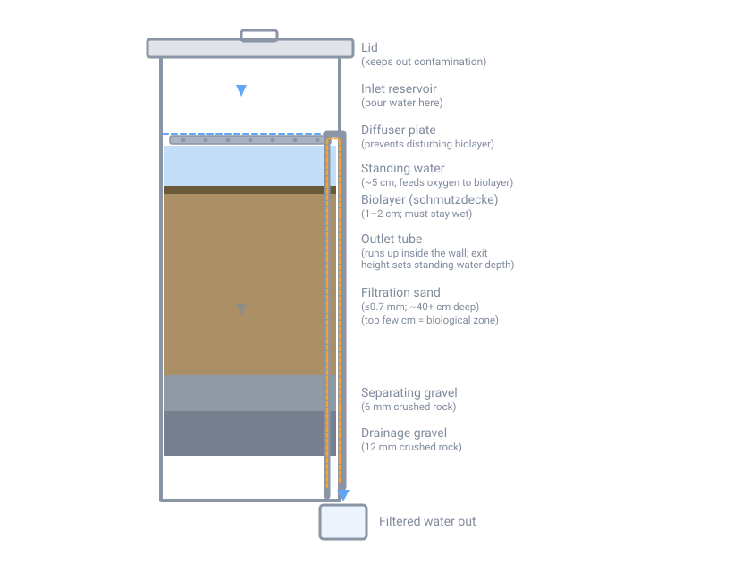

# Sediment Filtration

## Summary

This page is the construction deep-dive behind the Filtration section of
[Water Purification](20-water-purification.md). That page covers the whole
treatment sequence — settle, filter, disinfect — at a summary level. This one
stays entirely inside the "filter" step: what filter media actually are, what
a micron rating does and doesn't remove, and how to build the common
gravity-fed filters (biosand/slow-sand, bucket sediment filters, cloth
pre-filters, ceramic pot filters) from materials a household can source.

**Filtration is mechanical, not disinfection.** A well-built sediment filter
removes turbidity, particles, and a majority of bacteria and protozoa by
trapping them in media or a biological layer. None of the builds on this page
reliably remove viruses, and none of them are a substitute for a proper kill
step. Every filter described here should be followed by boiling, chemical
disinfection, or UV/solar disinfection before the water is considered safe to
drink — see [Water Purification](20-water-purification.md) for those methods
and doses. Treat that as the standing rule for this whole page, not a
one-time caveat.

!!! warning "Not a substitute for professional help"
    These are field-expedient and humanitarian-aid-grade designs, not
    NSF/ANSI-certified treatment devices. Build and use them for situations
    where certified equipment or laboratory testing is unavailable, and pair
    every one of them with disinfection.

**Regional note (northeastern US / New Hampshire):** a biosand filter is a
living biological system that cannot be allowed to freeze — the biolayer dies
and the filter body (concrete or a filled plastic barrel) can crack. Site it
indoors or in a heated space, not in an unheated shed or garage, for anything
beyond a three-season cabin. Locally available "mason sand" or "concrete
sand" from a landscaping or masonry supplier is a reasonable substitute for
purpose-graded filtration sand; ordinary bagged "play sand" from a hardware
store is a distant second choice (see [Sand](#sand) below).

## Filter media and micron ratings

### Sand

Filtration sand is not the same product at every grain size, and the
difference matters more than most DIY guides admit.

| Grade | Typical size | Role |
|---|---|---|
| Filtration sand | ≤ 0.7 mm (passes a 0.03 in sieve) | Removes pathogens and suspended solids in a biosand/slow-sand filter |
| Concrete sand | ~1 mm | Bulk fill / concrete work, not filtration |
| Separating gravel | 6 mm (¼ in) | Keeps filtration sand out of the drainage layer |
| Drainage gravel | 12 mm (½ in) | Supports the sand, protects the outlet from clogging |

The Centre for Affordable Water and Sanitation Technology (CAWST) — the
authority most humanitarian biosand filter programs build from — specifies
filtration sand as **crushed rock** passed through a stack of sieves (12 mm →
6 mm → 1 mm → 0.7 mm), with the material passing the finest sieve used as
filtration sand. CAWST's manual and independent characterization studies
describe the target gradation as an **effective size around 0.15–0.20 mm**
with a **uniformity coefficient of roughly 1.5–2.5** (a measure of how
consistently sized the grains are — lower is more uniform). This specific
range is documented in CAWST's newer sand-characterization literature rather
than spelled out as a single number in the 2009 construction manual itself;
treat it as CAWST's working target rather than a universal physical law.

**Why crushed rock, not river or beach sand:** CAWST is explicit that
natural rounded sand — river sand especially — is frequently contaminated
with pathogens and organic matter from human and animal waste upstream, and
that organic matter becomes a food source that lets pathogens regrow inside
the filter. If crushed rock genuinely isn't available, river sand can be used
only after washing, drying in full sun, and ideally disinfecting it, and even
then the organic content can't be fully removed without heating it hot enough
to burn it off. **Beach sand is the last resort.**

**Practical substitute in New Hampshire:** commercial "mason sand" or
"concrete sand" sold at landscaping and masonry suppliers is manufactured
(crushed and screened) sand and is a workable substitute for CAWST-spec
filtration sand once it's sieved to the right size and washed. Bagged play
sand sold for sandboxes is usually rounded and very uniformly sized — poor
pore structure for filtration — and often isn't washed of fines; use it only
if nothing else is available, and wash and sieve it regardless.

### Gravel

Ordinary crushed gravel, sieved to 6 mm and 12 mm, works for the separating
and drainage layers. Round pea gravel is a weaker substitute (larger voids,
less consistent support) but usable if crushed gravel isn't available.

### Activated carbon

Activated carbon adsorbs organic compounds, chlorine, and many taste/odor
contaminants onto its enormous internal surface area. It comes in two forms
relevant to a home-built filter:

- **Granular activated carbon (GAC)** — loose granules, used as a layer in a
  bucket filter or a loose-media cartridge. Handles higher flow with less
  pressure drop.
- **Powdered activated carbon (PAC)** — much finer, higher surface area per
  gram, but impractical to hold in place in a gravity bucket filter without
  being carried through with the water; it's mainly a municipal/batch-dosing
  tool, not a DIY media layer.

**Carbon does not remove pathogens, and a loaded or long-wet carbon bed can
become a bacterial breeding ground.** The EPA notes that a carbon filter left
wet and unused, or one that has become loaded with organic matter, becomes a
food source that lets bacteria colonize the media itself — which is why
carbon layers/cartridges need scheduled replacement (below), not just
"rinse and reuse." A number of popular DIY three-bucket filter writeups
claim the charcoal layer removes "99% of pathogens" — **this is not
correct** and is not supported by CDC, EPA, or WHO guidance; treat any such
claim on a prepper or content-farm site as wrong. Carbon's job in these
builds is taste, odor, and some chemical adsorption, not disinfection.

### Ceramic

Fired clay with a fine, continuous pore structure removes particles (and,
with the pores small enough, bacteria and protozoa) purely by size exclusion,
independent of any biological process. The Potters for Peace-style
colloidal-silver-impregnated ceramic pot filter is the reference design (see
[DIY ceramic pot filter basics](#procedure-diy-ceramic-pot-filter-basics)
below).

### Micron ratings — what they actually remove

CDC's household water treatment guide gives the working numbers most
manufacturers' claims trace back to:

| Filter class | Pore size | Protozoa | Bacteria | Viruses |
|---|---|---|---|---|
| Microfiltration | ~0.1 µm (range 0.05–5 µm) | Very high | Moderate | **Not effective** |
| Ultrafiltration | ~0.01 µm (range 0.001–0.05 µm) | Very high | Very high | Moderate |

A well-run mature biosand filter and a good ceramic pot filter both perform
in roughly the microfiltration range against bacteria and protozoa — which is
exactly why **none of the builds on this page are rated to remove viruses**,
and why every one of them needs a disinfection step afterward. See
[Water Purification § Filtration](20-water-purification.md#filtration) for
how DIY filter performance compares to certified filters, and
[Water Purification](20-water-purification.md) generally for the
disinfection methods that close the gap.

## Materials

General tools and supplies used across the builds below; each procedure
lists what it specifically needs.

- Food-grade 5-gallon buckets (2–3 per build) or a food-grade plastic barrel
  for a full-size biosand filter
- Drill with hole saws / spade bits sized to your bulkhead fittings
- Plastic bulkhead fittings and a length of rigid or flexible tubing (6 mm/¼
  in ID minimum) for the outlet
- Sieves or window screen mesh in a few graduations (roughly ½ in, ¼ in, and
  a fine ~0.03 in / window-screen-grade mesh) for grading sand and gravel —
  see [Appendix 2 of the CAWST manual](https://sswm.info/sites/default/files/reference_attachments/CAWST%202009%20Biosand%20Filter%20Manual.pdf)
  for a sieve you can build from wood frames and hardware cloth
- Crushed filtration sand, separating gravel, and drainage gravel (see
  [Filter media](#filter-media-and-micron-ratings) above)
- Tightly woven cotton cloth (an old t-shirt or bandana works), coffee
  filters, or non-woven landscape fabric for pre-filter stages
- Large clean containers for washing media
- A funnel and a diffuser plate (a perforated flat plate or a shallow tray
  with holes) for pouring water into a biosand filter without disturbing the
  sand surface

## Procedure — Two/three-bucket gravity sediment filter

The simplest build: media stacked in nested buckets, water gravity-feeds
through each in turn. This is a **pre-filter**, not a purifier — it clears
turbidity so disinfection works, and reduces (but does not eliminate)
bacteria load if a carbon layer is included.

### Materials

- 2–3 food-grade 5-gallon buckets with lids
- Bulkhead fitting or a small hole + spigot for each bucket's outlet
- Coarse gravel, sand, and (optional) granular activated carbon
- Cloth or coffee filter for a top pre-filter layer

### Steps

1. Drill a hole near the bottom side of each bucket and fit a bulkhead
   fitting or small spigot, positioned so the outlet clears the lid of the
   bucket below it.
2. **Bottom bucket (optional, carbon):** a few inches of washed granular
   activated carbon over a small gravel support layer, if you want taste/odor
   improvement. This does **not** add disinfection.
3. **Middle bucket (sand):** several inches of washed filtration or mason
   sand over a thin gravel support layer.
4. **Top bucket (gravel + cloth):** a coarse gravel layer to catch large
   debris, with a cloth or coffee-filter layer stretched over the very top to
   catch floating debris before it ever reaches the gravel.
5. Nest the buckets so each one's outlet drips into the top of the bucket
   below (or collect and re-pour manually between stages if you didn't build
   dedicated outlets).
6. Pour source water into the top bucket. Discard the first few batches
   while fines settle out of the new media; water should visibly clear up
   over the first several passes.
7. Collect the output and **disinfect it** — this design has no biological
   or fine-enough mechanical barrier to rely on for pathogen removal.

This is a widely repeated field design (Instructables, homesteading and
preparedness sites all describe close variants of it), not an engineered
CAWST-style specification — there's no authoritative source for exact layer
depths, so use enough of each media to give several inches of contact and
adjust based on how clear your output runs.

## Procedure — Biosand (slow sand) filter, bucket or barrel

This is the household adaptation of the century-old municipal slow sand
filter, formalized for single-household use by Dr. David Manz at the
University of Calgary and refined and distributed worldwide by CAWST. The
key difference from the simple bucket filter above is the **biolayer** — a
living microbial community at the top of the sand that does most of the
pathogen removal, not just mechanical straining.

{ width="760" }

*Water is poured into the reservoir, passes through the diffuser, stands
above the biolayer, and percolates down through the sand and gravel. The
outlet tube runs up inside the wall and exits at the height of the standing
water layer, which is what keeps that layer full between uses.*

### How it works

Water poured into the top reservoir passes through a **diffuser** (a
perforated plate) so it doesn't gouge the sand surface, then stands above the
sand for the length of the pause period before the next use. In that
standing water and the top 1–2 cm of sand, a biological community —
bacteria, protozoa, algae, diatoms — forms what's historically called the
**schmutzdecke** ("dirt layer" or "biolayer"). Pathogens and suspended solids
are removed by a combination of mechanical trapping, predation (the biolayer
eats them), adsorption, and simple die-off from lack of food and oxygen
deeper in the sand. CAWST's manual states plainly: **the biolayer is not
visible** — it is not a green slime coating, and a darkening of the sand
surface is trapped sediment, not the biolayer itself.

### Materials

For a household-scale build in a 5-gallon bucket or a food-grade 55-gallon
barrel (CAWST's own reference design uses a concrete or molded-plastic body
about 12 in × 12 in × 37 in tall; the same layer principles scale to other
containers):

- Watertight food-grade bucket or barrel, tall enough for a deep sand column
- Outlet tube (rigid or flexible, minimum 6 mm/¼ in ID) plumbed from near the
  bottom of the container up the inside wall to exit at the height you want
  the standing water to sit — this is what fixes the standing-water depth
  automatically
- A diffuser: a perforated plate or shallow perforated tray suspended a
  couple of centimeters above the sand
- A tight-fitting lid
- Washed drainage gravel (12 mm), separating gravel (6 mm), and filtration
  sand (≤0.7 mm) — see [Filter media](#filter-media-and-micron-ratings)
- A dedicated, covered storage container for the treated output, never
  reused for source water

### Layer order and depths

From the bottom up:

| Layer | Depth | Notes |
|---|---|---|
| Drainage gravel (12 mm) | ~5 cm (2 in) | Covers the outlet inlet; supports the layer above |
| Separating gravel (6 mm) | ~5 cm (2 in) | Keeps filtration sand from migrating into the gravel |
| Filtration sand (≤0.7 mm) | As deep as your container allows — CAWST's compact household design uses about 50 cm (~21 in) | The working filter media; the top few cm is the biological zone |
| Standing water | ~5 cm (2 in) above the sand | Set by the outlet tube's exit height; keeps the biolayer wet and oxygenated |

The two gravel-layer depths (5 cm each) and the 5 cm standing-water depth are
CAWST's own published specifications for their reference design. **Sand
depth for a bucket or barrel build is a scaling decision, not a fixed CAWST
number** — CAWST's own compact design uses roughly 50 cm of sand in a
container built specifically for that volume; other field manuals describing
taller barrel builds commonly cite depths in the 45–60 cm (18–24 in) range.
Treat that range as a commonly repeated field figure, not a verified
standard, and prioritize enough sand depth for slow, even flow over hitting
an exact number.

### Steps

1. **Grade your media.** Sieve gravel and sand through the sizes above,
   discarding anything larger than 12 mm. Wash each grade separately in a
   bucket of water — swirl, decant the cloudy water, and repeat until the
   rinse water runs clear (gravel) or only slightly cloudy (fine sand won't
   run perfectly clear — CAWST's own guide notes it takes practice to judge
   "washed enough" versus over-washed).
2. **Check the outlet** before adding any media: with the container empty,
   water poured in should drain at roughly 1 L/minute through the empty
   outlet tube, and the water level should settle just below the diffuser
   height when it stops. Fix any restriction now — you can't fix it once the
   filter is loaded.
3. **Add drainage gravel** (~5 cm) over the outlet, then **separating
   gravel** (~5 cm), leveling each layer.
4. **Add sand under water, not into air.** Fill the container partway with
   clean water first, then pour the sand in fairly quickly so it settles
   through standing water rather than being poured onto dry gravel. This
   prevents trapped air pockets and — because you're adding a graded mix of
   grain sizes all at once — keeps the natural random distribution of grain
   sizes that CAWST specifically calls out as important; pouring slowly lets
   coarser grains settle out first and separate into visible layers, which
   hurts performance.
5. **Fill and equalize.** Run water through until it stops flowing from the
   outlet on its own; note the water depth remaining above the sand. Add or
   remove sand until that standing depth settles at about 5 cm (CAWST's
   acceptable range is roughly 4–6 cm). Too little water and the biolayer can
   dry out; too much and oxygen can't diffuse down to it.
6. **Swirl and dump once**, then smooth the sand surface level. This clears
   the fine "fines" that rise during filling before you put the diffuser
   back.
7. **Flush the filter.** With the diffuser in place, pour 40–80 L (10–20
   gal) of the cleanest available water through repeatedly until the output
   runs clear. If it isn't clear after about 100 L (25 gal), the gravel was
   too dirty going in and you should rebuild that layer with cleaner
   material rather than continuing to flush.
8. **Site it permanently.** Once loaded with sand, the filter should not be
   moved — settling and re-leveling after a move can disturb the layers and
   the developing biolayer. Put it somewhere level, protected from freezing,
   direct sun, and contamination, ideally indoors near where water is used.

### Establishing and protecting the biolayer

- **It takes up to 30 days to fully mature.** During that time, treatment
  efficiency and the biolayer's oxygen demand both climb. Before maturity,
  removal is roughly 30–70% from mechanical trapping and adsorption alone; a
  mature biolayer can push pathogen removal toward the high figures below.
  **Disinfect the output during this whole ramp-up period regardless.**
- **Feed it consistently.** CAWST recommends using the same water source
  every time — the biolayer adapts to a specific level and type of
  contamination, and switching sources forces it to re-adapt, which can take
  several days each time.
- **It must not dry out.** The standing water layer is what keeps the
  biolayer wet and supplied with dissolved oxygen. A blocked or plugged
  outlet raises the water level (bad — reduces oxygen diffusion, thins the
  biolayer); an outlet that's been rigged with a hose or siphoned can drop
  the water level below the sand and kill it outright. Never plug the
  outlet, and never attach anything to it that could siphon the standing
  water away.
- **Use it regularly.** CAWST recommends running water through at least
  once every 1–2 days, ideally 2–4 times a day, with a pause of at least 1
  hour and no more than 48 hours between uses. Long pauses starve the
  biolayer; the flow rate itself partially recovers during each pause as the
  biolayer consumes what's trapped in the sand.
- **Never pour chlorine into the top of the filter.** It kills the biolayer.
  Disinfect the filtered output in its own storage container instead.

### How well it actually works

CAWST's manual reports lab and field treatment efficiencies drawn from
several independent studies (Buzunis 1995; Baumgartner 2006; Stauber et al.
2006; Earwaker 2006; Duke & Baker 2005; Palmateer et al. 1997; Ngai et al.
2004):

| | Bacteria | Viruses | Protozoa | Turbidity |
|---|---|---|---|---|
| Laboratory | Up to 96.5% | 70% to >99% | >99.9% | 95% (<1 NTU) |
| Field | 87.9% to 98.5% | Not available | Not available | 85% |

**Read the gap between "laboratory" and "field" as the whole point of this
page's safety section.** Field conditions — imperfect construction, variable
source water, inconsistent use — reliably underperform the lab numbers.
CAWST's own manual states outright that disinfection is still necessary even
though filtered water looks clear, because the filter removes most but not
all of the bacteria and viruses present.

## Procedure — Cloth and pre-filter stages

A cloth pre-filter is the cheapest and fastest improvement available and
belongs ahead of every other filter on this page, and ahead of chemical
disinfection generally (see [Water Purification § Step 0](20-water-purification.md#step-0-get-it-clear-first)).

### Steps

1. Let turbid water stand undisturbed so heavier sediment settles, and draw
   from above the settled layer rather than disturbing it.
2. Pour through a tightly woven cloth (folded cotton cloth, a clean bandana,
   or several layers of an old t-shirt) stretched over the receiving
   container, or through a paper coffee filter for smaller volumes. This
   removes visible particulates and much of the material that would
   otherwise plug a sand or ceramic filter prematurely.
3. Rinse and re-use cloth prefilters between batches; replace paper filters
   each time.
4. Treat this as the first stage before a bucket sediment filter, a biosand
   filter, or a ceramic filter — not a replacement for any of them. A cloth
   prefilter removes essentially none of the biological hazard on its own.

CAWST uses a simple field rule worth adopting here too: if source water is
turbid enough that you can't read text through a clear 2-liter bottle of it
held up to a page, presettle and pre-filter it before it ever reaches your
main filter — high turbidity is what plugs sand and ceramic media
prematurely and forces more frequent maintenance.

## Procedure — DIY ceramic pot filter basics

The reference design here is the Potters for Peace-style colloidal-silver
ceramic pot filter, developed from a 1981 Guatemalan study and now produced
by ceramics workshops worldwide. It's included for understanding and for a
simplified emergency fallback — **a properly made unit requires a kiln
capable of a controlled, sustained high-temperature firing and basic quality
testing, which is a harder bar to clear at home than the other builds on this
page.**

### How the real thing is made

- Clay and a combustible filler (fine sawdust or rice husk) are mixed in
  roughly equal volumes, then formed into a flowerpot-shaped filter element
  by wheel-throwing, hand-building, or pressing in a mold, with walls about
  1 cm thick.
- The pot is fired to roughly **860°C (about 1,580°F)**. The combustible
  filler burns out completely, leaving a network of fine, continuous pores
  through the clay wall.
- After firing and a flow-rate check, the fired pot is coated with
  **colloidal silver**, which acts bactericidally on organisms that make it
  through the pores or colonize the filter surface.
- Finished units filter at roughly **1.5–2.5 L/hour** by gravity (candle-style
  ceramic filter elements, a related design, run slower — roughly 0.1–1
  L/hour).

### Effectiveness, and where it falls short

Ceramic pot filters combine fine pore size with the colloidal silver's
bactericidal effect and consistently show strong bacteria and protozoa
removal in testing — reported *E. coli* log reductions in independent
studies commonly fall around **4.5 to 4.9 log** (roughly 99.99%+). They are
**not reliable against viruses**, which are small enough to pass through the
ceramic pore structure regardless of the silver coating; treat viral removal
as unproven for this design.

### A simplified fallback, and its real limits

If you have no way to fire clay yourself, an unglazed terra-cotta flowerpot
(plugging the drainage hole) can be pressed into service as a crude
size-exclusion filter for turbidity and some larger organisms, sitting inside
a second container to catch the output. **Do not treat this as equivalent to
a real ceramic pot filter.** Commercial terra-cotta is fired at a lower
temperature for a different pore structure, has no colloidal silver
treatment, and hasn't had its flow rate or integrity tested the way a real
CPF is checked before sale. Use it only as a coarse prefilter ahead of
disinfection, never as a standalone barrier against pathogens.

## Maintenance

### Backwashing and scraping (biosand and bucket sand filters)

- **"Swirl and dump" is the biosand filter's standard maintenance**, not a
  full backwash. When flow slows to an inconvenient rate (CAWST's threshold:
  below about 0.1 L/minute, versus a fresh filter's target of 0.4 L/minute):
  remove the lid and diffuser, add a little water if none stands above the
  sand, gently swirl only the top few millimeters of sand with a flat hand
  to loosen trapped fines, scoop out the resulting dirty water, smooth the
  sand back level, replace the diffuser and lid, and refill. Repeat if flow
  is still slow.
- **This disturbs the biolayer** — expect a temporary dip in treatment
  performance that recovers over the following days as the biolayer
  re-establishes. Disinfect output during that recovery period.
- **A slow flow rate by itself is not a water-quality problem** — CAWST is
  explicit that slower flow generally means *better* filtration, since water
  spends more time in contact with the biolayer. It only becomes a
  maintenance trigger when it's too slow to be convenient.
- For a simple bucket sediment filter (no biolayer to protect), you can be
  more aggressive: scrape and discard the top inch or so of visibly clogged
  sand or carbon and top up with fresh washed media.

### Replacement schedule

- **Activated carbon:** replace on a schedule (commonly every few months of
  regular use, sooner if flow slows sharply or taste/odor returns) rather
  than waiting for obvious failure — a carbon bed that's exhausted or has
  sat wet for an extended period can shed more than it removes.
- **Cloth prefilters:** rinse after every use; replace when they no longer
  come clean or start to fray.
- **Biosand filter sand:** CAWST's guidance treats "swirl and dump" as an
  indefinitely repeatable maintenance step, not something with a fixed
  replacement interval — full sand replacement is only needed if the filter
  was built with contaminated gravel to begin with (indicated by output that
  never runs clear even after ~100 L of flushing) or if the container itself
  fails.
- **Ceramic pot filter elements:** clean by gently scrubbing the outer
  surface with a soft brush under clean water when flow slows — never soap
  or harsh chemicals, which can strip the colloidal silver coating.
  Commercial units are typically rated for one to a few years of household
  use; replace a cracked or chipped element immediately; a crack bypasses
  the entire pore-size barrier.

## Safety

- **Filtration is not disinfection.** Every filter on this page must be
  followed by boiling, chemical disinfection, or solar/UV disinfection for
  water of unknown biological safety — see
  [Water Purification](20-water-purification.md). This is doubly true for
  water from surface sources (streams, ponds, rain barrels) versus a known,
  tested well.
- **None of these are certified treatment devices.** NSF/ANSI 42, 53, and
  the microbiological purifier standard NSF/ANSI P231 exist specifically
  because "removes contaminants" and "is independently verified to reliably
  remove a specific log reduction of a specific pathogen under test
  conditions" are different claims. A home-built filter has made neither
  claim, however well it performs in this page's cited studies.
- **Freezing kills a biosand filter and can crack its container.** Keep it
  indoors or in a heated space through a New Hampshire winter; a three-season
  camp is not an adequate location for a filter you're relying on
  year-round.
- **Never plug, cap, or attach a hose/siphon to a biosand filter's outlet.**
  Doing either can raise or drain the standing water layer and kill the
  biolayer (see [Establishing and protecting the biolayer](#establishing-and-protecting-the-biolayer)).
- **Never pour chlorine or other disinfectant into the top of a biosand
  filter.** Disinfect the filtered output in a separate storage container
  instead — chlorine in the reservoir kills the biolayer that does most of
  the filter's work.
- **Contaminated construction materials can make water worse, not better.**
  Unwashed river sand or gravel can introduce organic matter and pathogens
  that then multiply inside the filter. Wash and, where practical, sun-dry
  or disinfect media before use.
- **Source water above roughly 50 NTU turbidity should be pre-settled and
  pre-filtered** before it reaches a sand or ceramic filter — high turbidity
  both reduces treatment efficiency and causes rapid, inconvenient clogging.
- **Treated water storage still applies.** Keep filtered-and-disinfected
  water in a separate, clean, covered container, never the container used to
  carry source water — see
  [Water Purification § Storing treated water](20-water-purification.md#storing-treated-water).

## Sources

- CAWST (Centre for Affordable Water and Sanitation Technology), *Biosand
  Filter Manual: Design, Construction, Installation, Operation and
  Maintenance*, September 2009 Edition —
  <https://sswm.info/sites/default/files/reference_attachments/CAWST%202009%20Biosand%20Filter%20Manual.pdf>
- CAWST, *Biosand Filter* — WASH Resources topic page —
  <https://washresources.cawst.org/en/topics/69af3832/bsf>
- U.S. CDC, *A Guide to Drinking Water Treatment Technologies for Household
  Use* — <https://stacks.cdc.gov/view/cdc/12379>
- NSF, *NSF/ANSI 42, 53 and 401: Filtration Systems Standards* (includes the
  EPA bacteriostatic-agent registration process referenced for carbon filter
  bacterial regrowth) —
  <https://www.nsf.org/knowledge-library/nsf-ansi-42-53-and-401-filtration-systems-standards>
- NSF, *Standards for Water Treatment Systems* (NSF/ANSI P231
  microbiological purifier standard) —
  <https://www.nsf.org/consumer-resources/articles/standards-water-treatment-systems>
- Lantagne, D., *Investigation of the Potters for Peace Colloidal Silver
  Impregnated Ceramic Filter*, MIT/Alethia Environmental report —
  <https://web.mit.edu/watsan/Docs/Other%20Documents/ceramicpot/PFP-Report1-Daniele%20Lantagne,%2012-01.pdf>
- SSWM (Sustainable Sanitation and Water Management), *Colloidal Silver
  Filter* — <https://sswm.info/sswm-solutions-bop-markets/affordable-wash-services-and-products/affordable-water-supply/colloidal-silver-filter>
- Potters for Peace, *Ceramic Water Filter Project* —
  <https://www.pottersforpeace.org/ceramic-water-filter-project>
- Wikipedia, *Slow sand filter* (history and general mechanism, cites
  primary engineering sources) — <https://en.wikipedia.org/wiki/Slow_sand_filter>

The CAWST manual's cited treatment-efficiency figures (Table 1 in that
document) are themselves drawn from independent laboratory and field
studies: Buzunis (1995), Baumgartner (2006), Stauber et al. (2006), Earwaker
(2006), Duke & Baker (2005), Palmateer et al. (1997), and Ngai et al. (2004);
full citations are listed in the CAWST manual's references section.

The effective-size/uniformity-coefficient range for biosand filter sand
(0.15–0.20 mm ES, 1.5–2.5 UC) is reported in later CAWST-derived
characterization literature rather than the 2009 construction manual body
text itself — treat it as CAWST's documented target, not a number this page
independently verified against the primary manual's own printed sieve
specifications (which specify the 0.7 mm cutoff sieve directly).
